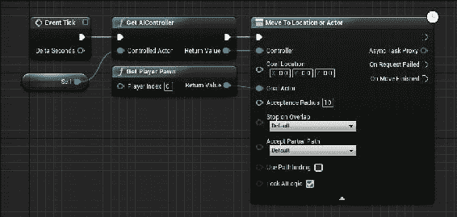
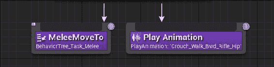
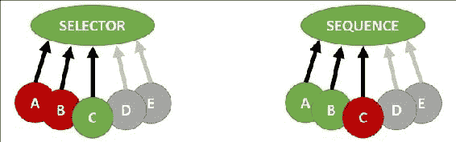
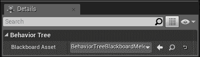
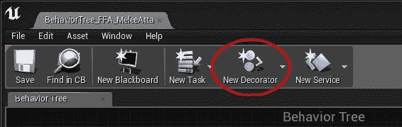
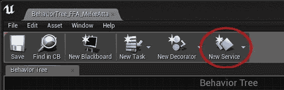
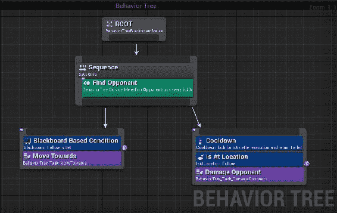

# 十、用于控制 npc 的人工智能

**人工智能** (**AI**) 在你的游戏中的作用是相当重要的。在本章中，我们将介绍以下使用 AI 来控制您的**NPC**字符的食谱:

*   铺设导航网格
*   跟随行为
*   将行为树连接到字符
*   构建任务节点
*   使用装饰器来满足条件
*   使用定期服务
*   使用复合节点-选择器、序列和简单并行
*   AI 为近战攻击者

# 简介

人工智能包括游戏 NPC 的许多方面以及玩家的行为。人工智能的一般主题包括寻路和 NPC 行为。通常，我们将 NPC 在游戏中一段时间内的行为选择称为行为。

UE4 中的 AI 得到了很好的支持。存在许多结构，以允许从编辑器内部进行基本的 AI 编程。如果引擎内部提供的 AI 不适合您的需求，也可以使用 C 的自定义 AI 编程。

# 铺设导航网格

导航网格 (也称为**导航网格**) 基本上是 AI 控制单元认为可通过的区域的定义 (即允许 “AI 控制” 单元进入或跨越的区域)。导航网格不包括几何形状，如果玩家试图通过它，则会阻塞玩家。

## 准备就绪

在 ue4 中，根据场景的几何形状构建导航网格相当容易。从一个周围有一些障碍的项目开始，或者一个使用地形的项目开始。

## 怎么做...

要构造您的 Nav 网格，只需执行以下步骤:

1.  转到**模式** | **卷**。
2.  Drag **Nav Mesh Bounds Volume** onto your viewport.

    ### 提示

    按*P*键查看您的导航网格。

3.  缩放导航网格以覆盖应允许使用导航网格的参与者导航和路径查找的区域。

## 它是如何工作的…

导航网格不会阻止玩家棋子 (或其他实体) 踩踏某些几何图形，但它可以指导 AI 控制的实体确定它们可以去哪里和不能去哪里。

# 以下行为

最基本的 AI 控制跟随行为作为一个简单的函数节点可用。您所要做的就是执行以下步骤，以使一个 AI 控制的单元跟随一个单元或对象。

## 准备就绪

准备一个 UE4 项目，在地面上有一个简单的景观或一组几何形状-理想情况下，在几何形状的某个地方有一个*死胡同*，用于测试 AI 运动功能。在此几何图形上创建一个 Nav 网格，以便`AIMoveTo`函数将按照前面的配方中所述工作。

## 怎么做…

1.  为您的级别的几何图形创建导航网格，如前面的配方中所述，*铺设导航网格*。
2.  通过在**类查看器**中找到`Character`类，右键单击它，然后选择**创建一个源自`Character`的蓝图类。创建蓝图类…**
3.  命名您的蓝图类`BP_Follower`。
4.  双击`BP_Follower`类以编辑其蓝图。
5.  In the `Tick` event, add an `AIMoveTo` node, which moves towards the player pawn (or any other unit) as follows:

    

## 它是如何工作的…

如果有 Nav 网格，则`AIMoveTo`节点将自动使用 Nav 网格。如果导航网格不可用，则 NPC 单元将不会移动。

## 还有更多…

如果您不希望设备使用导航网格进行寻路移动，则只需使用**移动到 Location 或 Actor**节点即可。

即使在几何图形上没有导航网格的情况下，**移动到位置或演员**节点也可以工作。

# 将行为树连接到字符

A`BehaviorTree`选择在任何给定时刻由 AI 控制的单元表现出的行为。行为树的构造相对简单，但是要运行一个，还有很多设置要做。您还必须熟悉可用于构建**行为树**的组件，才能有效地做到这一点。

行为树对于定义 NPC 行为非常有用，该行为比简单地向对手移动更多 (如前面的食谱中所示的`AIMoveTo`)。

## 准备就绪

设置行为树来控制角色的过程相当复杂。我们首先需要的是一个要控制的`Character`类导数的蓝图。然后，我们需要创建一个自定义 AI 控制器对象，该对象将运行我们的行为树来控制我们的近战攻击者角色。蓝图中的`AIController` 类将运行我们的行为树。

行为树本身包含一个非常重要的数据结构，称为**黑板**。黑板就像一个黑板，用于包含行为树的变量值。

行为树承载六种不同类型的节点，如下所示:

1.  **Task**: Task nodes are the purple nodes in the Behavior Tree that contain Blueprint code to run. It's something that the AI-controlled unit has to do (code-wise). Tasks must return either `true` or `false`, depending on whether the task succeeded or not (by providing a `FinishExecution()` node at the end).

    

2.  **Decorator**: A decorator is just a Boolean condition for the execution of a node. It checks a condition, and is typically used within a Selector or Sequence block.

    

3.  **服务**: 打勾时运行一些蓝图代码。这些节点的滴答间隔是可调的 (可以比每帧滴答慢运行，例如，每 10 秒)。您可以使用这些来查询场景的更新，或者要追逐的新对手，或者类似的东西。黑板可用于存储查询的信息。服务节点最后没有`FinishExecute()`调用。上图中的 Sequence 节点中有一个示例服务节点。
4.  **选择器**: 从左到右运行所有子树，直到遇到成功。当它遇到成功时，执行返回树。
5.  **Sequence**: Runs subtrees from left to right until it encounters a failure. When a failure is encountered, execution goes back up the tree.

    

    ### 注意

    选择器节点尝试执行节点直到成功 (之后返回)，而序列节点执行全部，直到遇到失败 (之后返回)。

    请记住，如果您的任务不调用`FinishExecute()`，则选择器和序列都无法连续运行多个选择器。

6.  **Simple Parallel**: Runs a single task (purple) in parallel with a subtree (gray).

    

## 怎么做...

1.  首先为 ue4 内的近战单元创建蓝图。您应该通过从`Character`中导出自定义蓝图来做到这一点。为此，请转到**类查看器**，键入`Character`，然后右键单击。从出现的上下文菜单中选择**创建蓝图…** ，并命名您的蓝图类`BP_MeleeCharacter`。
2.  To use a Behavior Tree, we need to start by setting up a custom AI Controller for our `Character` class derivative. Go to **Content Browser** and derive a Blueprint from the `AIController` class—be sure to turn off **Filters** | **Actors only** first!

    ### 注意

    默认情况下，在**类查看器**中不会显示非 actor 类导数!要显示`AIController`类，您需要转到**过滤器**菜单，然后取消选中**仅演员**菜单选项。

3.  通过右键单击**内容浏览器**并选择**人工智能** | **行为树**和**人工智能** | **黑板**来创建您的行为树和黑板对象。
4.  Open the **Behavior Tree** object, and under **Blackboard Asset** in the **Details** panel, select the Blackboard that you've created. Blackboards contain keys and values (named variables) for your Behavior Tree to use.

    

5.  Open your `BP_AIMeleeController` class derivative and go to the Event Graph. Under **Event BeginPlay**, select and add a **Run Behavior Tree** node to the graph. Under `BTAsset`, be sure to select your `BehaviorTree_FFA_MeleeAttacker` asset.

    

## 它是如何工作的…

行为树连接到 AI 控制器，而 AI 控制器又连接到字符的蓝图。我们将通过行为树通过向图输入任务和服务节点来控制`Character`的行为。

# 构建任务节点

任务节点就像功能块一样。您构建的每个任务节点将允许您捆绑一些蓝图代码，以便在满足行为树中的某些条件时执行。

任务有三个不同的事件: 接收滴答 (使用 AI 版本) 、接收执行 (AI) 和接收中止 (AI)。您可以响应任务蓝图中的这三个事件中的任何一个。通常，您应该响应任务的接收执行 (AI 版本)。

## 准备就绪

要创建任务节点，您应该已经准备好行为树，并将其附加到适当的 AI 控制器和蓝图字符上 (请参阅以前的食谱)。

## 怎么做…

1.  To construct a Task node with an executable Blueprint code inside it, you must select **New Task** from the menu bar from our **Behavior Tree** Blueprint editor. From the drop-down menu that appears, select to base your **New Task** on `BTTask_BlueprintBase`.

    

    ### 提示

    与行为树或黑板创建不同，没有一种方法可以直接从**内容浏览器**创建**新任务**。

2.  双击并打开您刚刚创建的行为树任务以对其进行编辑。覆盖任何可用事件 (在**我的蓝图**选项卡下的**函数**子标题中列出):
    1.  **接收 Tick AI**: 行为树任务的`Tick`事件的AI 版本。当你需要你的任务用包含它的 actor`Tick`时，你应该覆盖这个函数。如果只希望您的任务在行为树调用时 (而不是在游戏引擎滴答作响时) 执行，请不要覆盖此函数。
    2.  **接收 Execute AI**: 要覆盖的主函数。接收执行 AI 允许您在从行为树形图调用任务节点时运行一些蓝图代码。
    3.  **Receive Abort AI**: An abortion on a Behavior Tree task is called when the task is being aborted (by a `FinishAbort()` node call from the Blueprints diagram).

        ### 提示

        前面的函数有非 AI 版本，它们具有不同的参数: 在`*AI`版本中，owner 对象被强制转换为`Pawn`，并且有一个 Owner 控制器传递给事件调用。

# 使用条件装饰器

**装饰器**是节点，允许您在评估另一个节点时输入条件表达式。它们的命名相当奇怪，但它们被称为装饰器，因为它们倾向于*用执行条件装扮*执行节点。例如，在下图中，仅在满足 Decorators 条件时才执行`MoveTo`函数:

UE4 附带的预包装装饰器有几个，包括黑板 (变量检查) 、**比较黑板条目**、**锥体检查**、**冷却**、**路径是否存在**等等。在此配方中，我们探索了使用其中一些条件来控制行为树的不同分支的执行。

## 准备就绪

创建装饰器的能力仅可从现有**行为树**的菜单栏中获得。

### 注意

**新装饰器**按钮在现有**行为树**的菜单栏中，因此要找到它，您必须打开现有**行为树**。

## 怎么做…

1.  在现有的**行为树**的菜单栏中，选择**New Decorator**。基于现有的蓝图，`BTDecorator_BlueprintBase`。
2.  Assemble your Blueprints diagram determining whether or not the Decorator's condition is successful under the `PerformConditionCheck` function override.

    

3.  装饰器的内部检查黑板上的跟随目标是否在一定半径的边界内。如果满足装饰器的条件 (并且依赖于装饰器的块执行)，则返回`true`; 如果不满足装饰器的条件 (并且依赖于装饰器的块不执行)，则返回。

## 它是如何工作的…

装饰器就像`if`语句; 唯一的区别是，它们在行为树的正下方放置了执行节点的条件。

# 使用周期性服务

**服务**是包含要定期执行的蓝图代码的节点。服务很像任务，但最后没有`FinishExecute()`调用。

## 准备就绪

将服务添加到你的行为树是必不可少的定期检查的事情，如是否有任何新的敌人单位在范围内，或者如果你当前的目标左焦点。您可以创建自己的服务。在此食谱中，我们将组装一个服务，该服务将检查您所关注的对手是否仍然是可见性锥中最接近的对手。如果没有，那么对手就会改变。

服务节点有四个主要事件 (除了滴答):

1.  **接收激活 AI**: 在行为树启动且节点首次激活时触发。
2.  **接收搜索开始 AI**: 行为树进入底层分支时触发。
3.  **接收 Tick AI**: 触发调用服务的每个帧。大部分工作在这里进行。
4.  **接收停用 AI**: 当行为树关闭且节点停用时触发。

## 怎么做…

1.  First, add a **New Service** to your **Behavior Tree** via the **New Service** button in the **Behavior Tree** Menu Bar:

    

2.  命名您的服务描述它的功能，例如`BehaviorTree_Service_CheckTargetStillClosest`。
3.  双击您的服务开始编辑其蓝图。
4.  在编辑器中，添加一个接收滴答 AI 节点，并对您需要的黑板执行任何更新。

## 它是如何工作的…

服务节点以一些规则间隔的时间间隔 (带有偏差选项) 执行一些蓝图代码。在服务节点内部，您通常会更新黑板。

# 使用复合节点-选择器、序列和简单并行

复合节点在行为树内部形成树节点，包含多个要在其中执行的内容。有三种类型的复合节点:

*   **选择器**: 从左到右通过子节点转寻找成功节点。如果一个节点出现故障，它将尝试下一个节点。成功后，节点完成，我们可以返回树。
*   **序列**: 从左到右执行，直到某个节点出现故障。如果节点成功，请执行下一个。如果节点出现故障，请返回树。
*   **简单并行**: 单个任务 (紫色) 与一些子树 (灰色) 并行。

## 准备就绪

使用复合节点相当简单。你只需要一个行为树就可以开始使用它们。

## 怎么做…

1.  右键单击行为树形图中空白处的任意位置。
2.  选择**复合材质** | **选择器或** | **序列**。
    *   **选择器**: 将连续执行所有任务，直到一个成功
    *   **序列**: 将连续执行所有任务，直到一个失败
3.  根据需要，将任务链或其他复合节点附加到节点。

# 近战攻击者的 AI

我们可以使用行为树来构造具有近战攻击行为的 NPC。近战攻击者会有以下行为:

1.  每 10 秒搜索一次攻击的最佳对手。最好的攻击对手将是在`SearchRadius`内最接近的对手。我们将使用一项服务来实现这一目标。粉笔我们正在攻击的对手进入近战攻击者的行为树黑板。
2.  向我们正在攻击的对手移动 (由黑板指示)。
3.  如果我们在对手的`AttackRadius`单位内，则每`AttackCooldown`秒伤害我们正在攻击的对手。

### 提示

这只是使用`BehaviorTree`攻击对手的一种方法。你会发现你也可以攻击近战攻击者的攻击动画，在这种情况下，你可以指示在对手的`AttackRadius`内播放动画。

## 准备就绪

准备好近战攻击者角色的蓝图。我叫我的`BP_Melee`。准备`BP_Melee`角色的 AI 控制器，以使用我们接下来将创建的新行为树。

## 怎么做...

1.  从根开始，我们想要一个节点，如果它失败了，它会立即返回。创建一个新的序列节点，其中包含一个名为`BehaviorTree_Service_FindOpponent` 的服务。将节点的间隔设置为 10 秒。
2.  Build out the `BehaviorTree_Service_FindOpponent` node as follows:

    

3.  Inside another Behavior Tree node, indicate a per-frame motion towards the follow target:

    

4.  Finally, we'd like to damage the opponent when in `AttackRadius` of him. When the player is within `AttackRadius`, you can begin playing the attack animation (which could kick off damage events to the opponent), run a Damage Service (every `AttackCooldown` seconds), or simply **Cooldown** and **Damage Opponent** as shown in the following screenshot:

    