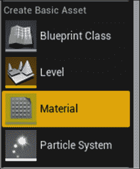
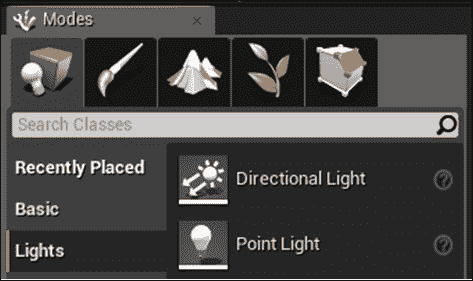
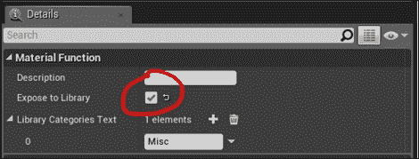
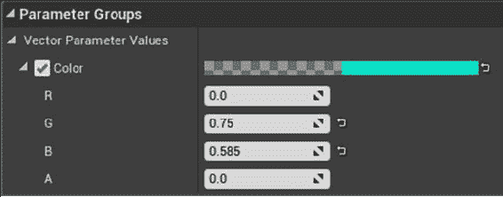
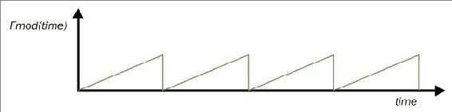
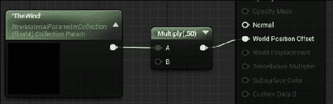
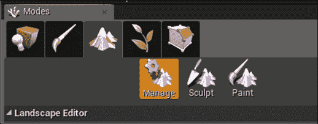

# 十一、自定义材质和着色器

UE4 中的材质定义和创建工具非常棒，更不用说它的实时渲染性能了。当你看到你的第一个闪闪发光的金色着色器时，你会惊讶于 UE4 的材质着色功能，这一点数学是可能的。我们将通过以下配方向您展示如何使用这些工具:

*   Modifying color using a basic material
*   使用材质修改位置
*   通过自定义节点的着色器代码
*   材质功能
*   着色器参数和材质实例
*   微光
*   树叶和风
*   反射率取决于视角
*   随机性-Perlin 噪声
*   遮蔽风景

# 简介

在计算机图形学中，**着色器**用于给某物着色。传统上，着色器被称为 “着色器”，因为它们根据对象的原始颜色和光源位置定义了对象获得的阴影。

如今，着色器并没有真正被认为是为对象提供着色，就像纹理化的最终颜色一样。


### 注意

着色器是关于确定给定光源，几何位置和初始颜色 (包括纹理，以及更昂贵的材质属性) 的对象的最终颜色。

着色器有两种口味: 顶点着色器和像素着色器。

*   **顶点着色器**: 在顶点 (网格中的点) 处着色，并从一个 3 空间点平滑地着色到另一个 3 空间点。
*   **像素着色器**: 像素处的颜色 (屏幕上的点)。使用一些简单的数学计算像素 (又名片段) 的 3 空间物理位置。

在 UE4 中，我们只是将着色器称为材质。材质将顶点和片段处理管道抽象为块可编程功能，因此您不必考虑 GPU 或代码即可获得所需的图形输出。你只是用块和图片来思考。您无需编写**高级着色语言** (**HLSL**) 、**OpenGL 着色语言** (**GLSL**) 一行即可构建材质并构建 GPU 着色功能，或者 Cg (C 表示图形) 代码!

### 提示

您通常会听到三种主要的 GPU 编程语言: HLSL，GLSL 和 Cg。GLSL 是 OpenGL 的 GPU 编程语言，而 HLSL 是微软的产品。在与 90 年代和 21 世纪前十年的流行斗争之后，Cg 诞生了，试图统一所有 GPU 编程。Cg 仍然流行，但 GLSL 和 HLSL 也仍然流行。

# Modifying color using a basic Material

材质的主要用途是使表面以您想要的颜色显示。在你的场景中，你会有光源和表面。表面涂有反射和折射光的材质，然后用相机的眼睛看到。与材质有关的基本事情是修改表面的颜色。

### 提示

不要忽略调整光源以使材质看起来像您希望的那样的重要性!

习惯材质编辑器需要一些练习，但是一旦你习惯了，你就可以用它做一些令人惊奇的事情。在这个食谱中，我们将使用一些非常基本的功能来构造木质纹理材质。

### 提示

纹理与材质: 请记住，纹理和材质这两个术语之间有很大的区别。纹理只是一个图像文件 (例如某些`wood.png`的照片); 另一方面，材质是纹理，颜色和数学公式的组合，用于描述表面在光线下的外观。材质将考虑表面属性，例如颜色吸收，反射率和光泽，而纹理只是一组彩色像素 (或图形处理器称之为纹理)。

着色器的编程就像普通的 C 代码一样，只受到更多限制。您可以选择几种参数类型。其中大部分会是以矢量格式 (`float`、`float2`、`float3`、`float4`) 排列的浮点数或浮点数的包。对于诸如位置和颜色之类的东西，您将使用`float3`或`float4`; 对于诸如纹理坐标之类的东西，您将使用`float2`。

## 准备就绪

你需要一个干净的 UE4 项目，你想把你的新材质放入其中。在 UE4 项目中安装 UE4 市场 (Epic Games Launcher 应用) 中的**GameTexture materals**包。它包含一些我们需要这个食谱的必需纹理。您还需要一块简单的几何图形来显示着色器的结果。

## 怎么做...

1.  To create a basic material, right-click in the **Content Browser,** and create a **Material** (available from the top four Basic Asset elements).

    

2.  命名您的材质 (例如，`GoldenMaterial`)，然后双击它进行编辑。
3.  Welcome to the Material Editor:

    

4.  You can tell it is the Material Editor because of the presence of the Material output node on the right. To the left is a 3D rendered sphere demonstrating what your material looks like. Materials start out as a kind of coal-ish black semi-shiny material. We can adjust all the material parameters, believe it or not, to make anything from a material that emits light like the Sun, to water, or to the texture of a unit's armor. Let us begin by adjusting the output colors of the material to create a gold-colored metallic material.
    1.  Change the **Base Color** to yellow by right-clicking on any blank spot in the Material Editor window and choosing a **Constant3Vector** (which represents an RGB color). Adjust the color by double-clicking on the node and dragging around the value of the color swatches. Connect the output of the Constant3Vector to **Base Color,** and wait for the 3D picture on the left to reload with your new material's appearance. Connect the output of the Constant3Vector to the **Base Color** to give the material a yellow appearance as shown in the following screenshot:

        

    2.  Select a metallicness level for all channels by attaching a constant value to the **Metallic** input, and setting it to 1\. 1 is very metallic, and 0 is not metallic at all (and so will look plasticy, like the material shown in the next screenshot).

        

    3.  为材质选择一个**镜面反射**值，同样在 0 和 1 之间。**镜面**材质有光泽，非镜面材质没有光泽。
    4.  选择材质的**粗糙度**值。**粗糙度**是指镜面高光的散开程度。如果**粗糙度**高 (接近 1.0)，则表面呈粘土状，几乎具有镜面高光。镜面高光在 0.7 或 0.8 的值附近显得又胖又宽。当粗糙度接近 0 时，镜面高光非常尖锐和薄 (极其闪亮/镜面)。

    

    ### 注意

    左边的材质粗糙度 = 0，右边的材质粗糙度 = 1。

5.  通过将材质单击并拖动到要应用于的模型网格上，将材质应用于场景中的对象。或者，在**Details**面板中选择一个模型网格组件，以及按名称创建的新材质。
6.  Finally, create a light in the scene to examine your material's response properties further. Without a light, every material appears black (unless its an emissive material). Add a light via **Modes** | **Lights**.

    

# 使用材质修改位置

不太常见的事情是使用材质来修改对象的位置。这通常在诸如水着色器之类的事情中进行。我们使用材质输出内的**世界位置偏移**节点来完成。


我们可以使用一些 GPU 数学来调节顶点的输出位置。这大大减轻了在 CPU 上渲染逼真的水的负担。

## 准备就绪

在你的世界中创建一个几何体。构造一个名为`Bob`的新着色器，我们将对其进行编辑，以产生用材质渲染的对象的简单摆动运动。

## 怎么做...

1.  在您的新材质 (命名为`Bob`) 中，右键单击并添加**Texcoord**和**时间输入**节点。
2.  Cascade the sum of the **Texcoord** (for spatial) and **Time Input** nodes through a `sin()` function call to create some wavy displacement. Multiply the output of the `sin()` function, and pass as Z-inputs to **World Displacement**.

    

    ### 注意

    `Chapter11`代码中给出的简单水着色器的一部分，产生位移。

3.  Select **PN Triangles** under **Tessellation** | **D3D11Tessellation Mode**, and set **Tessellation Multiplier** in the material to 1.0.

    

### 提示

通常，镜面和半透明不能在 UE4 着色器中组合。但是，Surface Perpixel (实验性，有限功能) 照明模式确实允许您同时启用两者。除了选择此照明模式外，您还必须记住确保在 Stats console 窗口中按```cpp 并键入`r.ForwardLighting 1`。

# 通过自定义节点的着色器代码

如果您更喜欢代码而不是图表块，那么您很幸运。您可以编写自己的 HLSL 代码以部署到 GPU，以对项目中的某些顶点进行着色。我们可以构造**自定义**节点，这些节点只包含在命名变量上工作的数学代码，以执行一些通用计算。在这个食谱中，我们将编写一个自定义的数学函数来使用。

## 准备就绪

你需要一个材质着色器，和一个通用的数学函数来实现。例如，我们将编写一个**自定义**节点，该节点返回所有输入的平方。

## 怎么做...

1.  In order to create a custom material expression, simply right-click anywhere on the canvas, and select **Custom**.

    

2.  选择了新的**自定义**块，转到材质编辑器窗口左侧的**详细信息**面板 (如果未显示**详细信息**面板，请选择**窗口** | **详细信息**)。
3.  在**描述**下，为您的**自定义**块命名。例如，`Square3`，因为我们计划对三个 float 输入进行平方，并返回`float3`。
4.  单击**图标可以多次生成所需的输入。在这种情况下，我们将提供三个浮动输入。**
***   命名每个输入。我们在下面的图表中命名了我们的*x*、*y、*和*z*。要在计算中使用每个输入，您必须将其命名为*   选择输出类型。这里我们选择输出一个`float3`。*   Enter the computation in the **Code** section at the top using the named variables you have created. The code we return here is as follows:

    ```
    return float3( x*x, y*y, z*z );
    ```** 

 **

### 提示

这样做的是构造一个 3-float 向量，并在`x`值中返回*X*的平方，在`y`值中返回*Y*的平方，以及`z`值中*Z*的平方。

要返回向量类型的*X*，*Y*，*Z*分量的不同值，我们必须返回对`float3`或`float4`构造函数的调用。如果你没有返回向量类型，你可以只使用`return`语句 (不调用`float`构造函数)。

## 它是如何工作的…

自定义节点实际上只是 HLSL 代码的一部分。任何有效的 HLSL 代码都可以在代码文本字段中使用。顶点或像素着色器程序中有几个标准输入。这些标准输入已经定义了很长时间，它们是您可以用来更改几何图形渲染方式的参数。


HLSL 和 Cg 具有一个称为语义的概念，它将一种具体的类型附加到浮点数上。这样做是为了使调用着色器的外部程序知道在调用顶点或像素着色程序时将哪个输入放在哪里。

在下面的 Cg 函数签名中，除了是一个`float`变量之外，`inPosition`在语义上是一个`POSITION`类型化变量`inTexcoord`一个`TEXCOORD`类型化变量，而`inColor`一个`COLOR`类型化变量。在着色器中，您可以将变量用于所需的任何内容，语义仅用于将正确的输入路由到正确的变量 (以确保颜色出现在`COLOR`类型的变量中-否则，我们必须做一些事情，比如跟踪参数指定的顺序或什么的!)

函数的输出参数指定如何解释着色器的输出。解释仅适用于程序输出数据的接收者 (渲染管道中的下一步)。在你的着色器程序中，你知道你只是写出一堆浮点数到着色器管道。没有什么可以禁止您在着色器内部混合不同类型的语义。`COLOR`语义变量可以乘以`POSITION`语义输入，如果需要，可以作为`TEXCOORD`语义输出发送出去。

# 材质功能

与往常一样，**模块化**是编程中的最佳实践之一。材质着色器也不例外: 如果您的着色器块是模块化的，并且可以装箱并将其标识为命名函数，那就更好了。这样，不仅您的着色器块更清晰，而且还可以在多个材质着色器中重复使用，甚至可以导出到本地 UE4 库，以备将来在其他项目中使用。

## 准备就绪

可以从自定义材质着色器程序中排除可重用或可重复的着色器功能块。在这个例子中，我们将编写一个简单的函数系列-`Square`，`Square2`，`Square3`和`Square4`-对输入值进行平方。通过打开 UE4 项目并导航到**内容浏览器**，准备执行此食谱中的工作。

## 怎么做...

1.  Right-click in the **Content Browser,** and select **Materials & Textures** | **Material Function**.

    

2.  命名您的**材质功能**`Square`。
3.  双击**材质功能**。
4.  As soon as you open **Material Function**, deselect the **Output Result** node by left-clicking anywhere in the blank canvas space of the Material Editor. Take a look at the **Details** panel, and note that the Function's exposure to the UE4 library is optionally available:

    

5.  当在**材质功能**编辑器屏幕中没有选择节点时，**暴露到库**复选框出现在**详细信息**面板中。
6.  在**材质功能**编辑器的空白处，右键单击，选择**输入**。说出你的输入。请注意，**输入**节点仅在**材质功能**编辑器中可用，而在正常的材质编辑视图中不可用。
7.  从任何常规材质中，通过执行以下操作之一来调用您的函数:
    1.  在空白处单击鼠标右键，选择`MaterialFunction`，然后从下拉菜单中选择您的`MaterialFunction`。
    2.  右键单击并键入您的**材质功能**的名称 (这要求您之前已经公开了您的**材质功能**)。
8.  如果您不想将**材质函数**公开到 UE4 库，那么您必须使用`MaterialFunction`块来调用您的自定义函数。
9.  右键单击**材质功能**编辑器中的任意位置，然后选择**输出**。

## 它是如何工作的…

**材质函数**是您可以创建的一些最有用的块。有了它们，您可以模块化着色器代码，使其更加整洁，紧凑和可重用。

## 还有更多…

将您的功能迁移到着色器库是一个好主意。您可以通过在着色器的根目录中选择**暴露到库**来使您的自定义函数显示在函数库中 (前提是您在材质编辑器窗口中没有选择任何内容)。

在开发**材质功能**时，有时，将材质预览节点更改为输出节点以外的节点是有帮助的。通过右键单击任意节点的输出插孔，然后选择**开始预览节点**，预览特定节点的输出。


材质编辑器左上角的窗口现在将显示您正在预览的节点的输出。此外，文本**预览**将添加到您正在预览的节点 (如果它不是最终输出节点)。确保在材质编辑器顶部的菜单栏中启用**实时预览**。通常，您希望预览最终输出。

# 着色器参数和材质实例

着色器的参数将是该着色器的变量输入。您可以将标量或向量配置为用作着色器的输入参数。UE4 中的某些材质预先编程，并暴露了材质参数。

## 准备就绪

为了为着色器设置参数，您首先需要一个着色器，该着色器具有要使用变量进行修改的内容。使用变量进行修改的一件好事是角色的西装颜色。我们可以将西装的颜色显示为着色器参数，将其乘以西装颜色。

## 怎么做...

1.  构建新材质。
2.  Within the Material, create a `VectorParameter`. Give the parameter a name, such as `Color`. Give it a default value, such as blue or black.

    

3.  关闭材质。
4.  在**内容浏览器**中，右键单击其中包含参数的材质，然后选择**创建材质实例**。
5.  Double-click on your Material instance. Check the box beside your `VectorParameter` name, and voila! Your `VectorParameter` is customizable without further affecting the base functionality of the Material.

    

6.  此外，如果更改材质的基本功能，材质实例将继承这些更改，而无需任何进一步的配置。

## 它是如何工作的…

材质参数允许您编辑发送到材质的变量的值，而无需编辑材质本身。在此外，您还可以很容易地从 C 代码中更改材质实例的值。这对于诸如团队颜色之类的东西很有用。

# �� T0 】 Mica

使用 UE4 材质编辑器中的标准节点可以轻松访问某些着色器功能。你可以想出一些整洁的斑点效果，比如闪闪发光的金色着色器，我们向你展示如何在下面的配方中构建。此食谱的目的是使您熟悉材质编辑器的基本功能，以便您可以学习构建自己的材质着色器。

## 准备就绪

创建一个您想要发光的资产 (如宝箱)，或者打开`Chapter11`的源代码包找到`treasureChest.fbx`模型。

我们要做的是在一定厚度的物体上移动一个平面*W*。当平面越过几何图形时，发射色彩通道被激活，并在宝藏上产生微光效果。

我们公开了几个控制微光的参数，包括**速度**，**周期** (微光之间的时间)，**宽度**，**增益**，**平面方向**，最后，**颜色**。

## 怎么做...

1.  通过右键单击**内容浏览器**并选择**材质**来创建新材质。
2.  Add input parameters to scale time as shown in the following image, pulling in a `Time` input, and making it periodic by calling `Fmod` with the period of time:

    

3.  `Fmod`带周期会使时间遵循锯齿模式。时间读取的值不会增加超过**周期**，因为我们将使用`fmod`操作将其降低到 0。
4.  在单独的文件中提供函数。`OnPlane`函数使用平面方程*Ax By Cz D = 0*来确定输入点是否在平面上。将`LocalPosition`坐标传递到`OnPlane`函数中，以确定在给定的框架中，此部分是否应在几何图形中突出显示发射光。

## 它是如何工作的…

假想的光平面以速度指定的速度通过几何形状，每**周期**秒一次。平面从边界框的角开始，沿**平面方向**指定的方向。飞机总是从盒子的角落开始，当飞机随着时间向前移动时，它将穿过整个体积。

# 树叶和风

在这个配方中，我们将编写一个简单的粒子着色器，演示如何在风中创建叶子。我们可以使用**粒子发射器**结合材质着色器来 “遮光” 我们的叶子，使它们看起来像在风中吹动。


## 准备就绪

首先，您需要一个叶子纹理以及放置落叶的场景。在`Chapter11`代码包中，您会发现一个名为`LeavesAndTree`的场景，其中包含可以使用的落叶树。

## 怎么做...

1.  通过右键单击**内容浏览器**并选择**粒子系统**，创建新的粒子发射器。
2.  通过右键单击**内容浏览器**并选择**材质**来构建新的材质着色器。您的叶子材质应在`BaseColor`组件中包含叶子的纹理。我们将在稍后的步骤中编辑叶子的**世界位置**，以表示由风表示的运动抖动。
3.  添加几个参数来修改 Leaves 粒子发射器:
    1.  **Spawn**应该有一个不错的高比率约 100。
    2.  **初始位置**可以分布在每边 100 个单位的立方体中。
    3.  **寿命**可以是 4-5 秒。
    4.  **初始速度**应该是从 (-50，-50，-100) 到 (25，25，-10) 的范围。
    5.  **初始颜色**可以是分布向量，其值为绿色，黄色和红色。
    6.  **加速度**可以是 (0,0，-20)。
    7.  **初始旋转速率**可以 0.25 (max)。
    8.  可以将**轨道**参数与分布 (0,0，0) 添加到 (0，10，10)。
4.  **风**: 通过右键单击**内容浏览器**中空白处的任意位置，然后选择**新材质参数集合**，创建**材质参数集合** (**MPC**)。
5.  双击以编辑您的新材质参数集，然后输入新参数`TheWind`。给它初始值`(1, 1, 1)`。
6.  在您的级别蓝图 (**蓝图** | **级别蓝图**) 中，创建一个名为`TheWind`的客户端变量。在 CPU 本地更改此变量后，我们将在每个帧中将其发送到 GPU。在事件`BeginPlay`中，将`TheWind`变量初始化为`(1, 1, 1)`。
7.  在事件`Tick`中，根据您的喜好修改风。在我的风的版本中，我将每帧中的风乘以一个随机向量，其值在 [-1,1] 之间。这使风每帧看起来很抖动。
8.  修改风矢量后，立即选择**设置矢量参数值**节点，将风变量更新向下发送到 GPU。**集矢量参数值**必须引用材质参数集合中的变量，因此引用我们在*步骤 4*中创建的材质参数集合中的`TheWind`变量。
9.  Modify `WorldPositionOffset` by some multiple of `TheWind` each frame. Since `TheWind` variable varies slowly, the modification presented in each frame will be a slight variation of the modification presented in the last frame, producing a smooth leaf motion.

    

## 它是如何工作的…

叶子以或多或少恒定的速率落下，并带有额外的轻重力，但是它们被着色器内部不断变化的风矢量拉动。

# 反射率取决于视角

材质的反射率依赖于视角的趋势称为**菲涅耳**效应。从掠射角比从正面角度来看，材质可能更镜面。


### 注意

菲涅耳效应在掠射角处具有大小。由于使用菲涅耳效应，在前面的屏幕截图中看到的这种水材质在掠射角处具有很高的投机性和不透明度。

UE4 具有专门内置的功能来解决此问题。我们将构建一个对半透明性具有视角依赖性的水着色器，以举例说明如何实际使用菲涅耳效果。

## 准备就绪

您需要一个新的着色器，您想在其中添加菲涅耳效果。优选地，根据视角选择您想要看起来有点不同的材质。

## 怎么做...

1.  在材质内部，通过菲涅耳节点的输出驱动通道 (不透明度，镜面或漫射颜色)。
2.  菲涅耳节点的参数指数和基本反射分数可以调整如下:
    1.  **指数**: 描述材质的菲涅耳。这里较高的值夸大了菲涅耳效应。
    2.  **基本反射分数**: 较低的数字夸大了菲涅耳效应。对于 1.0 的值，菲涅耳效应将不会显现。

## 它是如何工作的…

在实现菲涅耳效应的背后有一个公平的数学，但是用它来驱动材质中的一个组件是相当容易的，并且可以帮助你想出一些非常漂亮的材质。

# 随机性-Perlin 噪声

一些着色器受益于使用随机值的能力。每个材质都有几个节点，可以帮助向着色器添加随机性。来自**Perlin**噪声纹理的随机性可用于生成有趣的材质，例如大理石材质。噪声还可以用于驱动凹凸贴图，高度贴图和位移场，以获得一些整洁的效果。

## 准备就绪

选择一种您想要的材质会增加一些随机性。在材质编辑器中打开材质，然后按照步骤操作。

## 怎么做...

1.  将**噪声**节点插入您的材质编辑器窗口。
2.  Normalize the coordinates of the object you're adding the noise to. You can use math such as the following to do so:

    

    1.  从系统中每个处理过的顶点减去最小值，以使对象位于原点。
    2.  将顶点除以对象的大小，以将对象放入单元框中。
    3.  将顶点值乘以 2，将单位框从 1x1 扩展到 2x2。
    4.  从顶点值中减去 1，将单位移动到原点的中心，其值从 *[-1，-1]* 到 *[1,1，1]* 。
3.  选择一个要从中提取噪声的值。请记住，噪声在之间的输入值非常好。在这个范围之外，Perlin 的噪声在缩小时开始出现雪 (因为在你的输入*x*的输出值会有太大的变化)。

## 它是如何工作的…

Perlin 的噪音可以帮助您产生一些美丽的大理石纹理和图案。除了在图形中使用它之外，您还可以使用 Perlin 噪声以自然的方式驱动运动和其他现象。

# 遮蔽风景

景观着色器相对容易构建。它们允许您为称为横向的非常大的自定义几何图形指定多纹理。

## 准备就绪

景观对象非常适合用作游戏世界水平的地面飞机。您可以使用 “景观” 选项卡在同一级别中构建多个景观。通过单击山脉的图片，在**模式**面板中访问景观调色板，如下面的屏幕截图所示:



## 怎么做...

1.  Construct a new Landscape object by clicking on **Modes** | Landscape. Under the **New Landscape** heading, select the **Create New** radio button. You will see a green wireframe overlay proposing the new landscape. You can adjust its size using the **Section Size** and **Sections Per Component** settings.

    ### 提示

    当我们最终纹理时，景观将平铺我们为其选择的纹理**截面尺寸** * **每个组件** * **组件数量**次。如果要减少景观纹理图块的次数，则可以记下此数字-只需将馈送到纹理的 UV 坐标除以前一行中计算的数字即可。

2.  不要单击此对话框中的任何其他内容，因为我们仍然需要构建景观材质。这在以下步骤中进行了概述。
3.  导航到**内容浏览器**，并创建新的素材供您的景观使用。称之为`LandscapeMaterial`。
4.  通过双击它来编辑您的`LandscapeMaterial`。右键单击空白处的任意位置，然后选择一个`LandscapeCoordinate`节点，通过我们将要应用的纹理来馈送 UV 坐标。
    *   为了减少景观上的瓷砖，您需要将`LandscapeCoordinate`节点的输出除以横向的总大小 (**截面大小** * **每个组件的截面** * **组件数量**) (如*中的提示中所述步骤 1*)
5.  在画布中添加一个`LandscapeLayerBlend`节点。将节点的输出引至**基色**层。
6.  单击`LandscapeLayerBlend`节点，然后在**详细信息**选项卡中将元素添加几层。这将允许您使用**纹理绘画**在纹理之间进行融合。命名每个，然后从以下选项中选择混合方法:
    *   按涂漆重量 (磅重量混合)。
    *   由纹理内部的 alpha 值 (LB Alpha Blend)。
    *   按高度 (磅高度混合)。
7.  根据需要为要添加的每个`LandscapeLayer`设置其他参数。
8.  输入纹理，每层景观混合一个。
9.  通过将常量 0 输入添加到镜面输入，将景观的镜面度降低为 0。
10.  保存并关闭你的材质。
11.  立即转到**模式** | 横向选项卡，然后在下拉菜单中选择您新创建的`LandscapeMaterial`。
12.  在**图层**区域下，单击每个可用的景观图层旁边的**图标。为您拥有的每个横向图层创建并保存一个目标图层对象。**
***   最后，向下滚动 “横向” 选项卡，然后单击**创建**按钮。*   单击 “绘画” 选项卡，选择画笔大小和要绘画的纹理，然后开始纹理绘画您的风景。**

 **## 它是如何工作的…

景观材质可以按高度或手工艺术混合，如本配方所示。****