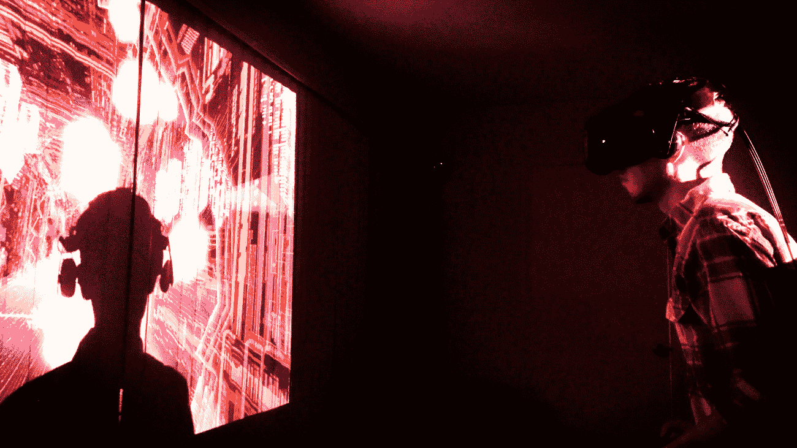
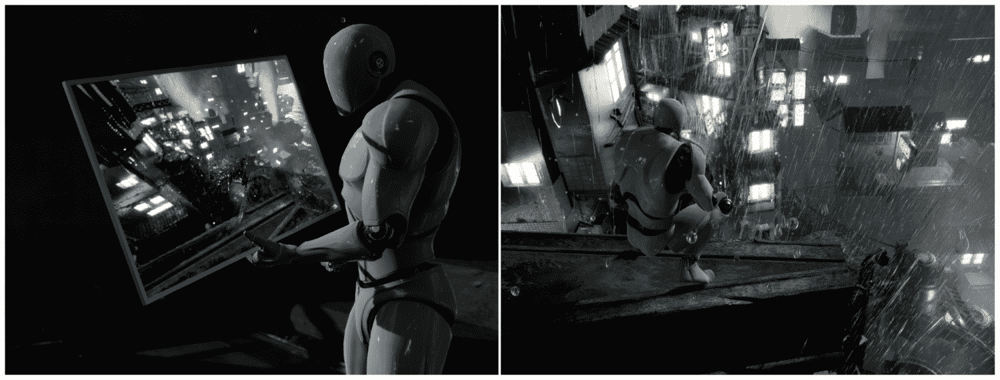
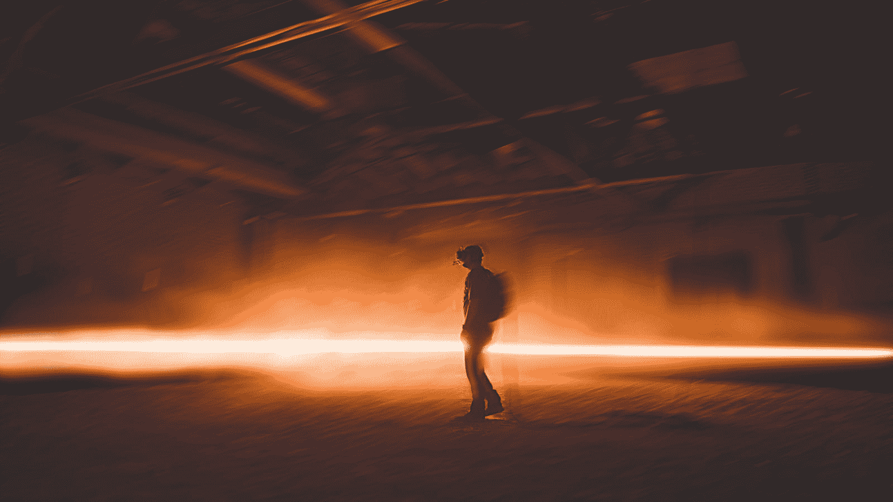

# 虚拟现实中的思考

"All reality is virtual.
That's a strong statement, and it's not obvious if you haven't thought about it before, so I'll say it again—the reality we experience is a construct in our minds, based on highly incomplete data. It generally matches the real world well, which isn't surprising, evolutionarily speaking, but it's not a literal reflection of reality—it's just an inference of the most probable state of the world, given what we know at any one time."
*–* *Michael Abrash, Chief Scientist at Oculus*
"The most important thing about a technology is how it changes people."
– Jaron Lanier, founder of VPL research, VR pioneer, and interdisciplinary scientist at Microsoft Research

欢迎来到虚拟世界。 (它的内部更大。)

在这本书中，我们将探索使用虚幻引擎 4 创建虚拟现实应用、游戏和体验的过程。我们将花一些时间看看什么是虚拟现实，以及我们可以做些什么来有效地为媒体进行设计，然后，我们将从那里开始深入演示这些概念，使用虚拟引擎来制作虚拟现实项目来演示和探索这些技术和想法。

每一章都将围绕一个动手项目展开，从设置开发环境和在 VR 中创建第一个测试应用等基础知识开始，然后深入探讨在 VR 中可以做些什么，以及如何使用虚幻引擎 4 来做到这一点。 在每个项目中，我们将带您完成构建一个在 VR 中演示特定主题的项目的过程，并解释使用的方法，在某些情况下，还会演示一些替代方法。 对我们来说，当你构建这些项目时，你不仅要知道如何做我们描述的事情，还要知道我们为什么要这样做，这一点对我们来说很重要，这样你就可以把你学到的东西作为一个发射台来计划和执行你自己的工作。

在第一章中，我们将看看什么是虚拟现实，以及它目前在众多领域中的几种应用方式。 我们将讨论 VR 中最重要的两个概念：**沉浸**和**呈现**，了解它们是什么以及它们是如何工作的将如何帮助您为用户提供更好的体验。 我们将列出开发身临其境、引人入胜的虚拟现实体验的最佳实践，并讨论虚拟现实发展带来的一些独特挑战。 最后，我们将把这些知识汇集在一起，挖掘一种规划和执行 VR 项目设计的方法。

简而言之，本章将带我们了解以下主题：

*   什么是虚拟现实？
*   我们在虚拟现实中能做些什么？
*   身临其境、身临其境
*   虚拟现实的最佳实践
*   规划您的 VR 项目

# 什么是虚拟现实？

让我们从头开始，谈谈虚拟现实本身。 在最基本的层面上，VR 是一种将用户沉浸在模拟世界中的媒介，允许他们看到、听到并与这个环境中实际不存在于他们周围的物理世界中的东西进行互动。 用户完全被这种体验包围着，VR 开发者称之为*沉浸*。 沉浸在空间中的用户可以环顾四周，经常移动和互动，而不会打破他们真的在那里的错觉。 正如我们将很快看到的那样，沉浸是 VR 工作方式的基础。

Rob Ruud testing an early build of Ludicrous Speed using an HTC Vive headset Immersion in VR is a term used to describe a VR system's ability to surround the user with the simulated world. They can look around and, in many cases, move and interact as though they were really there, and because the actual environment is blocked out by the headset, they're given few conflicting cues to remind them that they aren't.

# 虚拟现实硬件

最常见的让用户沉浸其中的方式，也是我们将在本书中讨论的，是通过使用**头戴式显示器**(**HMD**)，通常简称为**头戴式耳机**。 (例如，还有其他的 VR 方法--在墙上投射图像，但在这本书中，我们重点介绍的是头戴式 VR。)。 用户的耳机显示虚拟世界，并跟踪他们头部的移动来旋转和移动视图，以创造出他们实际上正在环顾周围并在物理空间中移动的错觉。 有些耳机(虽然不是所有耳机)都包括耳机，通过一种称为**空间化音频**的过程，使环境中的声音听起来就像来自虚拟世界中的来源一样，从而增加了错觉。

You'll see the terms **HMD** and **headset** used interchangeably throughout this book and in other writing on VR. They all refer to the same thing.

一些耳机只跟踪用户看的方向，而另一些耳机也可以跟踪用户位置的变化。 如果你使用的耳机可以跟踪旋转，但不跟踪位置，并且你身体前倾，试图更近距离地观察一个物体，那么什么都不会发生。 当你试着向它靠近时，这个物体看起来好像正在远离你。 如果你也在追踪位置的头戴式耳机上这样做，你的虚拟头部将会移动到更靠近物体的位置。 我们用术语**自由度**和(**DoF**)来描述物体在空间中移动的方式。 (是的，可以把它读成*Doff*。 所有的开发人员都这样做。)。 请看以下几点：

*   **3 自由度**：跟踪旋转但不跟踪位置的设备通常称为 3 自由度设备，因为它只跟踪描述旋转的三个自由度：即设备向一侧倾斜的程度(**滚**)、向前倾斜(**俯仰**)或侧转(**偏转**)。 直到最近，所有的移动 VR 头盔都是 3DoF 设备，因为它们使用**惯性测量单元**(**IMUS**)，类似于手机中的那些设备来检测旋转，但无法知道它们在太空中的位置。 Oculus Go 和 Samsung Gear 耳机就是 3DoF 设备的例子。

*   **6DOF**：跟踪位置和旋转的设备是 6DoF 智能设备，因为它不仅可以跟踪所有六个自由度-滚动、俯仰和偏航，还可以跟踪上下、左右和向前或向后移动。 追踪物体在空间中的位置要求你有一个固定的参考点，你可以从这个参考点来描述它的运动。 为此，大多数第一代系统都需要额外的硬件。 HTC Vive 的灯塔基站或 Oculus Rift 的星座相机在桌面系统上提供这种定位跟踪。 Windows 混合现实耳机和独立耳机(如 Oculus Quest 和 Vive Focus)使用耳麦上的摄像头阵列来跟踪耳麦在房间中的位置(我们称之为**由内向外****跟踪**)，因此它们不需要外部摄像头或基站。 HTC Vive、Oculus Rift、HTC Vive Focus、Oculus Quest 和 Windows 混合现实耳机都是 6DoF 设备。

3DoF devices track rotation only, so users can look around or point, but can't move from side-to-side. 6DoF devices track position as well as rotation, so users can not only look around, but can move as well.

耳机可以系在电脑上-Oculus Rift 和 HTC Vive 就是这种情况，它允许连接的 PC 的全部计算能力来驱动视觉效果-或者它们可以是独立的设备，如 Samsung Gear、Oculus Go、Oculus Quest 和 HTC Vive Focus。 在撰写本文时，个人电脑和 VR 头戴式耳机之间的无线连接已经开始进入市场。

大多数耳机还配有输入设备，允许用户与世界互动，这些设备可以充当指针或手。 手持设备和头戴式耳机一样，可以三到六个自由度进行跟踪。 3DoF 设备，如 Oculus Go 的控制器，本质上是指针-用户可以瞄准它们，但无法伸手拿东西。 6DoF 设备的行为更像虚拟手，允许用户以更多样的方式与世界互动。

# 不过，虚拟现实不仅仅与硬件有关

许多新开发人员在第一次接触 VR 时犯的一个主要错误是，他们试图将他们习惯于在 2D 空间中创建的传统设计应用到 VR 空间，但在大多数情况下，这是行不通的。 VR 是它自己的媒介，它不遵循与之前的媒体相同的规则。 花点时间来看看这意味着什么是值得的。

当大多数人第一次考虑 VR 时，他们看到耳机，认为它主要是一种视觉体验-传统的平板媒体以立体声显示。 看起来是这样，这是可以理解的，但他们的看法没有抓住要点。 是的，VR 头戴式耳机(取决于它是否包括集成音频)主要或完全是一种显示设备，但它为用户创造的体验与传统平板电视创造的体验截然不同。

让我们想象一下，你正看着一张照片或一段 2D 视频，俯瞰着一座高楼的边缘。 你可以看到下面很远的街道，但它们并不真的让*感觉*，好像它们在你下面很远。它们只是在图像中很小。 拍下同样的照片，但现在通过 VR 耳机以立体声呈现，你可能会感到眩晕。 这是为什么？ 请看下面的屏幕截图：

Non-immersive media, no matter how large or detailed, still leaves the viewer surrounded by reminders that the scene isn't real. Immersive media, on the other hand, seems to surround the user completely. (Scene: Soul:City Environment Pack, by Epic Games)

首先，正如我们刚才提到的，你*沉浸在*体验中，周围世界没有其他东西提醒你它不是真的。 让我们回到前面的例子-电视上的建筑边缘-转过身来看你身后。 噢。 你就在你的起居室里。 即使你直接看着它，你可能买到的最大的电视机仍然会给你留下大量的周边视觉，提醒你你在那里看到的不是真的。 平板屏幕上的一切，甚至 3D 屏幕，都发生在窗口的另一边。 你在看，但你并不是真的在那里。 在 VR 中，窗口不见了。 当你向右看时，世界还在那里。 看看你的身后，你还在里面。 你的感知完全被一种体验所取代，这种体验已经变成了一种环境，而不仅仅是你正在看的一个框架。

其次，立体图像创造了一种真实的深度感。 你可以看到价格下跌的真正程度。 下面街道上的汽车不仅很小，而且很远。 在支持运动跟踪的 6DoF 耳机中，您在现实世界中的动作会反映在虚拟世界中。 你可以从边上探出身子，也可以后退一步。 这种沉浸、真实的深度感知和对运动的自然反应的混合体结合在一起，让你的身体相信你所感知的是真实的。 我们称这种现象为*存在*，这是一种主要由身体体验的感觉。

*Presence* in VR refers to the user feeling that they're actually physically in the virtual world, responding to the environment as though they were really there and experiencing these things. Creating an experience of presence is what VR is all about—this is the major thing it can do that other media can't.

沉浸的机制和由此产生的临场感是 VR 独一无二的。 没有其他媒介可以做到这一点。

When reading about VR, you'll sometimes see the terms *p**resence* and *immersion* used interchangeably, but it's generally more clear to think about *presence* as the goal—the sensation you're trying to create in the user, and *immersion* as the mechanism by which we achieve it.

# 身临其境是很难做到的

当我们谈到临场感的话题时，值得指出的是，这是一个脆弱的现象，VR 技术的现状仍然面临着一些挑战，要完全、可靠地创造临场感。其中一些挑战植根于硬件，几乎可以肯定会随着技术的进步而消失。 例如，用户可以感觉到耳机戴在他们的脸上，在有线耳机上，他们可以感觉到电缆从耳机上延伸出来。 当前一代耳机提供的视野太窄，无法提供外围视野。 (台式设备提供 110°的视野，但与此同时，你的眼睛可以感知到两倍宽的视野。)。 显示器分辨率还不够高，无法让用户看到单独的像素(VR 用户称其为**屏蔽门**效果)，如果它们没有完全对准，挑剔的光学装置会使用户的视力变得模糊。 这意味着，在实践中，很难在 VR 头戴式耳机上阅读小文字，而且当用户不得不调整它以回到镜头的*最佳位置*时，有时会提醒他们硬件。

不过，从目前的情况来看，很明显，这些硬件挑战不会永远持续下去。 独立式和无线耳机正在迅速进入市场，跟踪越来越可靠，不再依赖外部设备。 显示器变得越来越宽，分辨率越来越高，光波导在更宽聚焦区域的更轻显示器方面显示出巨大的希望。 VR 已经运行得非常好了，很容易看出它将如何继续改进。

还有其他一些事情可能会破坏我们的存在，但我们对此无能为力-例如，不小心用控制器撞到了桌子，或者撞到了家具，失去了跟踪，或者听到了体验之外的声音。 当我们能够控制用户的空间时，我们可以管理这些内容，但在我们无法控制的地方，我们所能做的并不多。

然而，即使考虑到这些限制，想想当前一代的 VR 能在用户中创造出多么深刻的临场感，并意识到它只会从现在开始变得更好。 用户在一定程度上相信他们在 VR 中的体验，这在其他媒体上是不可能发生的。 他们探索和学习的方式是任何其他方式都不可能的。 除了身临其境之外，他们与人和地方的共鸣和联系比任何方式都要深入。 没有比这更深入的了。 我们才刚刚开始。

# 我们在虚拟现实中能做些什么？

那么，我们能用 VR 做些什么呢？ 让我们来探讨一下这一点，但在开始之前，值得指出的是，这种媒体仍处于初级阶段。 在写这篇文章的时候，我们正在使用第一代消费类 VR 硬件，绝大多数人甚至还没有见过 VR 头盔，更不用说体验过了。 试试这个：下次你在餐厅或公共场所时，问问自己，你周围的人中可能有多少人见过 VR 头盔--充其量只有几个。 现在，他们中有多少人看过电影(百年历史的媒体)，看过电视(四分之三个世纪)，或者玩过电子游戏(不到半个世纪)？ 虚拟现实是一种全新的技术。 我们还没有发现我们能用它做的一切。

考虑到这一点，将这些想法作为当前事物状态的地图和一些想法的素材，但要意识到还有更多我们甚至还没有想过的东西。 为什么你不应该成为那个发现新事物的人呢？

# 虚拟现实中的游戏

正如我们刚才讨论的，VR 的核心是创造一种身临其境的体验。 如果你正在为 VR 开发游戏，这意味着专注于让玩家体验*在一个地方的*的设计是很好的媒介。*Skyrim VR*和*Fallout 4 VR*可以很好地让玩家感觉自己真的置身于这些广阔的世界中。类似*Myst*的游戏也能很好地让玩家进入一个他们可以探索和操纵的空间。

通过添加运动控制器来模拟手(如 HTC Vive、Oculus Rift 和 Oculus Quest 附带的运动控制器)，开发人员可以创建具有复杂交互的模拟，例如*Job Simulator*和*Vinyl Reality*，这是使用传统游戏控制器无法实现的。 与此同时，嫩爪的虚拟现实*虚拟现实*提供了一个很好的例子，可以用 Oculus Go 的 3DoF 控制器实现类似 6DoF 的控制。

VR 的身临其境意味着让你身临其境的游戏，比如*太空海盗训练师*，效果很好，因为玩家可以与周围的演员互动，而不仅仅是前面的东西。 这种观察周围环境的需求可以成为你设计的重点。

在玩家身上唤起的动感 VR 将像*Thumper*和*LUDICLISH Speed*这样快速移动的游戏变成了令人着迷的身体体验，而像*击败 Saber*这样的游戏也利用玩家的身体动作将游戏变成了一种健身工具。

不过，虚拟现实中的游戏也带来了一些挑战。 这种在场和身体运动的体验让这种体验如此引人入胜，这可能意味着并不是每一款游戏设计都是 VR 的最佳候选者。 简单地将 2D 游戏移植到 VR 中不太可能奏效。 在 2D 空间中放置在场景上方的**平视显示仪**(通常缩写为**H****UD**)在 VR 中不起作用，因为没有 2D 平面可供放置该平视显示仪(通常缩写为**H****UD**)。 在 2D 模式下完全没有问题的快速动作，可能会让玩家在 VR 中晕动症。 为虚拟现实制作游戏的决定需要是一个有意识的选择，你需要在设计时考虑到媒体的长处和挑战。

When thinking about moving a game or a game design from 2D into VR, there are a few specific areas that need to be considered: will the movement scheme work in VR? How can the UI be designed to fit into the world in VR? Will the game fit within the performance constraints of VR? Does putting this game into VR improve the experience of playing it? We'll address all of these considerations—movement, UI, and performance, in later chapters.

# 交互式 VR

交互式 VR 体验不仅限于游戏。 3D 绘画应用，如*Tilt Brush*，允许用户在房间大小的 3D 中雕刻和绘画，并与其他用户共享他们的创作。 *Google Earth VR*允许用户探索地球，其中大部分是 3D 形式的。 互动讲故事体验，如*Colosse*、*Allumette*、*Coco VR*等，让用户沉浸在故事中，让他们与世界和人物互动。 交互式 VR 应用和体验可以为生产或娱乐而构建，可以采用几乎任何可以想象到的形式。

在考虑创建交互式 VR 应用时，有几点值得牢记。 在 VR 中，用户通常不能使用鼠标和键盘-他们看不到这些设备来使用它们，所以交互通常最好围绕 VR 系统提供的控制器进行设计。 VR 中的文本可能很难阅读--显示器的分辨率正在提高，但分辨率仍然很低，小文本可能无法阅读。 缺少 2D HUD 意味着传统菜单不容易使用--通常，这些菜单需要内置到世界中或附加到玩家的虚拟手中(参见*Tilt Brush*就是一个很好的例子。)

Input and output are the main considerations for interactive VR—how will the user communicate input to the system, and how do they get information back out of it? In both cases, you have to design around the strengths and weaknesses of the system. You don't have a 2D HUD or a mouse, but you do have objects that can be moved and manipulated in space. VR displays can't yet approach the resolution of a desktop monitor, so reading a lot of text may not work. Successful designs in VR take these factors into account and turn them into deliberate design choices.

交互式 VR 为全新的探索和互动方式提供了难以置信的可能性，很可能我们还没有开始看到所有的可能性。

# VR 影院-包括电影、纪录片和新闻

VR 非常适合某些类型的游戏，同样的临场体验也使其成为纪录片和新闻应用的强大媒介。 VR 能够让用户沉浸在一种环境或环境中，通过让观众深度分享体验来唤起他们的共鸣。VR 电影先驱克里斯·米尔克(Chris Milk)曾将 VR 称为“*终极同理心机器*”，我们认为这是一个公平的描述。 亚历杭德罗·伊纳里多(Alejandro Iñárritu)的*卡恩·y 竞技场(Carne Y Arena)*在 2017 年被美国电影艺术与科学学院(Academy Of Motion Picture Arts And Sciences)授予特别奥斯卡奖，以表彰其对媒体的强大使用，以讲述一个充满同情心的故事。 VR 通过沉浸创造存在的能力，使平板屏幕上无法实现的事情成为可能。

A player experiencing Alejandro Iñárritu's *CARNE y ARENA at Los Angeles County Museum of Art*

VR 中的电影和视频可以通过几种方式呈现，这些方式通常归结为呈现图像的虚拟屏幕的形状，以及这些图像是以单视 2D 还是立体 3D 呈现的。 平面或曲面通常用来呈现从传统电影或电视带来的媒体，而圆顶、全景或球体可以用来让观众获得更身临其境的 2D 或 3D 体验。

单声道 360°视频围绕着观看者，但缺乏深度-它只是简单地映射到播放器周围的球体上。 它的优点是更容易制作，需要更少的存储和更便宜的设备，对于许多场景来说，这与真正的立体声之间的区别可能很难察觉。 大多数早期的 VR 视频都是这样制作的。 立体-360°视频类似地映射到播放器周围的球体(我们将在后面的章节中学习如何做到这一点)，但会为每只眼睛显示不同的图像，以获得真正的立体深度。 (我们也将学习如何做到这一点。)在使用光场的体积视频的新方法中，**光检测和测距**(**LIDAR**)和摄影测量学将真实环境映射到真正的 3D 虚拟环境，并且随着技术的成熟和处理能力的增强，这些方法可能会变得更加普遍。 在撰写本文时，它们仍然是相当新的，通常很昂贵，而且在很大程度上仍然局限于高端专业人士和学者的领域。

纪录片和新闻作品最常被拍摄为在 360°摄像机或钻机上拍摄的真人视频，以单声道或越来越多的立体声拍摄，使观众能够环顾四周，沉浸在无缝的感官环境中。 360°影院通常旨在提供直接、身临其境和引人入胜的体验，但通常不是交互式的。 观众通常不能在场景中自由移动，除非触发到新场景的剪辑，并且通常不能影响场景内发生的事件。

In planning a cinematic VR experience, two of the primary choices to make are the following: will the experience be presented in mono or stereo, and what's the shape of the virtual screen on which it will be displayed?

电影虚拟现实是另一个仅仅移植平板屏幕的语言是不够的领域。 360°胶片中没有帧的概念，也没有特写镜头或长镜头等镜头大小的概念。 VR 电影制片人在移动摄像机时必须非常小心，因为移动或摇晃的摄像机很容易让观众生病。VR 电影制作仍处于初级阶段，我们正在开始学习这种语言的语法与传统电影或电视的不同之处，但在我们完全理解新媒体的语言之前，我们还有很长的路要走。

这并没有阻止亚历杭德罗·因纳里图(Alejandro Innaritu)、诺尼·德拉佩纳(Nonny De La Pena)、克里斯·米尔克(Chris Milk)、费利克斯和保罗(Felix And Paul)等电影制作人在 VR 中创造惊人而强大的电影体验，这突显了参与创造和发现一种强大而全新的艺术形式是多么令人兴奋的时刻。

VR 影院的变体包括以下几种：

*   叙事性故事
*   文件的 / 文件组成的 / 纪实的 / 记录的
*   新闻工作 / 新闻业 / 报章杂志 / 新闻报道
*   音乐会和活动
*   运动 / 运动会
*   虚拟旅游

# 建筑、工程和建筑(AEC)和房地产

VR 非常适合**建筑**、**工程**和**建筑**(**AEC**)规划，因为它允许设计师探索和快速迭代设计，并且它是设计师和客户之间出色的沟通工具。 VR 提供了一种身临其境的体验，允许用户以一种通过任何其他媒体都不可能实现的方式，在真实世界的尺度上探索和审查空间。

The **Architecture, Engineering, and Construction** industries are often bundled under the blanket initialism **AEC**.

出于同样的原因，VR 对于 AEC 来说是如此有用的工具，它对房地产应用也同样有用，为潜在买家提供了远程参观房屋的机会，或者在房屋建成前体验空间。 没有一种媒介能比 VR 更好地代表空间和尺度。

正如我们将看到的，虚幻引擎特别适合建筑应用，因为它基于物理的材质和照明工作流程使创建看起来真实的曲面以及对光线的响应成为可能，就像现实世界中的同行一样。

除了提供一个逼真的照明和着色模型，非常适合于逼真地表示空间，Epic Games(虚幻引擎的制造商)还提供了一套专为建筑可视化等非游戏用途设计的工具。 其中最重要的是名为*Datasmith，*的工具包，它允许将高细节场景从建筑**计算机辅助设计**(**CAD**)和 3D 包导入到虚幻中，几乎不需要修改即可从原始源复制对象放置、照明和着色。

**Architectural visualization** is often shortened to **archvis** or **archviz**.

就实际工作流程而言，VR 的工程和架构环境通常从 CAD 或 3D**数字内容创建**(**DCC**)工具开始，然后手动或通过使用 Datasmith 工作流将其带入虚幻，在那里它可以成为一个可以在 VR 中探索的环境。

对于房地产应用，环境可以完全以 3D 建模，或者可以拍摄成 360°球体或全景图，提供的交互性较少，但制作起来要容易得多，成本也低得多。尽管 360°摄影限制了用户的移动，但它仍然可以提供用户否则无法体验的身临其境的空间感。

# 工程与设计

与建筑规划一样，VR 对于工程和其他设计应用来说也是一个非常有效的工具。 设计可以在不需要构建物理原型的情况下进行深入测试和快速迭代，并可以放置在允许在上下文中进行评估的虚拟环境中。 设计师可以使用 VR 探索设计，了解部件如何装配在一起，并与利益相关者进行交流，体验与实际操作对象和与对象互动的体验紧密复制。

# 教育和培训

可以说，VR 在教育领域的应用始于 1929 年，当时埃德温·林克(Edwin Link)发明了 Link 教练机，使用早期的沉浸式模拟器培训飞机飞行员。 沉浸式和交互性的结合使 VR 成为教育、学习和探索的有力工具。 VR 的核心是能够提供比其他媒体更具体、更体验式的主题理解。 在大多数其他媒体交流思想的地方，虚拟现实传达的是直接的体验。

传统教育通常侧重于向学生传达事实，但如果他们还没有足够的背景来了解他们最初需要这些事实的原因，孤立的事实会让他们感到厌烦或不知所措。 相比之下，虚拟现实可以让学生通过直接使用材料和他们正在探索和学习的想法的表达，练习真实的技能，将抽象的想法转化为经验，从而发现和学习概念。 情境是沉浸的自然副产品，而 VR 唤起临场感的能力可以帮助为正在学习的学科创造一个物理、社会或情感框架。 这可能会使学生以其他方式可能无法理解的方式，使其具有潜在的意义或可理解性，并可以让学生探索复杂系统的各个部分如何组装在一起。

VR 还可以帮助集中注意力，因为它可以将学生的感官从不属于正在探索的主题的干扰中隔离出来，并且可以有效地创建虚拟社交学习环境，比如虚拟教室。

教育虚拟现实可以(也应该)易于使用、身临其境、引人入胜，对学生有意义，可以让学生按照自己的节奏学习，并利用其互动来推动他们自己的探索和发现。

# 商业、广告和零售业

商务中的 VR(昵称**v-Commerce**，有时用来描述它)为客户提供了一系列新的产品体验方式，并可以创造机会，将客户与他们原本可能从未遇到过的产品联系起来。例如，汽车购买者可以在虚拟汽车配置器中探索颜色选择和选项，让他们体验他们选择的选项在他们周围的外观和感觉。 这种体验也有助于将一件令人向往的购买从想象中转移到让人感觉真实的领域。

对于零售商来说，VR 提供了一种接触不到商店的客户的方式，增加了可及性和销售可能性。 客户可以更清楚地、更清楚地了解产品是什么，从而减少混淆和退货。 虚拟现实可以让客户在购买之前有机会尝试*，即使产品可能太大、太远或太复杂，无法通过其他方式进行有效演示。 例如，虚拟陈列室可以让客户将家具放在一起，进入一个虚拟环境，让他们看到这些家具如何放在一起，以及它们可能如何放在自己的空间里。*

VR 还可以用来促进与品牌的情感联系，将客户置于支持品牌情感空间的虚拟环境或体验中，比如山顶或时装秀。

# 医学与心理健康

VR 在心理学、医学、神经科学以及物理和职业治疗方面也提供了很有前途的机会。 例如，VR 可以通过*减慢时间*并允许患者缓慢和重复地执行动作来用于物理治疗，并已成功地用于疼痛管理。此外，VR 还可用于提供模拟虚拟患者进行医疗和急救培训。

在心理和行为健康领域，虚拟现实在评估、训练和治疗应激相关疾病方面有着强大的应用。 患者可以暴露在复杂的刺激下，以帮助评估和恢复中风、创伤性脑损伤和类似的神经疾病的认知功能。

# 还有很多其他的

贯穿 VR 所有用途的一条主线是，VR 在通过在场传达背景和创造意义方面工作得特别好，并允许与平板屏幕无法完成的复杂物理交互。 毫无疑问，VR 还有更有价值的用途尚未被发现或考虑。 唯一的限制是我们自己的想象力。

# 身临其境、身临其境

现在我们已经设置了一些关于 VR 是什么的背景，以及我们可以用它做的许多事情中的一些。 让我们开始动手吧，学习以下几点：

*   是什么让 VR 发挥作用
*   什么能打碎它？
*   作为开发人员，我们需要做些什么来确保我们构建的 VR 体验取得成功

为此，让我们列出几个 VR 领域的最佳实践，然后我们将深入讨论它们。

我们将从谈论我们试图创造的体验开始。

# 浸泡 / 沉浸 / 陷入 / 专心

正如我们前面讨论的，当 VR 工作时，它通过一个我们称为**沉浸**的过程工作，我们早先将其描述为一种物理存在于虚拟世界中的感知体验。 要想获得身临其境的体验，有几件事需要是真的。

# 运用所有感官

首先，它必须涵盖足够广泛的用户感官，这样来自 VR 体验之外的相互竞争的感官不会把用户拉回虚拟空间。 在实践中，这就是为什么 VR 耳机被设计成屏蔽所有其他光线的原因，也是为什么它们通常包括耳机或车载音频的原因。 我们看到或听到的任何不是 VR 体验一部分的东西都有可能打破沉浸。

虽然视觉和声音很容易通过眼睛和耳朵交流，但身体感觉更难产生。 在 VR 中，我们将物理感觉称为**触觉**。几十年来，人们一直在研究如何重现物理感觉，但在实践中，这是一个很难解决的问题。 在当前一代的 VR 硬件中，触觉在玩家的控制器中采用隆隆包的形式，在提示下震动控制器。 虽然它仅限于握住控制器的手，但即使在你的设计中使用这样的基本触觉反馈，在虚拟空间中创造一种物理感仍然令人惊讶地有效。 当用户的虚拟手接触到物体时，轻微的振动可以很大程度上让物体感觉就像它在物理上一样，并让用户感觉到它的边界，并知道他们何时接触到了它。

Remember to use all the senses to create an immersive experience, not just the visual. Use sound to involve the ears in the experience and haptic feedback on the controllers to create physical cues.

# 确保感官输入彼此匹配，并符合用户的期望

感官需要与用户的期望相匹配，它们需要相互匹配，才能获得身临其境的体验才能感觉真实。 当用户转过头时，他们正在查看的对象应该会在他们的视图中移动，就像它在他们周围的物理世界中一样。 虚幻引擎和你的 VR 硬件已经很好地处理了这一部分，但接下来的部分，声音，往往被开发人员忽视了。

产生声音的对象应该使用**空间化音频**来确保声音似乎来自对象所在的位置。 正如我们刚才提到的，当用户似乎触摸到物理对象时，应该使用触觉反馈来产生触觉反应。

The behavior of visual objects is pretty much taken care of for you by the HMD and Unreal Engine, but make sure you use spatialized audio to localize sounds to their apparent sources, and experiment with haptic feedback to make physical actions feel more real.

# 将延迟保持在尽可能低的水平

视觉和听觉体验的质量对沉浸非常重要，而推动这种质量的绝对最重要的因素是体验的流畅性和响应性。 这对开发人员来说意味着，在 VR 中，帧率比其他所有考虑因素都重要。 VR 开发人员使用术语**延迟**来描述 VR 应用的响应性-用户执行一个动作(如转头)和看到视觉结果(在这种情况下，世界似乎围绕着他们旋转)之间的时间。 开发人员将这种**运动到光子**称为时间，这一点很重要。 如果用户转过头来，世界落后了，它就不会有真实感，更糟糕的是，会让他们生病。 目前的 VR 头盔在硬件和软件上都做了相当多的工作来最小化和伪装延迟，但作为一名开发者，你也必须做很多事情来尽可能地保持低延迟。

*Latency* refers to the speed at which a VR application responds visually to the user's actions and is fundamental to immersion in VR. Research suggests that the absolute highest latency you can get away with is 20 milliseconds, but you should be shooting for far less.

实际上，这意味着，当您必须在场景细节和帧速率之间进行选择时(作为开发人员，您必须一直做出选择)，请选择速度。 用户会更容易原谅分辨率较低的纹理，而不会原谅丢失的帧。 你在 VR 开发方面的大部分工作将集中在让你的场景以可接受的帧速率运行，我们将会谈到如何在虚幻中做到这一点。 现在，一定要记住这一点：保持低延迟绝对是沉浸在 VR 中的基础，你在设计和开发 VR 应用时做出的选择必须牢记这一点。

When faced with a choice between image quality and framerate, choose framerate every time. Beautiful textures, high-poly models, and dynamic shadows won't create a convincing experience for the user if they're dropping frames. Users will fill in a remarkable amount of detail in their own minds, meanwhile, if the experience is running smoothly, while they won't believe it at all, or worse, will get sick if latency gets too high.

# 确保与世界的互动是有意义的

与对象的交互应该是一致的，并且它们应该是有意义的。 随着 VR 的身临其境的特性，人们越来越期待物体会像在现实生活中一样表现。在传统媒体上，通过平板屏幕传输，并限制在一个框架内，用户的眼睛和大脑不断被提醒，他们看到的是不真实的平面图像，他们会原谅很多人。 但在虚拟现实中，世界已经围绕着他们，看起来是真实的，他们会期待它表现得就像它也是真实的一样。

那些在现实世界中表现或反应不同的东西可能会让用户脱离体验，打破沉浸感。 实践是有限度的：当然，你不能让世界上的每个物体都互动，但在可能的程度上，你应该关注你的用户的期望是什么，并努力满足它们。 如果你把一个看起来可以捡起来的物体放在场景中，预计用户会试着把它捡起来，并明白如果它的行为不像他们想象的那样，你就是在与沉浸感作对。 尽量让场景中那些看起来像交互的对象和*交互的对象是*交互的，如果做不到，可以考虑把它们移出游戏区，或者改变它们的外观来管理用户的期望。 这是判断力发挥作用的另一个领域--不是每件事都可以是互动的，你可能也不总是希望它是互动的，这取决于你试图创造的体验类型。 在决定世界中的物体应该如何行为时，你应该在头脑中有意识地做出选择，这些选择应该感觉彼此一致，在世界空间内，而不是武断的。

Users will try to reach out and touch objects that look as if they can be touched and will try to move them. Try to satisfy their expectations where you can, or design your scene in such a way that these interactions aren't expected.

探索 VR，特别是带手控器的 6DoF VR 为您提供的独特互动机会。 在以前的媒体中，用户大多使用鼠标、按钮和操纵杆进行互动，但在 VR 中，用户的手与世界的互动要直接得多，这使得一系列全新的互动成为可能。 在传统游戏中，可以通过按下按钮来使用喷水器，而在 VR 中，用户可以挤压控制器手柄来拿起它，然后翻转手来使用它。 想一想在你的世界里什么是有意义的，当用户的手进入图片时，什么会成为可能，并设计如何利用这些机会。 界面不再需要只由按钮组成。

用户对交互的期望将根据您所创建的体验类型而有所不同。 如果你正在制作一款模拟身处另一个世界的游戏，沉浸非常重要。 另一方面，如果你正在制作电影观众，用户可能并不真的在乎附近桌子上的虚拟咖啡杯是否能被捡起来，因为这不是他们去那里的目的。 这取决于您是否理解什么对您的用户重要，什么对您的用户无关紧要，并满足这些期望。

您表示用户的手的方式也将推动人们对它们的行为方式的预期。 如果他们被建模为手，用户可能会自然地期望他们可以拿起物体并四处移动。 如果显示的不是手，而是控制器、调色板、武器或其他工具的模型，那么您建议的是一种不同类型的交互。 用户会尝试做他们看起来能做的事情。

# 建设一个始终如一的世界

正如我们在前面关于交互的讨论中提到的，整个体验应该是有意义的，因为它适合在一起。 用户应该能够从你在世界上给他们的东西中构建一个现实的模型，即使它是一个抽象的或完全的幻想。 你正在建造的地方应该感觉像一个地方，有自己的语言和规则。

你在你的世界里投入的细节会在这里产生影响。 体验越身临其境，沉浸感就变得越脆弱。加入细节和身临其境的元素会提高人们的期望值，认为世界上的其他一切也会达到这一标准，如果某些东西的行为不符合表面上的世界规则，就会把用户从沉浸感中拉出来。 在许多情况下，您可能希望以一种更具风格化的方式呈现您的世界，以管理用户的期望。 沉浸式体验并不要求 VR 体验完美地反映真实世界-它需要体验与自身保持一致。

# 注意不要与用户的身体意识相矛盾

注意添加与玩家对身体的感知相矛盾的身临其境的元素。 我们都有一种自然的意识，知道我们的身体在哪里，它在做什么。 这被称为**本体感觉**，即使你不看胳膊和腿，这种感觉也能告诉你它们在哪里。 用不符合这种感觉的方式表现用户的身体可能会打破沉浸感。

渲染用户的手通常效果很好，因为运动控制器会告诉我们它们的确切位置，但这可能不是渲染手臂其余部分的好主意，因为我们不知道手臂实际在做什么。 如果你猜错了，用户会觉得不对劲，可能会打破沉浸感。 通常情况下，最好不要猜测，只需将手渲染到手腕，让手臂、腿和身体保持想象。 有趣的是，用户似乎更喜欢这样。 他们往往不会注意到身体是看不见的，直到它被指给他们看，而一个被渲染但错误的身体会唤起人们对它自身的关注。

出于类似的原因，逼真、丰满的手如果与现实世界的手不匹配，可能会让用户感到不舒服。 如果手被设计成半透明、卡通或机器人的风格，那么手的工作效果就会好得多，这样用户就不会觉得他们试图模拟现实，结果却搞错了。

Animators commonly refer to a phenomenon called the **uncanny valley**, which occurs when a simulation gets just close enough to resembling a human that it triggers the viewer's instinctive awareness of everything that's wrong with it. For a simulation to work, it either needs to be stylized enough that viewers don't expect realism, or it needs to get the realism right. Anything in between is creepy. The same principle holds for representations of the user's own body in VR. Don't get it almost right. Get it perfect, or stylize it. 

# 确定应用的身临其境程度，并进行相应的设计

最后，并不是每一次 VR 的使用都需要同样的身临其境。 您在这方面的选择实际上取决于您的应用要做什么。 如果它是一个可视化工程模型的工具，你最感兴趣的可能是 VR 允许用户轻松操作模型的能力，而他们是否真的相信自己在另一个地方对你来说可能并不那么重要。 另一方面，如果你正在创建身临其境的游戏或电影体验，这些选择将是至关重要的。 这些规则中的哪一条对您的特定应用最重要，这取决于您自己。

# 出席 / 存在

沉浸在 VR 中只有一个目的--在用户身上创造一种临场感。正如我们之前定义的那样，临场感是一种身处一个地方的感觉，这在很大程度上是一种物理感知的现象。 很多时候，他们会对世界上的事物做出身体和本能的反应，比如高度或向他们飞来的物体。 身体在很大程度上相信它在虚拟现实中感知到的东西，并做出相应的反应。 如果您主要从生理角度考虑在线状态，您将更容易理解用户是如何体验它的。 这种体验给你的用户带来了什么感觉？

理解存在的一个关键是理解，与其说虚拟现实是通过试图准确地模拟环境，不如说是通过触发和愚弄我们用来感知世界的一系列系统。 这就是为什么如果我们正确把握世界的运动并保持较低的延迟，我们就可以在纹理中获得低细节的原因之一-我们的感知系统对运动的感知要比细节多得多。 VR 不一定要愚弄所有的感官--只需要以正确的方式愚弄正确的感官即可。

# 模拟器病

在虚拟现实中，你要处理的一个主要因素是**模拟器和疾病**。 这是 VR 中经常出现的一种视觉诱导晕动症，你会遇到很多问题。

作为人类，我们大部分时间都是直立行走的，这需要极其复杂的协调才能实现，然而我们却不假思索地做到了这一点。 我们通过内耳中的一个叫做**前庭系统**的结构来实现这一点，我们用它来协调运动和保持平衡。 这个系统非常敏感，它与我们的视觉和身体感觉(**本体感觉**)协同工作，以了解我们是如何移动的。

You'll hear VR developers talk a lot about the *vestibular system* or the *inner ear*. For our purposes, since the vestibular system is located in the inner ear, we mean the same thing when we use the terms interchangeably. This is one of three systems that tell us whether we're moving and how to keep our balance. The other two are our *visual system* and our *proprioception* (our natural sense of our body's position). Problems arise when signals from these three systems don't agree with one another.

当视觉信息告诉身体它在运动，但它感觉不到内耳的运动时，这就产生了一个问题。 (研究人员称之为**感觉冲突理论**。)。 晕船和晕车的原因是一样的。 当视觉运动信号和来自内耳前庭系统的运动信号不匹配时，身体可能会做出反应，引发恶心、出汗和其他效果。 (研究人员还没有就原因达成一致，但有一种理论认为，当感官不匹配时，身体可能会认为自己被毒死了。)

VR 的挑战在于它在模拟运动方面做得非常好。 使用者的大脑自然会接受他们看到的运动是真实发生的，当来自内耳的信号不能证实这一点时，就会遇到问题。 开发人员需要意识到这一挑战并加以应对。 我们稍后会讨论如何做到这一点。 (请注意，相反的情况也是正确的-如果用户转过头来，请始终在耳麦中显示移动。)

**Simulator sickness**, sometimes shortened to **simsickness**, is a form of motion sickness that can occur in VR. (You'll also sometimes see it shortened to **VIMS** for **Visually-Induced Motion Sickness**.) The most common cause of simulator sickness is poorly-designed locomotion. The second most common cause is high latency. How users move through the world, and how smoothly and consistently it responds to their movements are critical factors in combating simulator sickness.

# 安全 / 保险 / 安全设备

另一个主要考虑因素是**安全**。 因为 VR 完全淹没了用户的感官，所以有可能让用户陷入不安全的境地，这取决于你作为开发人员要努力避免这种情况。例如，如果你倾斜地平线，你的用户很有可能会失去平衡。 如果您设计的体验涉及大型物理动作，如挥舞剑或棒球棒，请注意您的用户看不到他们周围的东西，可以很容易地击中现实世界中的对象。 也要注意可能导致眼睛疲劳的因素，比如迫使用户将注意力集中在离相机太近的 UI 元素上，以及闪光可能导致的光敏性癫痫发作。

考虑到这些因素，让我们更具体地列出一些可以帮助您的用户舒适和安全的最佳实践。

# 虚拟现实的最佳实践

现在我们已经谈到了沉浸感和临场感，让我们来看看我们可以遵循的一些具体做法，以保持用户的舒适感，避免打破沉浸感。 不要认为这些都是一成不变的(除了保持帧频和让用户的大脑保持安静的要求)-VR 仍然是一种非常新的媒介，还有很大的空间来试验和寻找新的可行的东西。 有人说一件事不能做并不意味着它不能做。话虽如此，下面的建议通常代表了我们目前对虚拟现实中什么是有效的最好理解，遵循这些建议通常是一个好主意。

# 保持帧速率

你感觉到这里有什么规律吗？ 您绝对必须保持帧速率。 高延迟会将用户从沉浸状态中拉出来，这是导致模拟器疾病的主要原因。 考虑到您要求渲染器在 VR 中完成的工作，您会发现这将是一个小小的挑战。 HTC Vive Pro 显示 2,880 x 1,600 张图像(每眼 1,400 x 1,600 张)，而最初的 Vive 和 Oculus Rift 显示 2,160 x 1,200(每眼 1,080 x 1,200)，所有这些都要求每秒发生 90 次，让渲染器有 11 毫秒的时间准备帧。 Oculus Go 每秒显示 2,560 x 1,440 像素(每只眼睛 1,280 x 1,440)72 次，这意味着渲染器有大约 13 毫秒的时间来传送帧。 虚幻引擎渲染器的速度非常快，但即便如此，渲染的工作量也很大，绘制帧的时间也不多。 你必须做出一些妥协才能达到你的目标。 我们将在本书中讨论如何做到这一点。

以下是目前市场上的头戴式耳机及其渲染要求。

# 系带耳机

| **头盔显示器设备** | **分辨率** | **目标帧速率** |
| 小眼裂隙(Oculus Rift) | 2160 x 1200(每只眼睛 1080 x 1200) | 90 FPS(11 毫秒) |
| HTC Vive | 2160 x 1200(每只眼睛 1080 x 1200) | 90 FPS(11 毫秒) |
| HTC Vive Pro | 2880 x 1600(每只眼睛 1400 x 1600) | 90 FPS(11 毫秒) |
| Windows 混合现实 | 这是不同的。 大多数显示器为 2,880 x 1,440(每只眼睛 1,440 x 1,440) | 90 FPS(11 毫秒) |

# 独立耳机

| **头盔显示器设备** | **分辨率** | **目标帧速率** |
| 齿轮 VR | 根据使用的手机不同而不同。 | 60 FPS(16 毫秒) |
| Oculus 走 | 2560 x 1440(每只眼睛 1280 x 1440) | 72 FPS(13 毫秒) |
| Oculus Quest | 3200 x 1440(每只眼睛 1600 x 1440) | 72 FPS(13 毫秒) |

还请记住，您的目标帧速率应该略高于这些目标，这样故障就不会造成严重的不适。

如果帧速率下降，当耳机需要显示新的帧时，新的帧还没有准备好渲染，VR 硬件确实会做一些工作来减少感知的延迟，但它是通过一些技巧来做到这一点的。 在这些情况下，硬件将重新渲染最后一帧，并调整它以适应用户当前的头部运动，因此用户看到的不是完全正确的帧-只是比完全丢弃帧要好。 (Oculus 称这个过程为**异步时间扭曲**(**ATW**)，在 Vive 上称为**异步重投影**。)。 不过，不要将时间扭曲或重新投影用作拐杖--它们的存在是为了在应用出现故障时让用户感到舒适，但对于用户来说，这仍然是一种降级的体验。 不要让您的应用在较长时间内错过目标帧速率。

此外，请确保在您打算支持的最低规格硬件上测试您的应用，并为您的用户提供扩展渲染需求的方法，以便他们能够在其运行的硬件上满足帧速率目标。

# 永远不要控制用户的头脑

除了丢帧，导致模拟器疾病的下一个最常见的原因是我们前面提到的感觉冲突-视觉感知的运动和内耳感觉到的运动之间的不匹配。 在 VR 中，您需要适应两种主要类型的运动：

*   玩家化身的移动(四处走动、传送或驾驶车辆)
*   玩家的头部相对于他们的头像的移动

玩家化身的移动是由你为体验而实现的移动系统来处理的。 你在这里真的没有选择-你必须创造现实生活中不会发生的运动，但你可以做一些事情来让这个问题变得不那么严重，我们稍后会讨论这些问题。

The word *avatar* originated in Sanskrit and referred to the embodiment of a deity in human form. In its current usage, it extends this metaphor to refer to the embodiment of a human user in a virtual world. You'll hear the term commonly used to refer to a character in a simulated world under the control of a human player. Its companion term, *agent,* refers to a character under the control of an AI routine.

然而，你永远不应该干扰运动员头部的移动。

这在实践中意味着：永远不要以用户不是自己行为造成的方式移动相机。 如果你在玩游戏时，用户的头像死了，不要让相机在身体倒下时固定在头部。 如果您这样做，几乎肯定会让用户感到恶心。 可以考虑切换到第三人称视图，或者以其他方式处理操作。 切勿通过移动摄像机来强迫用户在电影院中环顾四周，也不要使用**行走的 bob**或摄像机抖动。 使用者应该始终控制自己的头部。

Never move the camera separately from the user's head, and never fail to move the camera when the user's head is moving. You should always maintain a 1:1 correlation between head movement and camera movement relative to the user's avatar.

这对双方都适用。 如果玩家移动头部，即使游戏暂停或加载，摄像机也必须移动。 永远不要停止追踪。

如果您需要将用户传送到新位置或出于任何原因更换摄像头，请考虑使用快速淡出到黑色或白色来覆盖过渡。 人们在快速转过头时会本能地眨眼，模仿这种行为是个好主意。

出于同样的原因，游戏中的剪辑场景在 VR 中的处理方式需要与在传统平板屏幕上的处理方式不同。 通常，在创作剪切场景时，你会控制摄像机，在镜头之间移动和剪切，但在 VR 中不能做到这一点。 你不能控制你的用户要往哪里看，你需要小心地移动它们。 这给您留下了几个选择。 首先，如果您的场景是预先渲染的，那么您确实别无选择，只能将它们映射到虚拟环境中的屏幕上。 这打破了沉浸感，但对用户来说并不比在现实生活中看电影更困难。 如果你是在引擎内操作，你需要考虑如何处理玩家的观点。

从第一人称的角度来看，最好是在用户周围上演电影场景，并允许他们在其中自由观看和移动。 这样做的时候你不能切换到另一个镜头，你也不能保证当关键时刻发生时，你的用户会看到你想让他们看到的地方，但这是你能采取的最身临其境的方法。

剪辑场景也可以在第三人称中处理，在第三人称中，你将用户的视点从他们的身体中拉出来，让他们看到展开的场景，但你需要小心-身体外的体验可能会让你的玩家迷失方向，可能会削弱沉浸感和玩家对角色的认同感。

在 VR 中拍摄电影时，要非常小心你移动相机的方式。 即使是非常小的举动也可能引发疾病。 用户更容易容忍向前移动，而不是左右移动或旋转移动，如果移动是由可见的车辆或其他方式来解释为什么会发生，用户似乎更容易容忍移动。

思考如何在 VR 中使用摄像头也不仅仅是为了管理用户的不适感。 这是一个新领域，你从电影和游戏中学到的规则在这里的运作方式不同。 你的设计是为了重现用户的眼睛，而不是相机，这对你的构图有深远的影响。 用户如何移动？ 他们知道你想让他们看哪里吗？ 当他们看着自己的手时，他们看到了什么？ 镜子怎么样？ 用世界包围用户(而不是让他们通过窗口观看)会如何改变他们与世界的关系？ 所有这些因素都需要你在发展工作时有意识地做出选择。

# 不要将相机加速或减速。

根据您正在创建的应用的类型，您可能需要为您的用户提供一种方式来更改他们的位置，无论是通过传送还是平滑移动。 (我们将在后面的章节中深入探讨这一点。)。 如果你确实选择了一种流畅的移动方式，不要在玩家开始和停止移动时加速或减速。 全速开始运动，或者如果你选择平稳地开始和停止，保持它们非常短。 (当然，千万不要制作控制用户相机的开始移动或停止移动动画。)

# 请勿覆盖视场、操纵景深或使用运动模糊

我们刚才提到，VR 模仿的是用户的眼睛，而不是相机。 因此，不要在模拟中做眼睛在现实生活中不会做的事情。 切勿更改相机镜头的焦距或景深。 眼睛的焦距不会像电影变焦镜头那样改变，如果你改变这一点，你很可能会让你的用户生病。

在当前一代的 VR 中，操控景深并不是一个好主意，因为我们还没有一种可靠的方法来了解用户在视图中实际看到的是什么。 在未来，随着眼球跟踪技术的改进，这一点可能会改变，但目前，不要为你的用户做出这一选择。

运动模糊不应应用于摄影机或场景中的对象。 这是胶片在一段固定的时间内拍摄静态帧的人工制品，会模糊帧内的运动，但这不是眼睛的工作方式，在 VR 中看起来会不自然。

当我们谈到这个话题时，要避开其他模仿相机的效果，比如镜头光斑和胶片颗粒。 再说一次，它们模仿的是电影的行为，而不是眼睛，我们也不是试图在 VR 中模仿电影。 这样的电影效果也会给用户带来不想要的身体副作用，如果效果在眼睛之间不对齐，就会导致模拟器疾病，而且它们会花费宝贵的帧时间进行渲染。 别用它们。

# 将视觉效果降至最低

你有没有看过坐在车窗外静止不动的汽车，看到卡车或公共汽车等大型车辆在行驶，却觉得自己好像在朝相反的方向行驶？ 这种现象被称为**向量**，它指的是由光流模式产生的自我运动的错觉。 如果你的视线的很大一部分在移动，这会在你的身体里产生运动感，正如我们前面讨论的，与内耳发出的信号不匹配的运动感可能会引发模拟器疾病。

*Vection* is the illusion of movement produced when large parts of your field of view move. **Optical flow**, or **optic flow**, refers to the pattern of movement of the contents of your view, and it's these patterns of movement that cause vection.

这实际上意味着，如果用户的视图有很大一部分在移动，那么您就有可能引发模拟器病。 关于移动用户的头部(不要这样做)，我们已经讨论过了这一点，我们还谈到了在您的移动系统中可以处理这一问题的一些方法，但您还需要了解其他可能导致视觉反应的情况。

注意占据画面大部分区域的移动模式--无论它们是否属于运动系统的一部分，它们仍然会产生一种运动错觉，这可能会给用户带来问题。

一些游戏和应用已经试验了**隧道视觉**效果，以减少用户需要在环境中快速移动时的视觉-当玩家的头像运行时，虹膜从视图边缘靠近以减少周边视觉。

用户似乎更能容忍向前移动，而不是**横移**。 这在一定程度上可能是因为，在现实生活中，我们向前移动的次数远远多于我们横向移动的次数，但也可能是因为用户向前移动时看到的光流在中心仍然有一个相对固定的点，而在横向移动时，视图中的所有东西都会移动。

When you're trying to figure out whether a particular movement in VR is likely to cause simulator sickness, it can be useful to think about the kind of optic flow that movement is going to create. Optic flows with relatively fixed reference points, such as the horizon when running forward, may be fine, while flows that move everything in the view, such as sideways movements, may not.

旋转玩家的视角尤其成问题。 它几乎可以移动视野中的所有东西，前庭系统特别适合检测旋转。 这里要非常小心。 平滑旋转通常不是一个好主意，但开发人员发现，**将用户**捕捉到新的旋转可以很好地重新定位用户，而不会让他们生病。 事实证明，大脑非常擅长填补感知上的中断，所以在一个大的移动过程中，捕捉到一个新的旋转或“眨眼”视图，在不分散用户注意力的情况下，可以非常有效地扰乱对运动的感知。

许多开发人员还发现，给用户提供一个与他们一起移动的可见工具，比如飞机驾驶舱，可以减轻旋转时的倾斜影响。 这是否是一个适合您的解决方案取决于您正在创建的体验类型，但这里的结论应该是，如果用户在他们看来是固定的参考点，那么他们似乎不太容易患上模拟病症。 在合适的地方，考虑在你的设计中考虑它，而在不合适的地方，如果你必须做大的平滑动作，比如眨眼或抓拍，考虑其他打破光流的方法。

# 避免爬楼梯

如果您允许用户在您的环境中流畅地移动，请注意，当用户导航时，环境的某些功能可能会引发模拟器问题。 楼梯尤其糟糕。 为每一步提供碰撞的楼梯，使视图在用户导航时反弹的情况更糟。 像这样的环境特征在穿越时会产生垂直移动感，因为内耳对海拔的变化非常敏感。

如果可能的话，尽量避免走楼梯。 如果你无法避免它们，要意识到它们有多陡峭，你让你的用户在它们上面移动的速度有多快。 你必须测试一下才能把它做对。

# 使用比平时更暗的灯光和颜色

请注意在场景中使用明亮的灯光和强烈的对比度。 在一些用户中，明亮的灯光会导致模拟器疾病，而强烈的对比度可以增加用户在世界穿过他们的视线时的视觉感受。 此外，在目前的硬件环境下，明亮的光线通常会在耳机的菲涅尔镜头上产生耀斑，提醒用户他们正在佩戴的硬件，从而让他们走出沉浸状态。 一般来说，建议你使用比平时更凉爽的色调和更暗的光线。

# 使世界的比例尺保持准确

**VR**以平板屏幕所不具备的方式传达世界上物体的大小。 我们每个人都是通过一双相隔一定距离的眼睛用立体视觉看世界的。 这个距离称为**瞳孔间距离**(**IPD**)，有助于我们判断世界上物体的大小。 大多数 VR 头戴式耳机都可以根据使用者的瞳孔间距离进行调整，而且应该正确调整，以最大限度地减少眼睛疲劳。

The distance between the pupils of the user's eyes is called the *interpupillary distance *and is a major contributor to a user's sense of how large or small objects in the world are.

作为一名开发人员，这意味着您的世界中对象的规模很重要。 在平板屏幕上，用户仅限于将一个对象的大小与另一个对象的大小进行比较，以确定其大小，但在 VR 中，用户的 IPD 驱动的是绝对的尺寸感。 如果对象在平板屏幕上太大或太小，如果它单独出现在屏幕上，仍然会显示正常。 同样的物体在 VR 中，即使没有任何东西可以与之相比，在立体 3D 中对观众来说也会看起来不对劲。

如果世界的规模感觉不对，一些用户可能会患模拟器病，即使是那些没有感觉到的人也可能会觉得世界“不对劲”，而不一定知道为什么。

确保世界中的对象缩放正确。 在虚幻中，默认情况下，一个**虚幻单位**(**uu**)等于一厘米。

# 意识到身体上的行为

虚拟现实中的用户戴着电动眼罩在现实世界中走动。 尊重这一点，在 VR 中要求他们做什么都要小心。 在要求用户挥动手臂、奔跑或扫射时要小心，因为他们很容易撞到现实世界中的障碍物或墙壁。 对于带线缆的耳机，不要要求用户向同一方向反复转动，并将自己缠绕在线缆中。 也要有意识地要求用户伸手够到地板上或他们正常伸手区域之外的物体-这在他们的现实世界物理环境中可能并不容易或不可能。 如前所述，避免以可能导致用户失去平衡的方式改变视线。 记住，用户几乎所有关于世界的信息都来自 VR 模拟，而他们身处其中--要意识到这些信息是如何与他们周围看不见的物理世界中的信息相一致或相矛盾的。

# 管理眼睛疲劳

眼睛使用肌肉来聚焦物体和定位眼睛，这些肌肉和任何其他肌肉一样，可能会感到疲劳。 我们称之为**眼疲劳**。 眼睛疲劳的症状包括头痛、疲劳、视力模糊或复视。 作为一名设计师，你可以做一些事情来减少用户的眼睛疲劳，了解一些导致眼睛疲劳的原因会帮助你做到这一点。

首先，闪烁会导致眼睛疲劳。 我们已经讨论了很多关于保持低延迟的重要性-这是保持低延迟优先的另一个原因。 不要故意创建闪烁的内容，因为这会造成眼睛疲劳，但也可能引发光敏性癫痫发作。

Flickering caused by high latency can cause eyestrain. Keep your latency low.

其次，眼睛需要做一些物理工作才能聚焦在 3D 空间中的对象上。 他们必须调整镜头的形状以聚焦在物体上(这被称为**调节**)，他们需要对准自己，这样他们的视线才能会聚到物体上。 这称为**收敛**。 我们自然有一种将这两个动作相互关联的反射，所以眼睛自然想要会聚到一个深度平面，这个深度平面与他们的晶状体聚焦的深度相匹配，而晶状体自然想要以一种与眼睛会聚的地方相匹配的方式聚焦。 问题出现在 VR 中，眼睛看到的实际图像是在固定距离之外，但这些图像的内容存在于不同的虚拟深度平面上，所以眼睛仍然必须旋转，以便汇聚在他们正在观看的对象上。 这就产生了冲突，因为镜片适应的焦深与眼睛会聚的深度不匹配，这可能会导致眼睛疲劳。

*Eyestrain* can be caused by two factors in VR: *flickering,* which can be managed by keeping your latency low, and conflict between the fixed distance at which the eyes' lenses need to focus to see the headset screen, and the changing distances at which they need to converge to see objects in stereo depth. This is commonly called the **vergence-accommodation conflict**, and you can manage it by keeping important objects in the virtual world about 1 m away so the vergence and accommodation demands mostly line up.

在设计你的世界时，你可以通过牢记这两个要求来管理这一点。 头盔显示器上的菲涅尔镜头使耳机屏幕看起来离眼睛大约 1 米，使镜头可以适应大约 1 米远的焦平面。 因此，用户的眼睛自然会发现更容易聚焦在虚拟世界中看起来那么远的物体上。 实际上，在 0.75 米到 3.5 米的范围内最容易看到物体，1 米似乎是理想的。 避免让用户长时间注视距离眼睛不到半米的物体。

Put objects you know your user will be fixating on for long times at least a half-meter away from the camera and ideally around 1 m to minimize eyestrain.

不要强迫你的用户成为眼球柔术演员来查看你的用户界面。 在用户的脸上挂上图形用户界面通常不是一个好主意--当他们转过头去看一个 UI 元素时，它看起来就像是“逃跑”了，因为它和转过头来试图看它的头是一样的，所以用户必须单独转动他们的眼球才能专注于它。 不要这样对他们。 它令用户恼火，令人疲惫，而且没有现实世界的类似产品。 把你的用户界面放在世界上，这样你的用户就可以从舒适的视角和舒适的距离来关注它。 将 UI 元素附加到用户身体(如手腕)可以很好地工作，因为它允许用户在想要与其交互时将其显示在视图中。 将 GUI 元素放入驾驶舱或车辆中也可以很好地工作。 UI 元素可以放置在世界各地，当用户查看它们时会显示出来。

将 GUI 元素保持在我们讨论过的理想范围内，并且保持在一个允许读取它而不会使其紧张的角度，如果您确实将其附加到用户的头上的话。

尽量避免造成迫使用户快速且频繁地改变焦距的情况。 例如，如果你正在制作一个射击游戏，当敌人在远处时，你会把关键信息放在附近的 UI 元素上，你可能会创造一种情况，迫使你的用户频繁地改变焦点来检查 UI，并将焦点放在战场上的敌人身上。 在平板游戏中，这不是问题，但在 VR 中，这会让他们疲惫不堪。 设计用户界面的方式是让用户可以获得关键信息，而不必关注这些信息--例如，易于阅读的图形元素，或者考虑将用户界面元素放在敌人的头顶上。

GUI 元素可以被世界上比 UI 元素更靠近相机的对象遮挡。 不要试图使用 2D 游戏空间中的技巧来改变这一点。 在 2D 游戏设计中，在 3D 元素上绘制 UI 元素是很常见的，即使该元素确实会遮挡玩家的视线。 然而，如果你在 VR 中这样做，你会产生一个令人困惑的立体图像，看起来一点也不舒服。 接受这样一个事实，即您的 UI 作为物理对象存在于世界上，并且遵循与其他物理对象相同的规则。

# 有意识地选择你体验的内容和强度

身临其境，当它在虚拟现实中实现时，会产生强烈的反应。 这是一种亲密的体验，一种发自内心的体验，有时甚至是一种令人恐惧的体验。 在你创造体验的时候要意识到你在做什么--你很容易在一些用户中引发战斗或逃跑的反应。 这可能正是你想要的，我们并不是建议你回避你想要创造的东西。 但要注意的是，你可能会在这里玩弄强有力的东西，并做出刻意的选择。 VR 比以前的平板电脑更容易引发恐惧症，因为用户沉浸在空间中，不会不断地被他们的外围视觉提醒他们看到的不是真的，这是因为用户沉浸在空间中，而不是不断地被他们的外围视觉提醒他们所看到的不是真的。 注意那些可能导致眩晕、幽闭恐惧症、害怕黑暗、害怕蛇、蜘蛛或其他恐惧症的环境。 还要记住，用户会对其个人空间内的威胁做出更强烈的反应。

For those of you deliberately playing with fear in VR, making horror experiences, or therapeutic experiences to treat PTSD, there are meaningful distinctions between film and VR—the user always exists in VR, which isn't the case in film. They have an instinctive sense of personal space that you can use to great effect. Film doesn't have this either. In film, an object that's supposed to seem close is just big on the screen, but it's still whatever distance away from the user that the screen actually is. In VR, this space is real. *It's right behind you* in VR really means that it's right behind you.

# 让玩家管理自己的会话持续时间

VR 对用户的身体、眼睛和大脑提出了其他媒体没有的要求。他们头上戴着一个设备，经常站着或移动。 设计你的体验，让他们在他们想要或需要的时候退出，并在以后继续。 让他们在需要的时候休息一下。

# 保持较短的装货时间

与平板屏幕上的游戏和应用不同，VR 中的用户在等待应用加载时不能做其他任何事情。 优化以保持较短的加载时间。 还要记住，即使在加载期间，您的应用也必须响应用户的头部跟踪。

# 质疑我们刚刚告诉你的一切

虚拟现实作为一种媒介和一种艺术形式还处于初级阶段。 现在假装我们知道它的规则到底是什么还为时过早。 在电影的早期，演员总是全景拍摄的，因为当时的普遍看法是，观众不会花钱看*半个演员*。 同样愿意质疑你在虚拟现实设计中得到的指导和建议。 这些代表了目前对什么似乎有效的最好理解，但这并不意味着没有其他方法可以做没有尝试过的事情。 对他们敞开心扉。 这就是为什么这些指南都被提供了关于它们为什么存在的详细信息的部分原因-这样你就可以理解它们是从哪里来的，做出你自己的选择，尝试你自己的实验。 你正处在虚拟现实的前沿，这是一种全新的交流方式创造的一部分。 不要害怕去探索。

# 规划您的 VR 项目

我们已经从抽象的角度讨论了很多关于虚拟现实的问题--我们可以用它做什么，我们认为到目前为止我们知道它是如何工作的，以及在它里面什么工作得很好。 从现在开始，这本书将变得非常实用和亲身实践，我们希望，当我们通过这些项目，学习如何在虚拟现实中构建 VR 体验时，我们刚刚谈到的这些原则会留在你的脑海中，并指导你的选择。

考虑到这一点，在开始动手之前，我们应该探索最后一个话题，那就是如何将一个想法转化为你真正能做的事情。

# 阐明你想要做的是什么

开发设计的第一件事是决定它是用来做什么的。 这听起来可能很明显，但经常发生的情况是，开发人员直接投入到一个项目中，开始建设，而不是首先后退一步，弄清楚他们真正想要做的是什么，以及它是为谁而做的。 结果往往是，由于各个部分没有协同工作来支持一个共同的目标，或者是一个需要很长时间才能完成的项目，导致体验不集中，不能真正实现预期的效果。 这浪费了大量的工作，因为开发人员发现了需要更改的东西，不得不丢弃现有的工作来进行更改。 通过在开始构建软件之前花一些时间进行计划，您可以节省大量的精力，并使项目更有可能成功。

在设计中要记住的第一件事是，您构建的越多，更改的难度和成本就越高，因此请尽量在设计过程中尽早做出这些决定。 你能做的最便宜的原型就是你自己的想法。 第二便宜的是纸面上的。 一旦开始构建软件，就从运行项目所需的最低要求开始--**灰盒**环境，或者一个简单的原型，然后对其进行测试，看看它需要如何改变。 你几乎肯定会发现一些你没有预料到的东西，现在是发现这些东西并改变你需要的东西的时候了。 一旦你经历了这个过程，发现了什么是真正有效的，什么不是，并调整了你的设计，以回应你所学到的东西，现在你就准备开始在作品中投入昂贵的艺术和润色。 太多的开发人员倒退工作，试图一走出大门就制作出最终产品，他们被锁定在决策中，如果跑腿工作先完成的话，这些决策可能会更容易改变。

考虑到这一点，首先要考虑的是这个项目是为谁设计的，以及你为什么要为他们制作这个项目。 这是游戏还是娱乐体验？ 您希望用户有什么感受？ 他们在玩耍或参与体验时会做些什么？ 同样的问题也适用于电影虚拟现实--这种体验是关于什么的？ 你想讲什么故事？ 花点时间把这个写下来。

如果你正在进行一次学习体验，那么用户需要学习什么呢？ 教它的最好方法是什么？

如果您正在开发架构或设计可视化应用，那么对您的最终用户来说，什么才是重要的呢？ 建筑师或工程师可能希望能够看到墙壁和结构的内部，以查看电气和管道设计，而房地产买家可能更关心空间的光线质量。

弄清楚你的用户是谁，对他们来说什么是重要的，并弄清楚你想要创建的是什么，什么对你来说是重要的。 这应该写在纸上。 模糊的设计元素很容易隐藏在你的心理模型中，当你开始写下它们时，只会暴露出漏洞或意想不到的问题。

# 它适合虚拟现实吗？ 为什么？

一旦你阐明了虚拟现实项目的设计意图，接下来你应该做的就是思考它如何适应虚拟现实。

从 VR 允许你做什么的角度来思考你的项目。 它是否依靠沉浸和强烈的临场感来发挥作用？ 它是关于利用虚拟现实的能力来模拟人体还是为信息提供背景？ 为什么你的项目在虚拟现实中比在平板屏幕上效果更好？ 你的用户可以做什么或体验什么是他们在传统媒体中做不到的？

同时也要考虑虚拟现实带来的挑战。 正如我们在提到的最佳实践中看到的那样，虚拟现实带来了一系列与传统媒体不同的挑战。 模拟器病是一个主要问题--您的项目是否要求您以会让用户感到不舒服的方式移动摄像头？ 它依赖于你的用户以一种在 VR 中可能很难或不可能的方式移动吗？ 您是否要求您的用户阅读大量在当前耳机上可能无法辨认的小文本？ 考虑一下我们概述的实践，并评估其中是否有任何实践对您的设计构成了挑战。 这并不一定意味着你的设计不能在 VR 中工作，但它确实意味着你必须做一些额外的设计思考来应对这些挑战。

你把你的项目放到虚拟现实中的选择应该是经过深思熟虑的。 你应该能够描述为什么你的项目在虚拟现实中比在传统媒体中效果更好，以及你计划如何应对虚拟现实带来的挑战。 这也应该以书面形式进行。 你可能会发现你没有看到的机会，以及一些你没有意识到你需要克服的挑战。 写下这些将帮助你理解项目的重要之处，以及需要采取哪些措施才能取得成功。

# 重要的是什么-这个项目必须存在什么才能发挥作用？ (MVP)

既然你已经弄清楚了你的项目是为谁设计的，你打算做什么，以及为什么在虚拟现实中做它是有意义的，你就可以开始弄清楚构建它真正需要做些什么了。 根据**最小可行产品**(**MVP**)来计算这一点是有帮助的。 简单地说，这是产品的一个版本，它只包含满足其意图所需的内容。 例如，建筑可视化项目需要将观察者以正确的比例放入建筑物中，并给用户一些方法来四处走动，从不同的角度观察建筑物的外观和感觉。 你的 MVP 包含的是你作为设计师的选择，但你应该清楚你正在谈论的东西是你需要的还是你想要的。 如果这个项目根本不值得你去做，如果你不能给它一个给定的功能，那么它是一个需要的功能，应该进入你的 MVP。 如果它可以改善用户的体验，但用户仍然可以在没有它的情况下获得他们需要的东西，那么它就不是 MVP 的一部分。

MVP refers to a version of the project that contains only what's needed to satisfy its goal and little or nothing else. Clarifying your MVP can help you to understand what the *spine* of your project is, which can tell you what to prioritize and gives you a baseline from which to evaluate whether your project succeeds at achieving what it set out to do.

你的 MVP 的内容在不同类型的项目中会有很大的不同--电影虚拟现实体验的需求与工程可视化应用的需求有很大的不同，但作为一名设计师，你应该知道它们是什么，并把它们写下来。 你不需要在这里写一本书或一篇文章--一张子弹清单就足够了，但是对于清单上的每一项，问问你自己，这个项目是否仍然可以在没有它的情况下完成它想要做的事情，并清楚地回答你的问题。 欲望，即使是强烈的欲望，也不是需要。 这里的重点是要知道你的楼层在哪里。

也要留意你错过的东西。 想象一下，您的用户正在使用您的项目--从启动应用到关闭应用的那一刻，他们每时每刻都在尝试做什么？ 使用这个练习来发现你错过的东西，弄清楚它们是想要的还是需要的，如果它们属于清单，就把它们放到清单上。

# 把它拆开

如果你已经做过前面的练习，你应该清楚地知道你的项目是为了什么，为什么它在虚拟现实中有效，以及它需要什么才能起作用。 现在，您已经准备好了，可以知道如何做到这一点了。

对于你 MVP 中的物品，你需要做些什么才能让它们存在？ 需要 UI 元素才能向用户显示信息吗？ 您需要一种方法让您的用户四处走动吗？ 用户是否需要能够加载或保存信息，或者连接到服务器？

对于列表中的每一项，找出该项真正需要您构建的内容并将其写下来。 完成本练习后，您应该对构建项目所需做的事情有一个相当清晰的细分。

A **breakdown** is a list of things you need to do or build to get your project made. Use it as a tool to ensure that you haven't missed required elements, or underestimated risks, and to see whether the project you're trying to build is realistically achievable with the time and resources you have. It's a tool for spotting problems early, while you still have a chance to fix them, and then later for tracking your progress as you build.

看看这份清单--重要的工作在哪里，最大的风险在哪里？ 你能用你拥有的时间和资源做到这一切吗？ 如果你的范围开始看起来太大，你需要重新评估吗？ 记住，少做几件事总比事事做得好而做得不好要好得多。 在这一点上，发现项目范围超出了您实际能做好的范围是很常见的，这是一件好事。 现在是发现这一点的时候了，你可以重新组织工作，将项目从 MVP 中移走，或者改变你的日程安排或资源。 如果你在刚开始的时候发现了这些问题，你就有机会解决它们，而如果你在软件开发的几个月后才发现它们，你可能会发现你已经把自己逼到了绝境。 在你还可以灵活地这样做的时候，在纸上为自己的成功做好准备。

# 按正确的顺序处理事情

在你的细目中，有些项目会比其他项目更容易做，有些项目会更有趣。 当你弄清楚做事的顺序时，运用你的判断力。 一般来说，先处理有风险的事情是个好主意。 如果某件事很重要，可以放在你的 MVP 中，而且它可能会持续很长时间，或者根本不起作用，那么及早把它去掉通常是明智的。 这样做可以让您有时间在做其他事情的同时迭代一个有风险的项目，或者在最坏的情况下，如果您发现一件您一直指望的事情无法完成，那么您在项目中仍处于足够早的阶段，您可能会退回到另一个计划。 不要把高风险、高优先级的项目留到最后--如果出了问题，你会有麻烦的。

查找项目之间的依赖关系。 如果有些事情在另一件事情完成之前无法完成-例如，一个角色，只有在角色被构建和操纵之后才能设置动画，那么请确保将这些依赖因素考虑到您的计划中。 计划按一定的顺序做一件事，然后发现你做不到，因为它所依赖的东西还没有准备好，这对你没有好处。

As you plan how you're going to get through your breakdown, look for items that involve risks or uncertainties, items that are just going to take a long time, and items that depend on other items. Factor these into your plan. In general, where you can, do your high-importance, high-risk work early in your project so you have time to handle things if something goes wrong.

关于项目管理--有大量关于计划和跟踪项目的文献，深入讨论它们超出了本书的范围。 大体上，这些思想可以分为两大流派：**瀑布**和**敏捷**。 瀑布项目管理方法以严格的顺序安排任务，假定一旦一个任务完成，下一个任务就可以开始。 当你正在做的事情很清晰，而且不会带来太大的风险，比如粉刷房子时，这种方法效果很好，但 VR 设计和开发很少会像这样进行。 在看到一个特性与其他系统一起运行之前，您可能根本不知道该特性是否已经*完成*，并且您可能必须在这一点上循环返回并更改某些内容或将其完全返工。 敏捷方法(如**Scrum**)考虑到了这一现实，并且适用于设计和开发项目，在这些项目中，随着项目的发展和揭示新的信息，需要重新审视项目内容。 一般来说，敏捷方法比瀑布计划更适合软件开发。

根据项目的范围，您可能不需要应用正式的项目管理方法，但是即使您计划松散，仍然应该有一个计划，并且您应该确保该计划适应这样的现实：您将不得不循环并迭代特性和设计，一些项目将依赖于其他项目，并且某些事情将比您想象的花费更长的时间。

# 及早并经常测试

尽早测试您的设计。 尤其是虚拟现实是一种非常新的媒体，人们对它的反应非常不同。 尽可能早地测试各种不同的主题，这样您就可以在相对容易更改的情况下发现需要更改的内容。

还要记住，VR 开发人员做的测试对象很糟糕。 与其他用户相比，我们使用 VR 的次数要多得多，而且往往更喜欢使用 VR 界面，而且比普通用户更不容易患模拟器病。 测试 VR 的用户有新用户，也有熟悉媒体的用户。

在尽可能多样化的人群中进行测试。 虚拟现实以以往媒体所不具备的方式体现了用户，这对你的用户来说可能很重要。 对于手部看起来不同的用户来说，看起来不错的手可能会觉得陌生。 确保你的测试人群并不局限于像你这样的人。

在这个过程中，尽可能早地寻找机会进行测试。 甚至在你达到 MVP 之前很久，就测试一些元素，比如可能需要设计迭代的运动系统。 将用户放入灰箱环境中，让他们在其中导航，观察他们做了什么以及他们在哪里卡住了。 你做的测试越多，你的项目就会越好，你越早测试，就越容易把你学到的东西付诸行动。

# 设计是迭代的

很多人认为成品不知何故完全出自天才设计师或开发人员的脑海。 不是这样的。 任何值得做的事情都需要迭代才能实现。

现在就准备好面对这样一个现实：你的设计的第一次迭代不会像你想要的那样，这就是重点。 任何东西的初稿的目的都是向你展示你正在建造的东西中真正重要的是什么，以及它需要如何组合在一起。 为此做好计划。 设计是一个过程，时间和迭代是这个过程中最关键的元素。

这就是为什么我们强烈建议先在纸上设计，并尽早在软件中测试原型。 每次你给自己一些有形的东西来回应，你都会发现一些东西，可能还会发现一种让它变得更好的方法。

# 简略的 / 概括的 / 简易判罪的 / 简易的

在这一章中，我们研究了什么是虚拟现实，以及它可以在现实世界中使用的一些方式。 我们谈了很多关于沉浸感和临场感的话题。 让我们在这里回顾一下。

*存在*，我们说，是*在一个地方*的一种生理感觉，也是 VR 的真正意义所在。 我们创造虚拟现实是为了创造临场感。 沉浸是一种带来临场感的方式，它涉及完全控制用户的感官，使他们能够开始相信他们周围的虚拟世界。

我们讨论了一些目前掌握的创建良好虚拟现实的最佳实践。 其中最重要的是需要保持尽可能低的延迟，并且需要非常小心地移动用户的视点。 模拟器病在很大程度上是由视觉运动感和内耳感觉不到运动之间的冲突引起的。 分解运动并了解最有可能引发模拟器疾病的运动类型对于保持用户在体验中的舒适感非常重要。 我们还谈到了安全问题--需要注意你要求用户进行的动作类型，需要设计避免眼睛疲劳，以及需要小心触发光敏性癫痫发作。

最后，我们概述了规划虚拟现实项目并对其设计进行迭代的过程，以尽您所能使项目达到最佳效果，并确保它成功完成您想要做的事情。

在下一章中，我们将一头扎进去，开始接触虚幻引擎，从现在开始，这本书的其余部分都将亲力亲为。 我们希望在您开发过程中，本章概述的想法会一直伴随着您，并帮助您取得成功，不仅是在开发运行中的 VR 应用方面，而且是在做好这些应用方面。

把这事解决了，我们开始工作吧。