# 你好，世界--你的第一个虚拟现实项目

现在是开始建设的时候了！ 回到[章](01.html)，*在 VR 中思考*，我们了解了 VR 是什么以及它能做什么，我们还学到了一些设计的最佳实践。 然后，在[第 2 章](02.html)，*设置您的开发环境*中，我们设置了我们的开发环境。 现在我们准备开始建造了。

在本章中，我们将从头开始在虚拟现实中构建一个虚拟现实项目。 不过，我们将采用与大多数教程不同的方法。 我们不会只给你一张要遵循的步骤清单，而是我们要做的每一件事，我们都会讨论一下幕后发生的事情，以及我们为什么要这样做。 这才是真正重要的。 如果您对这些系统的工作原理有所了解，您就可以更好地理解在构建自己的项目时应该做些什么。

在构建我们的第一个 VR 项目时，我们将了解它的结构，并了解最适用于 VR 开发的具体项目设置。 我们还将研究那些特别影响移动 VR 的设置和选择，并向您展示您需要了解的内容。 从这里，我们将为我们的项目带来一个详细的场景，并了解如何在项目之间安全地移动资产以及如何管理项目的内容。 最后，我们将设置游戏模式以及运行 VR 项目所需的棋子蓝图。

本章将介绍以下内容：

*   从头开始创建 VR 项目
*   了解在开始项目时需要进行的重要设置和选择
*   建立移动虚拟现实项目
*   在项目之间安全地移动内容并管理项目内的内容
*   在虚拟现实中设置虚拟现实开发所需的基本蓝图

# 创建新项目

好了，让我们开始创作吧！

我们需要做的第一件事是创建一个新项目。 我们在上一章中创建了几个一次性项目，只是为了确保一切正常工作，但现在我们已经准备好开始真正的构建了。

打开你的**Epic Games 启动器**，如果它还没有打开，请转到库选项卡，在看到你的**引擎版本**的地方，点击最新引擎版本的启动。 (您也可以从启动器左侧的启动按钮执行此操作。)

将出现虚幻项目浏览器。 选择[新建项目]页签，再选择[新建蓝图]页签和[空白]模板，创建一个空的《蓝图》项目。

**Templates** are very useful starting points for Unreal projects. They contain simple and useful working foundations of many game types, and much of the time when you're starting a new project, you'll want to use them. We're beginning with a blank project here so you can see each element as it goes in. You'll probably most commonly use the First Person, Third Person, and VR templates as starting points for most projects.

我们在此对话框中还有几个选择，我们应该了解它们的含义：

# 设置硬件目标

硬件目标选择器为您提供两个选项：

*   台式机/控制台
*   移动/平板电脑

通常，你应该为你的目标平台选择正确的选项，但是当你为 VR 开发时，选择移动/平板电脑选项可能是个好主意，即使你是在台式机上开发，因为该选项会关闭一些在 VR 中可能很昂贵的渲染选项。

具体地说，选择移动目标而不是桌面目标将关闭以下渲染选项：

*   单独的半透明
*   我是布鲁姆。
*   周围闭塞

# 设置您的图形目标

您需要做出的下一个选择是您的**图形目标**。 同样，您在这里有两个选择：

*   最高质量
*   可扩展的 3D 或 2D

选择最高质量将启用虚幻引擎提供的所有默认高端渲染选项。 然而，正如我们之前提到的，在 VR 中，满足目标帧速率比在场景中包含细节要重要得多。 对于 VR 开发，选择 Scalable 选项总是一个好主意。

You're better off beginning with everything turned off and turning things on as you need them. If you start the other way, with everything turned on, it can be difficult to figure out what's killing your framerate and figure out what you need to turn off. It's a much better practice to start with your project running at a reasonable speed and keep it running quickly than to build something that runs poorly and hope that you're somehow going to get it running faster later on.

# 设置摘要

对于我们的项目，我们将遵循以下内容：

*   项目模板：蓝图-空白
*   硬件目标：移动/平板电脑
*   图形目标：可缩放的 2D 或 3D
*   没有入门内容

我们可以暂时关闭入门内容，因为我们可以在以后需要时轻松添加这些内容。

选择要保存项目的位置，然后单击“创建项目”进行设置。

# 快速查看项目的结构

我们现在已经创建了一个空项目。 让我们花点时间来看看这到底是什么意思。

如果您将 Windows 资源管理器导航到保存项目的位置，您将看到 Unreal 已经在那里创建了一个文件，其中包含项目名称和`.uproject`扩展名，以及四个目录：

*   **配置**：`DefaultEngine.ini`和`DefaultGame.ini`等配置文件位于此处，并保存引擎和项目的设置。
*   **内容**：这是您的项目资产(如模型、纹理、材质和蓝图)所在的位置。 这是你项目的主要部分。
*   **Intermediate**：在编译项目资产时创建的临时文件位于此处。 此处的所有内容都是临时的，如果您将其删除，将会重新生成。
*   **保存**：日志文件、屏幕截图，并将游戏保存在此目录中。

如果您已经生成了一个 C++ 项目，您将看到另外三个目录：

*   **二进制文件**：您的项目构建的可执行文件和支持文件位于此处。 在 Visual Studio 中生成项目时，这是保存生成的可执行文件的位置。
*   **Build**：与特定目标(如 Windows64 或 Android)的构建相关的文件位于此处。 其中包括在构建时生成的日志，以及某些支持资源(如应用程序图标)。 您很少接触到此目录的内容。
*   **Source**：您的 C++ 文件和管理构建它们的 C#脚本都在这里。

# 内容目录

在很大程度上，当您使用虚幻项目时，您将使用`Content`目录和`Config`目录的内容。 通常，您应该在虚幻编辑器中对内容目录进行所有管理，否则很容易断开对象之间的引用。 我们将很快讨论如何做到这一点。

# 配置目录

然而，我们应该花点时间来看看`Config`目录。

此目录中包含包含项目设置的配置文件。 所有与引擎相关的项目设置(例如有关渲染质量的选择)都会写入`DefaultEngine.ini`文件。 当您在创建项目对话框中选择硬件和图形目标时，实际上只是选择要写入该文件的默认选项。类似地，当您从编辑器更改项目设置时，这些设置也会写入`DefaultEngine.ini`(或某些与游戏相关的设置的`DefaultGame.ini`。)

您的`Config`目录将始终包含以下两个文件：

*   `DefaultEngine.ini`：它包含渲染设置、启动贴图设置、物理设置以及控制引擎运行方式的其他选项。
*   `DefaultGame.ini`：这在很大程度上包含有关您的游戏和版权信息的信息，但它也包含有关当您准备在不同平台上发布应用程序时将如何打包的信息

当您从编辑器中更改项目设置时，您主要是在向这两个文件写入更改。

根据您在构建项目时更改的设置，可能会创建其他`Config`文件：

*   `DefaultInput.ini`：它包含与使用输入设备相关的输入映射和设置。
*   `DefaultEditor.ini`：它包含控制编辑器行为的设置。
*   `DefaultDeviceProfiles.ini`：它包含您可能向其发布应用程序的不同平台的特定设置。

你不一定要知道这一点才能使用发动机。 完全从编辑器中管理您的设置是非常好的，但这是虚幻引擎的另一个伟大之处-它不会将重要信息分散在奇怪的地方。 如果在某个时候你确实需要弄清楚你在什么地方设置了什么，你知道去哪里找。 它将会出现在其中一个文件中。

If you're not seeing file extensions such as `.ini` in your Windows explorer, open your File Explorer Options control panel, and turn off Hide extensions for known file types. It's on by default in Windows, but it will hide useful information from you when you're developing.

# 源目录

如果您已经创建了一个 C++ 项目，那么您的项目目录还将包含一个`Source`子目录。 您的 C++ 源文件位于此处。

# 项目文件

我们还应该快速查看一下您的项目的`.uproject`文件。 它实际上只是一个简单的文本文件，其中包含一些有关项目的信息，但是如果您在资源管理器中右键单击它，您会看到三个有用的选项：

*   **启动游戏**：这将在虚幻编辑器中打开您的项目。 双击`.uproject`文件也会这样做。
*   **生成 Visual Studio 项目文件**：仅当您创建了 C++ 项目时才适用。 通常只有在清除了保存 VS 项目文件的 Intermediates 目录，或者从编辑器外部添加了新的源代码文件时，才需要这样做。
*   **切换虚幻引擎版本**：这会更改与您的项目关联的引擎版本。 通常，在转到新的引擎版本时，在启动器中复制和更新您的项目会更安全、更明智，但如果您已经知道这样做是安全的，可以在此处切换。

# 一个虚幻的工程结构综述

现在我们已经快速了解了一个虚幻项目的结构，我们应该在工作时把它放在我们的脑海中。

同样，虚幻项目至少由以下几个部分组成：

*   `Project`目录：
*   `Project`文件
*   `Content`目录
*   `Config`目录
*   (仅限 C++)`Source`目录

If you need to share a Blueprint-based Unreal project with someone, you only need to share the `.uproject` file, the `Content` directory, and the `Config` directory. All the rest are dynamically generated when the project runs.

根据您对项目所做的操作，可能会自动创建其他目录。

这就是我们在这里想要做的所有事情--在我们开始向我们的项目添加大量内容之前，只需快速浏览一下，看看情况就行了。 它可以让你以后的生活变得更容易，知道东西在哪里。

# 设置项目的 VR 设置

让我们回到编辑器中，继续设置我们的项目。 在我们做任何其他事情之前，我们有几个设置需要看一看。

我们将要讨论的所有这些设置都会影响场景*渲染的方式*：

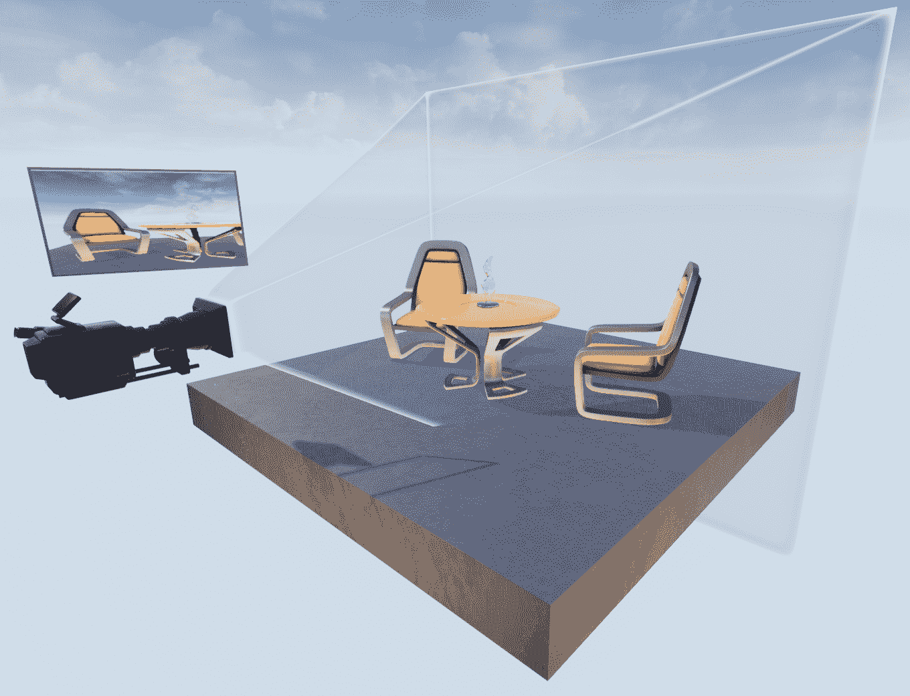

Rendering is the process of taking the 3D geometry in your scene, looking at it through a virtual camera, and turning that geometry into an image that can be displayed on your screen or in your headset.

正如我们在[第 1 章](01.html)，*中提到的，用 VR*思考，VR 对渲染流水线的要求比传统的平板渲染要高得多。 即使是目前市场上分辨率最低的耳机也会显示相当多的像素，而且更新速度极快。 似乎这还不够有挑战性，我们也有两只眼睛要思考，他们看到的观点并不完全相同。 这意味着我们正在渲染两个不同的视图。 那是相当多的事情要做，而且没有太多的时间去做。

正因为如此，对于 VR 开发人员来说，了解一些 Unreal 提供的渲染选项是很重要的。 在这里，好的选择可以让你朝着既好看又跑得快的目标走很长一段路。

# 实例化立体声

还记得我们刚才提到需要在 VR 中同时渲染两个不同的视图吗？ 回到糟糕的过去(在虚幻 4.11 之前)，这确实是真的。 引擎只需运行整个渲染过程两次-每只眼睛一次。 这是极大的浪费，因为两种视角之间唯一的真正区别是眼睛注视它的位置发生了微小的变化。 第二个渲染过程的全部成本都花在绘制与刚刚绘制的内容几乎相同的内容上。

**实例化立体**渲染允许在单个过程中渲染场景，从而改进了这一点。 然后，将渲染的视图连同其调整每只眼睛的视图所需的信息一起提供给视频硬件。 这比运行两次整个过程要快得多，而且你要确保你打开了它。 我们现在就开始吧。

If you create a project using the VR template, Instanced Stereo will already be turned on for you, but if you're creating a project from scratch, or taking an existing project and modifying it to work in VR, you need to remember to do this yourself.

在编辑器中，通过单击编辑器工具栏上的设置按钮并选择项目设置...，或通过选择编辑|项目设置来打开您的项目设置：

在项目设置中，在引擎部分找到渲染项。 在渲染页面中，在 VR 区域中找到实例化立体选项并将其启用：

完成此操作后，系统会要求您重新启动引擎。 这需要一些时间，因为着色器需要重新编译。

# 轮询阻塞

因为我们没有太多时间把镜框放到耳机上，所以我们不想浪费时间画任何我们不需要画的东西。 引擎通过称为**剔除**的过程选择要绘制的对象。 它使用四种主要方法按从最快、最简单到最复杂的顺序执行此操作：

*   **距离**和**消隐**只是忽略距离相机一定距离之外的任何对象。 这个不贵。
*   **查看视锥**和**消隐**会忽略不在相机当前视图中的对象。 这比距离淘汰法更贵，但仍然相当便宜。
*   **预计可见度**允许设计者设置音量，明确告诉引擎从某些位置可以看到什么，不能看到什么。例如，如果你知道一个房间里的玩家不可能看到外面的任何东西，你可以使用预计算可见度告诉引擎它甚至不需要费心检查。
*   **动态遮挡**会进行实时测试，以查看场景中的某个演员是否遮挡了另一个演员。 这是相对昂贵的，所以它只对那些没有被更便宜的方法剔除的对象执行。

对于 VR 项目，虚幻提供了一种优化的动态遮挡剔除方法，称为**循环轮询遮挡**，它只测试每帧一只眼睛的遮挡，而不是两个都测试。 这节省了相当多的时间，特别是在具有大量对象的场景中，而且效果很好，因为每只眼睛的视图几乎相同。 系统会切换它在每一帧上测试的眼睛，这就是这个名字的由来。

让我们打开它：

1.  在项目设置|引擎|渲染|VR 中，选中循环调度遮挡查询：

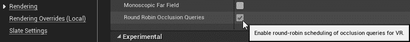

# 正向明暗处理和延迟明暗处理

现在，我们需要对要用于项目的呈现方法做出重要选择。

一般来说，有两种绘制场景的方法，它们之间的差异主要归结为场景中对象的照明方式。 这两种方法称为**向前**、**着色**和**延迟着色**。

You'll sometimes see these as **forward rendering** and **deferred rendering**, or you'll hear people talk about a **forward renderer** or a **deferred renderer**. Epic uses the terms interchangeably in its documentation, but they all refer to the same things. For our purposes here, we'll stick with the term **forward shading**, since that's what the option is called in the editor and it most accurately describes what's really different between the two approaches.

**着色**是将灯光应用于几何体的过程。 这包括高光、曲面反射、阴影以及灯光撞击材质时执行的所有各种操作：

前面的屏幕截图显示了未应用明暗处理的相同网格，然后应用了明暗处理。 在左侧图像中，您可以看到对象的形状及其基色(通常也称为**反照率**)，但没有阴影、反射或高光。 右侧图像已着色，因此高光、阴影和反射可见。

我们在下面的描述中稍微简化了一些，但就我们的目的而言，这是很好的。 您真的不需要了解渲染管道如何工作的每一个细节，就可以做出关于如何使用它的正确决策。 重要的是要有足够的理解力，以便为你需要做的事情做出正确的选择。

**正向着色**是在大多数实时 3D 渲染历史中绘制 3D 场景的原始方法。 在正向明暗处理中，场景中的每个几何对象在渲染时都会进行着色，并且会检查场景中的每个灯光以查看它可能会如何影响它。 如果场景中有很多对象和很多灯光，这可能会变成很多操作。 这就是为什么大多数照明倾向于烘焙到静态光照贴图中，而在 20 世纪 90 年代和 21 世纪初的游戏中，动态灯光往往非常罕见。 每个动态灯光都会显著增加场景的成本。

**另一方面，延迟着色**会在视图中绘制每个对象，但它不会立即对其进行照明和着色，而是会写出一系列图像，其中包含有关场景中的材质、每个像素的深度以及影响场景照明方式的其他因素的信息。 然后，在收集完所有这些信息后，只执行一次着色。 这就是名称的由来-着色过程已推迟到基础过程完成之后。

This collection of buffers is called the **geometric buffer**, or **G-buffer**, and the process of building them is called the **base pass**. If you're using deferred shading in Unreal Engine (which is the default setting for a new project), you can see the contents of the G-buffer by selecting View Mode | Buffer Visualization | Overview. Take a look at the following screenshot:

由于照明过程只发生一次，因此对于具有大量动态灯光的场景而言，这要快得多，并且还可以有效地处理屏幕空间效果(如环境光遮挡)。 但是，它不如使用部分透明对象的正向着色效果好。

# 为您的项目选择正确的渲染方法

所以，听起来不需要动脑筋，对吧？ 延迟着色似乎提供了很多好处。 对于虚拟现实之外的渲染，这基本上是正确的，到本世纪头十年末，延迟明暗处理成为几乎所有游戏引擎的默认设置，包括虚幻。

然而，虚拟现实却是另一回事。 延迟明暗处理的问题在于，由于其处理信息的方式，很难关闭渲染过程的各个方面。 在很大程度上，这是一笔要么全有要么全无的交易。 这在平板屏幕上通常不是问题-开发人员几乎总是想要延迟着色器提供的所有功能。 然而，其中一些过程太昂贵了，无法在 VR 中高效运行，或者它们是在屏幕空间计算的，当它们在两只眼睛之间不匹配时看起来很糟糕。 在虚拟现实中，你通常会想要自由地关闭它们。

When you hear the term *screen-space* what this means is that instead of doing the calculations on the object in 3D space, the part of the scene containing the object is rendered to 2D (this process is called **rasterization**), and then the calculations are performed on the 2D image. This can create a problem in VR, because many screen-space calculations won't match between the eyes. You'll usually want to avoid using screen-space effects in VR.

在虚幻 4.14 中，Etic 增加了一个专门为 VR 项目设计的选项--正向明暗处理(Forward Shading)。 他们还引入了一种集群系统，降低了在基础通道中处理灯光的成本，因此它的成本远没有过去那么高。 对于大多数 VR 项目，使用正向明暗处理是个好主意。

在某些情况下，您可能仍然希望在 VR 中使用延迟渲染-如果您的场景需要支持大量可移动灯光，或者如果您知道您将需要非常复杂的反射-但您应该认真考虑在大多数 VR 项目中使用正向明暗处理。

You'll almost always want to use forward shading for VR projects. It gives you much greater control over which parts of the rendering process you want to do, and which ones you want to skip; it handles transparency more easily, and supports better anti-aliasing options.

让我们为我们的项目打开它吧。

从项目设置|引擎|渲染中，找到正向渲染器部分，然后启用正向着色。 执行以下操作后，您必须重新启动编辑器：

When using forward shading, many expensive material features that would normally be included by default need to be turned on explicitly. This is a good thing in VR, as it gives you the freedom to use expensive features only where they'll be seen. We'll talk later on about doing this when we start creating and modifying materials for VR.

虽然您可以在稍后的项目开发中启用或禁用明暗处理，但您通常会希望做出选择并坚持使用它，因为项目的照明、材质和反射在这两种方法之间可能会有很大差异。 你不想花太多精力来开发你的外观，然后在开发后期再做这样的改变。 你最终会重新做很多工作。

# 选择您的抗锯齿方法

使用正向明暗处理的一个主要优点是，与使用延迟明暗处理相比，**抗锯齿**要容易得多。 让我们来谈谈这意味着什么，以及为什么它对我们虚拟现实很重要。

当渲染器在平板屏幕上绘制场景时，无论是监视器还是 VR 耳机，显示器实际上都由一个由小方块组成的网格组成，称为**像素**(**图片元素**的缩写)，渲染器必须决定每个方块的颜色。 当 3D 场景中的对象仅部分填充要绘制到的 2D 空间中的像素时，这就会出现问题。 然后，渲染器必须决定是用对象的颜色填充像素还是用背景的颜色填充像素。 没有介于两者之间的-它必须选择一个或另一个。 这实际上意味着，对象最终可能看起来边缘参差不齐，特别是沿着跨越许多像素边界的对角线。 我们将这个问题称为**混叠**：

A scene rendered with no anti-aliasing

请注意，场景中窗口周围的**锯齿**在没有抗锯齿的情况下渲染。 这些在这里看起来很糟糕，在 VR 中也会看起来更糟。

我们解决这个问题的方法是通过一个名为**反走样**的过程，这并不令人意外。 不同的抗锯齿方法使用各种技术来确定如何通过为要在前景色和背景色之间混合的像素找到正确的颜色来柔化锯齿边缘。 这具有平滑锯齿状边缘并从对角线中删除楼梯台阶的效果：

A scene rendered using multisampling anti-aliasing (MSAA)

查看使用多重采样抗锯齿渲染此场景时窗口看起来平滑了多少？

这一点在 VR 中尤其重要，因为耳机的分辨率仍然相当有限，因此用户通常可以看到单个像素。 在平板屏幕上可以接受的锯齿在 VR 中可能会看起来很糟糕，因为用户环顾场景，锯齿状的边缘爬来爬去，到处都是微光。 你要避免这种情况。

幸运的是，虚幻引擎提供了三种**抗锯齿方法**来解决此问题：

*   **FXAA**代表**快速近似反走样**。 它在场景中寻找边缘，并在这些边缘混合颜色，而且它足够智能，可以避免处理没有对比边缘的区域，因此它看起来很棒，运行速度也很快。 如果您在 VR 中使用延迟明暗处理，这应该是您的默认选择。
*   **时间 AA**(**TAA**)通过查看前面几个帧来决定如何消除当前帧的锯齿。 这通常使它成为 VR 的一个糟糕的选择，因为用户的视线往往会移动很多，而时间 AA 会对快速移动产生“涂抹”效果。 即使在涂抹不明显的地方，它也可能看起来太模糊，在 VR 头盔上是无法接受的。 时态 AA 在平板屏幕上的表现往往非常出色，但对于 VR 来说，它并不是一个很好的选择。

*   **MSAA**代表**多采样抗锯齿**。 此方法仅在使用正向明暗处理时可用，并且将提供比 FXAA 更清晰、更好的效果。 如果您在项目中使用正向着色，并且几乎总是应该这样做，则这是您应该使用的抗锯齿方法。

让我们在我们的项目中处理这一点：

从项目设置|引擎|渲染中，找到默认设置部分，然后将抗锯齿方法设置为 MSAA：

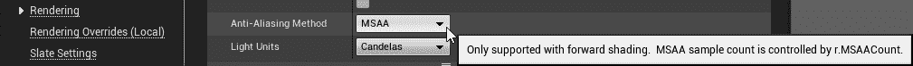

大多数情况下，您不需要对抗锯齿方法的工作方式进行任何更改，但如果您这样做了，请继续阅读。

# 修改 MSAA 设置

该位是可选的。 调整抗锯齿设置是一个高级主题，对于大多数项目来说，您不需要这样做。 如果你真的需要调整你的 MSAA 设置，这里有一个很好的方法：

选择 Window|Developer Tools|Device Profiles 以打开 Device Profiles 窗口：

在此面板中，单击 Windows 行中的 CVARS 按钮。

在出现的对话框中，打开控制台变量|渲染。 从这里，您可以看到当前指定的所有与渲染相关的控制台变量。 如果单击渲染旁边的+号，则可以在出现的搜索窗口中键入`msaa`，然后为 r.MSAACount 添加值。 默认情况下，该值设置为 4。将其减少到 3 或 2 会降低抗锯齿的质量，但会稍微加快抗锯齿的速度。 将其设置为 1 会将其禁用。 将其设置为 0 会将其禁用并回退到临时抗锯齿：

如果您在此进行了更改，请单击设备配置文件窗口上的另存为默认设置以保存这些设置。 它们将被写入到项目的`Configs`目录中名为`DefaultDeviceProfiles.ini`的新配置文件中。

同样，更改这些值是一个高级主题。 我们建议您在理解它们的功能之前不要修改它们。

# 从虚拟现实开始

同样重要的是，当我们运行项目时，告诉我们的项目从 VR 开始。 如果您想要构建一个既可以在 VR 中运行又可以在平板屏幕上运行的项目，您可以选择将其关闭，并在启动时使用`-vr`命令行参数。 不过，我们的项目是一个仅限 VR 的项目，所以我们想打开它。

转到项目设置|项目|描述|设置，并将在虚拟现实中开始设置为 True**。**

# 关闭您不需要的其他杂散设置

在环境渲染|默认设置中，禁用环境光遮挡静态分数。 环境光遮挡是一种创建出现在物体相互接触处的细微阴影的方法，但它们的计算成本很高，而且在 VR 中可能看起来很糟糕，因为它们是在屏幕空间中计算的。 我们不打算在这里深入讨论这个话题。 当您将项目设置为移动、可缩放的 2D/3D 时，您已经关闭了环境光遮挡，因此这只是一个应该清除的杂乱设置。

# 关闭默认触摸界面(Oculus Go/Samsung Gear)

如果你在为 Oculus Go 或三星 Gear 进行开发，你需要关闭默认的触摸界面。 移动应用程序通常假设你会通过触摸屏幕来操作它们，但当然这不会发生在你的耳机内。

导航到 Project Settings|Engine|Input，然后从 Mobile 部分中，抓住 Default Touch Interface 旁边的下拉列表并将其清除：

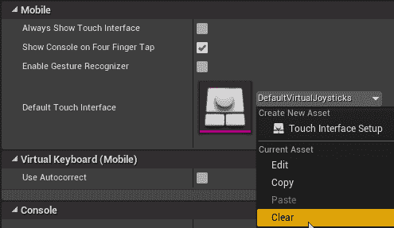

# 为 Android 配置项目(Oculus Go/Samsung Gear)

现在我们需要配置项目以使用 Android SDK。 我们在上一章中介绍了这个过程--我们只需要为这个项目设置相同的设置。 这里有一个快速提醒，我们需要做些什么。

从项目设置|平台|Android，找到 APK 打包部分，然后点击立即配置。 如果您在上一章中已经接受了 SDK 许可证，则该按钮将被禁用--您只需接受一次：

然后设置这些设置(正如我们在上一章中提到的，大多数指南会告诉您使用 SDK 版本 19 作为最低版本。 对于 Samsung Gear，这是可以的，但对于 Go，请使用版本 21)：

*   最低 SDK 版本：21
*   目标 SDK 版本：21
*   在 KitKat 及更高版本的设备上启用全屏沉浸式：true

向下滚动到高级 APK 打包部分，并设置以下内容：

*   将用于部署到 Oculus Mobile 的 AndroidManifest 配置为 True。

# 验证您的 SDK 位置

选择项目设置|平台|Android SDK，并确保您的 SDK 位置设置正确。 如果您通读了上一章中的说明，它们应该是正确的。 如果没有，现在就跳回那里，把它们设置好。

# 确保移动 HDR 已关闭(Oculus Go/Samsung Gear)

检查您的项目设置|引擎|渲染|移动设备，并确保已关闭移动 HDR。

# 移动多视图(Oculus Go/Samsung Gear)

还记得在实例化立体渲染一节中，我们讨论过为每只眼睛渲染整个场景是多么浪费吗？ 移动耳机也有一个解决方案，叫做**移动多视图**。 Mobile Multi-View 的工作原理与实例化立体渲染非常相似--为左眼渲染一次场景，然后移动和调整右眼的图像。 我们想把它打开。

在“项目设置”|“引擎”|“渲染”|“VR”中，将“移动多视图”设置为“true”，并启用“移动多视图直接”。 Oculus 不建议或支持在没有直接选项的情况下使用移动多视图。 将它们都打开：

# 单目远场渲染(Oculus Go/Samsung Gear)

这是关于立体深度感知的事情-我们只能在一定距离内看到它。 在这个距离之外，立体图像和平面图像之间没有明显的区别。 在我们看来，它们看起来是一样的。 我们不妨利用这一点作为我们的优势。

如果将项目设置|引擎|渲染|VR|单镜远场设置为 true，则引擎将只渲染指定距离以外的任何对象一次，这可以在正确的场景类型上节省大量时间：

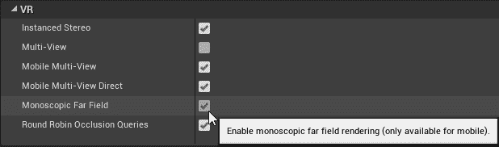

默认情况下，单声道渲染和立体渲染之间的分割发生在 7.5 米处，但这是在每个地图上单独设置的。 (此分割的位置称为**剔除平面**。)。 此剔除平面与相机的距离是为每幅地图单独设置的。 要对其进行调整，请打开窗口|世界设置，然后在出现的设置面板上查找 VR 部分。 调整单色消隐距离将移动消隐平面的位置。

对于场景中的某些对象，特别是大型对象，如果它们的边界延伸到摄影机附近，则可能需要强制它们以单声道进行渲染，即使它们实际上只出现在很远的地方。 在这些情况下，打开对象的详细信息并将 Render|Render in Mono 设置为 true。 (此选项在渲染部分的高级选项中隐藏。)

# 项目设置小抄

我们刚刚介绍了在设置 VR 项目时应该修改的一些设置，以及每个设置的一些背景知识。 简单回顾一下，以下是我们所做更改的小抄：

*   项目设置|引擎|渲染|VR|实例化立体：true
*   项目设置|引擎|渲染|VR|循环调度遮挡查询：TRUE
*   项目设置|引擎|渲染器|正向渲染器|正向着色：TRUE
*   项目设置|引擎|渲染器|默认设置|消除锯齿方法：*MSAA
*   项目设置|引擎|环境渲染|默认设置|环境光遮挡静态分数：FALSE
*   项目设置|项目|说明|设置|在 VR 中开始：真

这是移动 VR 版：

*   项目设置|引擎|输入|移动|默认触摸界面：无
*   项目设置|平台|Android|APK 打包：配置和设置提到的设置
*   项目设置|平台|Android SDK：确认您的 SDK 位置已设置。
*   项目设置|引擎|渲染|移动|11-13 移动 HDR：11-13 False
*   项目设置|引擎|渲染|VR|11-13 移动多视图：TRUE
*   项目设置|引擎|渲染|VR|移动多视点直达：*True
*   项目设置|引擎|渲染|VR|单目远场：真

再说一次，不要只是盲目地追随这些。 对于大多数虚拟现实项目来说，这些都是你想要的设置，但这并不意味着它们会适用于你做过的每一个项目。

# 装饰我们的项目

现在我们已经设置了项目的基本设置，让我们添加一些环境艺术，这样我们就可以在工作时看到一些有趣的东西。

# 将内容移植到项目中

从您的**Epic Games 启动器**中，打开学习环境选项卡，然后搜索`Sun Temple`示例环境。 单击创建项目按钮，然后选择要保存它的位置：

让它下载吧。 项目下载完成后，打开它。 它应该能打开太阳神庙的地图。 现在，我们将把这张地图移植到我们现有的项目中。

We could just as easily have downloaded the Sun Temple project and then set it up to run in VR. We're doing it this way to give you an opportunity to learn about the Migrate... tool. When you need to get assets from one project to another, the Migrate tool is the best way to do it.

在内容浏览器中，选择内容|地图|Sun Temple。 右键单击它，然后选择资产操作|移植...：

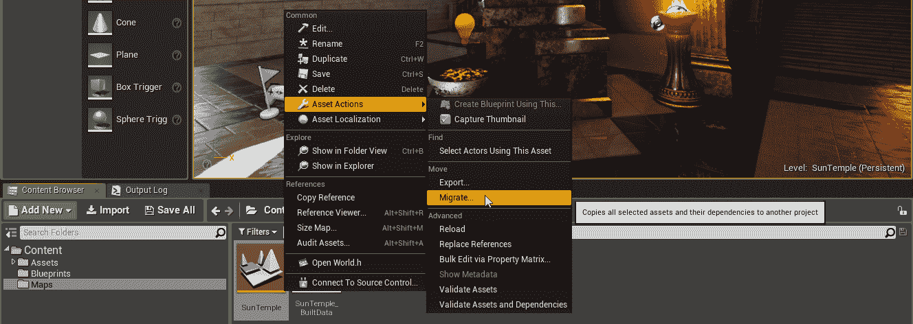

现在，您将看到一个列表，其中列出了如果您迁移此地图将复制的所有内容。 这就是迁徙的力量。 工具，这就是您应该使用它的原因。 将资源移植到另一个项目时，虚幻会检查该资源工作所需的所有其他内容，并将其包括在要复制的资源列表中。 因此，例如，如果您要迁移网格，该网格使用的材质和纹理也会自动找到并迁移。 在我们的例子中，我们正在迁移一张地图，因此虚幻将把地图所依赖的一切都带到新项目中：

现在，您需要选择要将迁移的内容放在哪里。 迁移操作的目标始终必须是目标项目的`Content`目录。 导航到该位置并选择它。 (这就是为什么我们在本章开头提到了解虚幻项目目录的结构是很重要的。 您有时需要知道其中的内容在哪里。)

迁移完成后，让我们关闭此项目并重新打开刚刚添加了此地图的项目。

现在，您应该会在内容浏览器的 Maps 目录中看到 Sun Temple 地图。 我们把它打开吧。

Unreal will probably need to compile lots of shaders if this is the first time you've opened this map. (This is one of the reasons why we set up a derived data cache in [Chapter 2](02.html), *Setting Up Your Development Environment*—once you've compiled your shaders, they'll be stored in this cache so you won't have to re-compile them when you open other projects.)

当我们迁移这张地图时，我们发现了一些额外的东西。 我们现在要摆脱它，这样我们就可以专注于我们正在创建的新资产。 在此期间，我们将利用这个机会向您展示一些关于将资产管理到内容浏览器的内容，这些内容在您继续开发时对您很重要。

# 清理迁移的内容

打开 Sun Temple 地图，打开 Window|World Settings，然后找到 GameMode Override。 (我们稍后将讨论游戏模式。)。 通过点击属性旁边的黄色 Reset to Default(重置为默认设置)箭头将其清除：

Any time you see a yellow Reset to Default arrow, hitting it will restore the property to its standard setting.

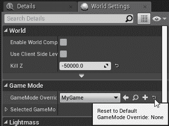

保存地图。

# 安全删除资产

现在选择内容浏览器中的`Blueprints`文件夹。 我们将在稍后制作我们自己的蓝图，因此我们不需要这些。请删除此文件夹，但请注意出现的确认对话框。

如果你看到一个带有警告的强制删除按钮，这意味着你试图删除的东西在某个地方仍在使用中。 您几乎不应该只是删除仍在引用的内容。 (我们在这里说*几乎是*，因为一旦你真正知道发动机在做什么，在某些情况下你可以把它推来推去，但不要这样做，直到你真正确定你知道引擎盖下面发生了什么。)。 相反，应找出资源仍在使用的位置，然后更改引用以指向其他对象，或者删除引用它的对象，或者不使用它：

如果删除对象是安全的，对话框将只显示一个删除按钮。 这意味着处理掉它不会破坏其他任何东西：

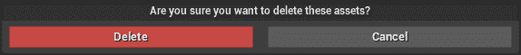

在这种情况下，强制删除警告将意味着您要么没有从地图的世界设置中清除游戏模式覆盖，要么在清除之后没有保存地图。 如果你看到的是一个简单的删除按钮，点击它可以删除文件夹及其内容。

# 转移资产和重定向董事

现在让我们把剩下的整理一下。 从内容浏览器中，为项目创建一个新文件夹。 我们可以将此文件夹命名为`HelloVR`。

It's a good idea always to create a folder for your project inside the content browser. This way, as you migrate more content into your project from other sources, or add assets from the marketplace, you'll never be confused about which assets belong to your project and which arrived from outside. Similarly, if you migrate assets somewhere else, they'll all appear together in the new project's content browser. Most developers don't do this. Everybody should. The first time you migrate in a plugin and have it dump assets all over existing folders in your contents, you'll see why. You can prevent a lot of mess by keeping your own project organized.

因为我们已经清除了`Blueprints`文件夹，所以我们迁移的内容中还有另外两个文件夹，它们就在内容根目录中。 让我们将它们移动到我们的项目文件夹中。

抓起`Maps`文件夹并将其拖到您的`HelloVR`文件夹中。 当系统询问您是要移动还是复制它时，请选择移动它。 现在抓起`Assets`文件夹并执行相同的操作。

但这是什么？ 我们已经移动了文件夹，但旧位置的文件夹并没有消失。 为什么？ 原因是虚幻留下了**个重定向器**的集合。 你应该知道这些。 让我们让他们看得见。

从搜索栏旁边的筛选器下拉列表中，选择筛选器|其他筛选器|显示重定向器：

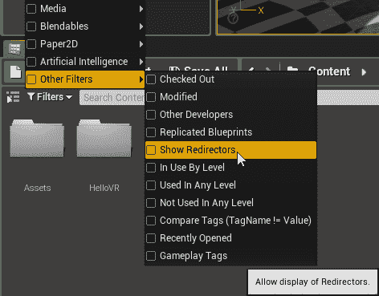

现在，让我们导航到遗留的`Assets`文件夹中，并跳转到它的`Blueprints`文件夹。 其中有一个**重定向器**，其中包含我们搬到新位置的 BP_Godray 蓝图的名称。 双击此重定向器，它会将您带到资产的新位置。 这就是重定向器所做的事情。 当您在虚幻中移动资源时，很可能项目中的其他对象正在使用并指向该资源。 而不是强制您更改引用此时要移动的对象的每个资源，而是允许您在不更改引用的情况下移动它，并且当其他对象试图在其旧位置找到它时，重定向器只会将它们指向新位置，您可以稍后更改引用指向的位置。 这是一个很好的系统，可以为您在大型项目中省去很多麻烦。

然而，如果你不需要重定向器，你不会想把它们留在那里。 要清理重定向器，请右键单击该重定向器，然后选择修复：

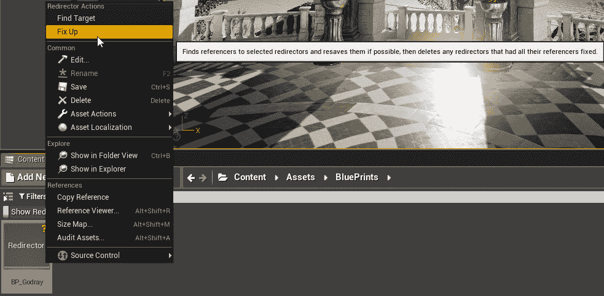

这将查找在其旧位置引用该资产的每个资产，并替换指向新位置的引用。 一旦完成此操作，它将删除重定向器，因为不再需要它。

也可以一次对文件夹中的每个重定向器执行此操作。 接下来让我们来做这件事。

首先，我们将更容易地查看内容浏览器的文件夹结构。 单击筛选器下拉菜单旁边的源面板按钮以打开源面板：

这将切换项目内容目录的树状视图，这样可以更方便地四处走动和移动资产：

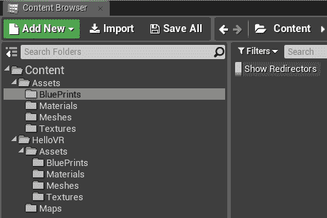

现在我们可以看到我们正在做的事情了，让我们选择包含所有重定向器的旧`Assets`文件夹，右键单击它，然后选择 Fix Up ReDirectors in Folder(修复文件夹中的重定向器)：

操作完成后，您可以删除旧的`Assets`文件夹，因为它现在是空的。

A good way to verify that a folder is empty before you delete it is to right-click the folder in your content browser, select Show in Explorer, and from within Explorer, select the folder and hit *Alt* + *Enter* to bring up its properties. If it shows 0 files, it's empty. If there's anything in it, you can dig in and find out what's there and whether it's anything you want to keep.

我们的`Content`目录现在应该组织得很好，我们正在使用的所有内容都合并在我们的`HelloVR`文件夹下。 如果您养成了在项目小的时候保持`Content`目录整洁的习惯，那么一旦项目变大，您就会轻松得多。

# 设置默认地图

既然我们已经引入了我们的地图并清理了附带的额外蓝图，让我们设置我们的项目将 Sun Temple 加载为其默认地图。

在项目设置|项目|地图和模式|默认地图下，使用下拉菜单将 Sun Temple 设置为编辑器启动地图和游戏默认地图：

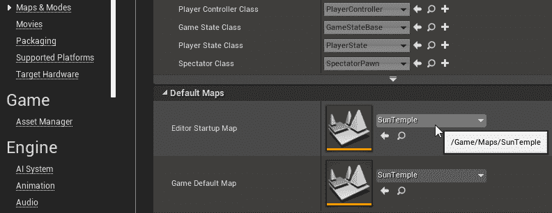

这样，当您启动编辑器或将游戏作为独立的可执行文件启动时，它将直接加载到此地图中。

# 在台式机上测试我们的地图

让我们来看看到目前为止我们得到了什么。 如果我们正在开发桌面虚拟现实，我们可以在虚拟现实中启动地图，然后四处看看。 选择编辑器工具栏上播放按钮右侧的下拉列表。 选择 VR Preview(如果 VR Preview 变暗，请检查以确保您的 VR 耳机已连接且其软件正在运行)：

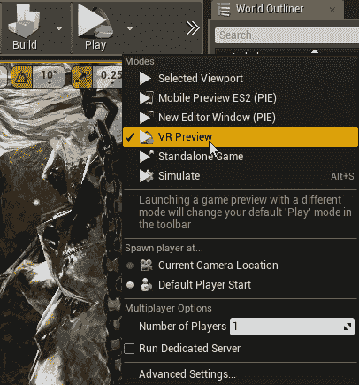

这里挺不错的，对吧？

我们还不能做太多事情，我们相对于地面的高度不合适，但它正在运行，我们已经准备好开始设置东西了。

# 在手机上测试我们的地图(Oculus Go/Samsung Gear)

如果我们想要在移动设备上测试地图，我们还需要做一些其他的事情。

假设我们已经将项目设置为在移动设备上运行(如上所述)，让我们首先检查一下我们的移动设备是否已连接并且可以看到。

Important: If you update your Unreal Engine version, be sure you re-run the **CodeWorks for Android** installer at `<Engine Install Location>\Engine\Extras\AndroidWorks\Win64`. Building with newer Unreal code and out-of-date Android SDK code can create difficult-to-debug errors when you try to run in mobile VR. Remember to keep your CodeWorks up-to-date.

打开 Windows PowerShell 并导航到 Android SDK 目录中的`platform-tools`目录。 默认情况下，这将是`C:\NVPACK\android-sdk-windows\platform-tools`。 从这里输入`./adb devices`。 您应该会在此处看到所连接设备的序列号，旁边带有单词“`device`”。 如果显示为*未授权*，则您需要接受从耳麦内到 PC 的连接。 如果显示为*脱机*，则可能需要重新启动`adb`服务器。 键入`./adb kill-server`，然后再次运行`./adb devices`：

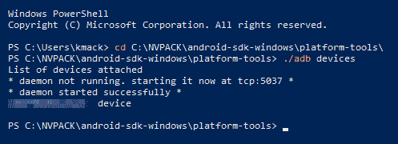

If you're working on mobile devices, there's no way around the reality that you're going to spend a lot of time in PowerShell talking to the device. Take the time to learn about ADB especially. When something goes wrong, you're going to use ADB to figure out what's happening. Learn more about it here: [https://developer.android.com/studio/command-line/adb](https://developer.android.com/studio/command-line/adb).

如果您的`./adb`设备看起来不错，那么您应该已经准备好在该设备上启动项目了。

从编辑器工具栏上的启动下拉列表中，选择与设备序列号匹配的 Android 条目。

发射过程应该开始了。 正如我们在[第 2 章](02.html)，*设置您的开发环境*中提到的，第一次设置开发环境预计需要一段时间。

# 设置游戏模式和玩家棋子

现在我们已经设置了基本场景并验证了它在平台上运行，接下来让我们开始构建一些功能。

# 创建 VR 棋子

我们需要做的第一件事是创建一个**棋子**来代表玩家。 棋子是一种可以由玩家或人工智能控制的演员。 在我们的例子中，我们将创建一个玩家可以控制的棋子。

Unreal Engine is an **object-oriented** system. This means that the engine is organized around discrete items called **objects**. An object consists of **properties**, which you can generally see by looking at the Details panel of an item you select in the map, and **functions**, which you can often see in the blueprint editor. Objects often **inherit** from one another, so a new class of object might be created using another class as its parent. This means that the new class would take on the attributes and behavior of its parent, but could then change these attributes and behaviors or add new ones. An actor, therefore, is a child of the object class that adds the capability to be placed in the world. A pawn is a type of actor that adds the ability to be controlled by a player or AI. When we create our own class using a pawn as a parent, we're setting up that class to take on everything a pawn can do, and then changing its behaviors or adding our own.

让我们导航到内容浏览器中的`Content/HelloVR/img/Blueprints`文件夹，右键单击该文件夹中的任何空白区域，然后选择创建基本资源|蓝图类：

在接下来的对话框中，我们将被要求选择新蓝图的父类。 选择典当：

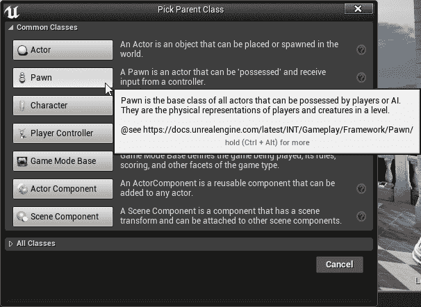

将在我们的`Blueprints`目录中创建一个新的蓝图资产。 让我们将其命名为`BP_VRPawn`。

It's a good idea to get into the habit of following a **naming convention** when you name your assets. A naming convention is a set of rules you follow when thinking up a name for a new thing you're creating. By following rules when you name objects, you can make it much easier to see what an object is, or to remember what you called it. In this instance, we're using the `BP_ prefix` as a reminder that our pawn is a blueprint class. A particularly thorough and well-thought-out naming convention lives here: [https://github.com/Allar/ue4-style-guide](https://github.com/Allar/ue4-style-guide).

稍后，我们将开始修改我们的棋子，但是，首先，我们需要告诉我们的地图使用它。

# 创建游戏模式

每当“虚幻”加载地图时，它做的第一件事就是检查控制地图行为的规则。 这些规则可以指定很多东西，但是我们现在关心的是从`Player Start`对象中产生什么样的棋子。 这个规则集合位于一个称为**游戏模式**的类中。

让我们创建一个游戏模式。 在空白处单击鼠标右键，创建一个 Blueprint 类，然后选择 Game Mode Base 作为其父类。 我们将它命名为`BP_VRGameMode`。

双击我们的新游戏模式将其打开，在其详细信息部分，选择 Classes|Default Pawn Class：下拉列表，然后选择我们刚刚创建的`BP_VRPawn`类：

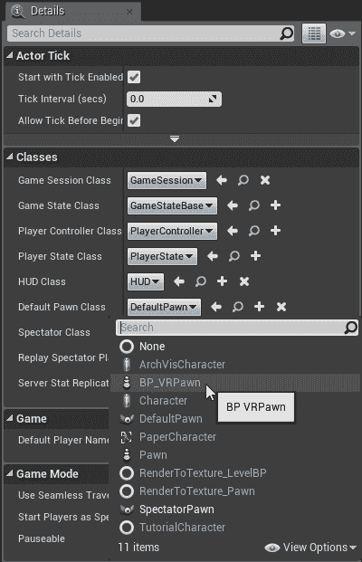

就我们目前的目的而言，这就是我们在游戏模式下需要做的所有事情。 我们只是用它来指定我们想要加载的棋子类。 编译并保存它。

Blueprint is a **compiled** language. Before the code you write can be run by the CPU, it needs to be translated into a language the CPU understands. There are two main ways this can happen. **Interpreted** languages are translated on-the-fly while they're running. This comes with a cost though, since the interpreter needs to be running alongside your code and trying to translate it while it runs. It's much faster to translate everything offline in a separate process so it's ready to go when the CPU needs to run it. This is how compiled languages handle things, and when you compile your blueprints, this is what you're doing. 

默认情况下，当蓝图被编译时，它们被编译成一种格式，然后在应用程序运行时由托管蓝图代码的虚拟机使用。 这个系统运行得很快，但是如果您想要从中挤出更快的速度，您可以选择将它们转换为本机 C++，这样就可以将它们编译成机器码。 在这一点上，它们的运行速度可以与直接用 C++ 编写的代码一样快。

# 分配游戏模式

现在，我们需要告诉我们的项目使用此游戏模式作为其默认模式。

打开项目设置，在项目|地图和模式|默认模式下，将默认游戏模式设置为新创建的游戏模式：

现在，在我们的项目中加载的任何级别都将使用此游戏模式来决定生成什么以及运行场景时要遵循的规则。

# 覆盖特定地图的游戏模式

如果我们想让我们的地图使用不同的游戏模式怎么办？ 例如，如果我们设置了一个入口菜单场景，我们可能希望生成一个旨在与菜单交互的棋子，而不是默认的玩家棋子。 幸运的是，这很容易。

如果尚未显示，请选择窗口|世界设置以打开我们的世界设置选项卡。 在世界设置中，在游戏模式下，将游戏模式覆盖设置为我们刚创建的新 BP_VRGameMode：

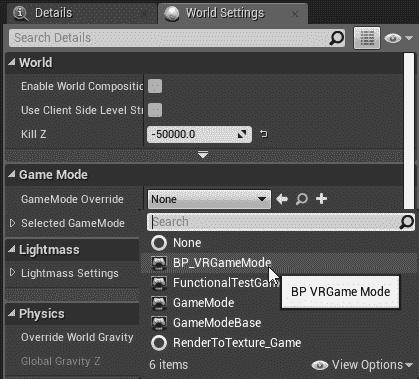

我们刚刚告诉引擎在地图加载时使用我们的新游戏模式，不管在项目设置中指定了什么游戏模式。

我们可以在四个地方指定要使用的游戏模式：

*   您可以在项目设置|地图和模式|默认模式|默认游戏模式中进行设置。 默认情况下，此处指定的游戏模式将加载到项目中的任何位置，除非其他内容将其覆盖。
*   您可以在单个贴图中设置游戏模式覆盖，就像我们在这里所做的那样。 这将覆盖项目设置中的全局默认游戏模式(如果已设置)。
*   在启动可执行文件时，可以使用*命令行参数*和`?game=MyGameMode`指定游戏模式。 反过来，这将覆盖您的默认游戏模式，以及地图中设置的任何覆盖。
*   在您的`DefaultEngine.ini`中，您可以指定在加载带有特定前缀的地图时要加载的特定游戏模式。 如果设置了它，它将覆盖任何其他规范。

# 把棋子直接放在这个世界上

虽然使用游戏模式和玩家启动对象将玩家棋子放入世界通常更可取，但您不必这样做，并且偶尔会遇到不使用 GameMode 来设置玩家棋子的现有项目，例如默认的 VR 模板项目。

在这些情况下，不是将播放器开始对象放置在希望播放器繁殖的场景中，而是将兵蓝图直接拖动到场景中。 如果您的场景已有播放器开始，请将其删除。

还记得我们说过棋子可以由玩家或人工智能控制吗？ 你需要把你的棋子放在玩家的控制下，因为你没有游戏模式为你做这项工作。 选择刚刚放置在关卡中的棋子，在其详细信息中，找到 Pawn|Auto Hoost Player，并将值设置为 Player 0。 当棋子产卵到世界上时，这将使棋子处于玩家的控制之下：

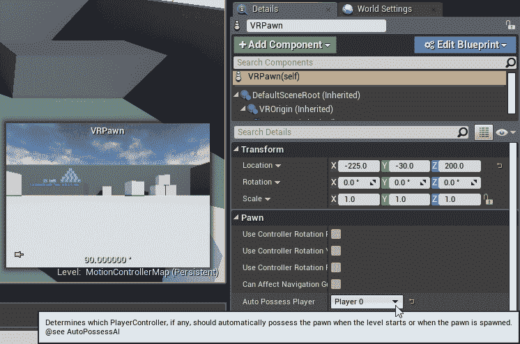

通常，使用 GameMode 指定玩家棋子类是更好的做法，但您应该知道此方法是存在的，因为您会看到一些项目使用它。

# 设置 VR 棋子

现在我们已经创建了一个 VR 棋子，并设置了游戏模式来使用它，让我们修改这个棋子，以便在 VR 中使用它。 我们要在这里从头开始。 通常，在创建简单的 VR 应用程序时，您将使用 VR 模板提供的 Pwn 类，但我们不希望您将其用作拐杖。 了解一个棋子是如何为 VR 建造的要好得多，这样你就可以根据你需要它做什么来适当地建造它。

我们要做的第一件事就是打开我们的棋子。

# 添加摄像机

在蓝图编辑器视图的左上角，您应该看到 Components 选项卡。 点击绿色的[+Add Component]按钮，然后在出现的下拉列表中，选择 Scene 以创建场景组件。 将其命名为`Camera Root`：

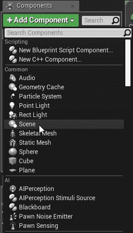

**Components** are additional elements that can be added to blueprint objects. There's a wide variety of components available to you, and they all do different jobs. Components are organized into a hierarchy, allowing you to attach components to other components. You can do quite a lot with this.

现在，创建一个新的摄影机组件。 如果执行此操作时摄影机根场景组件仍处于选中状态，则摄影机组件将被创建为摄影机根的子组件。 如果不是，请将其拖动到 Camera Root 以将 Camera Root 设置为其父对象。

It's often a good idea to set a separate root component as we've done here. This gives you much more flexibility to change the structure of the actor later, or to change rotations or positions of components such as cameras without having to adjust the position of the object.

# 添加运动控制器

接下来，选择`DefaultSceneRoot`组件，并创建一个`Motion Controller`组件。 对于这个选项，使用 Add Component(添加组件)菜单顶部的 Search Components(搜索组件)栏，然后键入`mot`将搜索范围缩小到运动控制器组件。 使用此搜索栏可以节省大量时间。 将这个新组件命名为`MotionController_L`，并确保它是`DefaultSceneRoot`的子组件，而不是 CameraRoot 或相机的子组件。

选择`DefaultSceneRoot`并再次执行此操作，以创建第二个运动控制器组件。 将此名称命名为`MotionController_R`，并再次确保它是`DefaultSceneRoot`的子级，而不是任何其他组件：

Your component hierarchy should now look like the preceding screenshot.

在我们继续之前，我们需要设置一些运动控制器组件的属性。 选择`MotionController_R`组件，并在其详细信息面板中找到运动控制器|运动源条目。 将其设置为右侧，允许右手边的 Oculus 或 Vive 控制器移动控制器。 在此期间，请确保`MotionController_L`仍设置为使用 Left 作为其运动源。 默认情况下应该是这样：

让我们也让这两个控制器都可见，这样我们就可以验证它们是否工作正常。 从每个运动控制器组件的详细信息面板中，选择可视化|显示设备型号。 启用此选项，并验证显示模型源是否仍设置为默认值，这将仅显示您正在使用的运动控制器硬件的模型。 稍后我们将更换运动控制器显示屏，但目前，我们只想查看它们，以便验证我们是否正确设置了它们：

# 设置我们的追踪起点。

现在我们需要告诉我们的棋子应该如何解释耳机在跟踪空间中的位置。 在棋子的组件选项卡下查找 My Blueprint 选项卡，如果您的 EventGraph 面板在主编辑窗口中不可见，请双击 My Blueprint 选项卡中的 Graphs|EventGraph 以显示它：

进入 EventGraph 后，找到 BeginPlay 事件，或在图形编辑器中的任意位置单击鼠标右键(Right)，然后在显示的搜索对话框中键入`beginplay`，以查找或创建 BeginPlay 事件。 从 BeginPlay 事件拖动一条执行线，然后右键单击以创建一个新节点。 查找输入|头戴式显示器|设置跟踪原点，或开始在搜索框中键入以查找它。 创建`Set Tracking Origin`节点，并将其原点设置为 Floor Level，如果使用的是带有触摸控制器的房间级 VR 系统(如 HTC Vive 或 Oculus Rift)，或者如果使用的是非房间级的系统(如 Oculus Go 或更老的单摄影机 Oculus Rift)，则将其原点设置为 Eye Level。

# 根据地图调整我们的玩家开始位置。

最后，我们需要调整球员在地图上的开始位置。 在世界大纲视图中找到它(可以使用搜索栏更快地找到它，然后选择它并在场景中向下拖动它，直到它的中心与地板相交(这是一种有点粗糙的对准棋子的方法，我们稍后会做得更好，但现在它会起作用)：

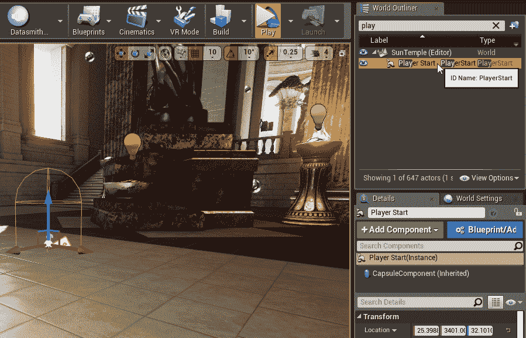

# 在耳麦中测试。

我们现在有了在虚拟现实中创建虚拟现实体验所需的构件。 我们有一个项目已经做好了适当的设置，可以在 VR 中高效地运行，还有一个棋子，它可能还没有起到多大作用，但已经准备好作为我们真正想做的事情的基础。

我们来测试一下。 使用 VR 预览启动地图，并验证您的视图似乎位于正确的高度，并且当您移动双手时可以看到运动控制器。 帧速率也应该是可以接受的。

# 打包独立版本

当我们将一个虚幻的应用程序分发给其他用户时，我们通常不会向他们提供编辑器的源文件。 相反，我们将项目打包成可以在目标平台上运行的独立可执行文件。

让我们创建一个 Windows 独立可执行文件。

选择文件|打包项目|Windows|Windows(64 位)以启动打包过程。 你会被问到把它放在哪里。 选择一个有意义的位置。 (通常，在项目目录中创建`Packaged`目录可能是合理的。 您可以将打包的构建放在您想要的任何位置。)。 出现 Build Status(构建状态)对话框时，单击 Show Output Log(显示输出日志)，以便您可以看到它正在执行的操作：

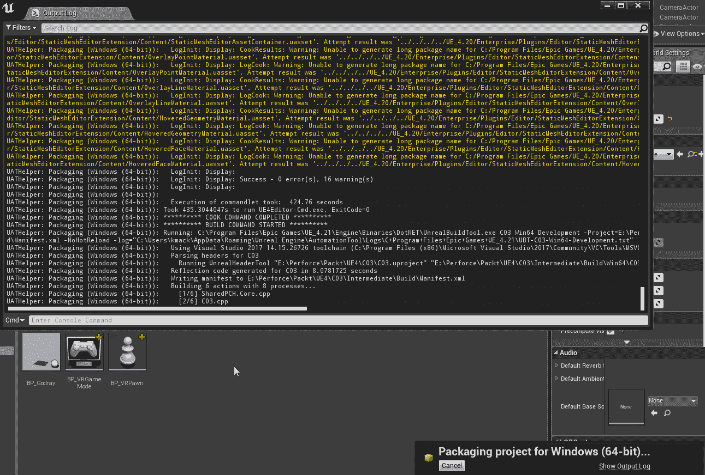

预计这个过程需要一段时间。

该过程完成后，关闭编辑器并检查您告诉系统构建可执行文件的位置。 您应该在其中看到一个`WindowsNoEditor`文件夹。 在其中，您应该看到一个带有项目名称的可执行文件。 启动可执行文件。 如果您在 Project Settings(项目设置)中设置了 Start in VR(在 VR 中启动)标志，它应该会直接启动到您的耳麦上。

# 简略的 / 概括的 / 简易判罪的 / 简易的

祝贺你!。 我们覆盖了很多地方。 在这一章中。 我们经历了开始创建 VR 项目的过程，并对其进行了适当的设置，以便在目标硬件上正常运行。 我们学习了如何决定在为 VR 设置新项目时使用什么设置，以及如何在虚幻项目目录中找到自己的路。 我们还了解了 VR 开发中使用的一些重要的虚拟引擎功能：

*   实例化立体声
*   轮询阻塞
*   正向着色
*   多采样抗锯齿(MSAA)
*   [移动]移动多视图
*   [移动]单目远场渲染

我们了解了如何将内容从一个项目迁移到另一个项目，以及如何在内容到达后清理`Content`目录。

最后，我们设置了一个基本的 VR 棋子游戏，并设置了一个游戏模式来指示地图加载它。 在与棋子的合作中，我们了解了如何使用组件从简单的部件中构建复杂的对象，添加了相机和跟踪的运动控制器。 最后，我们设置了棋子蓝图的第一个元素，为我们的 VR 硬件设置了合适的跟踪原点，并测试了我们的地图。

在下一章中，我们将使我们在本章中创建的棋子在世界上移动成为可能。 我们将使用蓝图创建一个心灵传送移动方案，并学习如何设置支持它的环境，然后我们将从那里开始实施一系列身临其境的移动方案。