# 在虚拟世界中穿梭

在本章中，我们将使用我们在上一章中构建的棋子，让它在世界上移动。 我们将从一个常用的心灵传送移动方案开始，并涵盖设置该方案所涉及的广泛任务。 我们将了解我们环境中的导航网格，如何在我们的项目中设置输入事件并在蓝图中使用它们，以及如何构建玩家棋子蓝图并使其在世界各地移动。 最后，我们还将探索一种身临其境的无缝移动方案，您可以使用该方案让您的玩家在没有传送的情况下在世界中移动。

在本章的整个过程中，我们将讨论以下主题：

*   导航网格-什么是导航网格，如何在您的级别中设置它们，以及如何优化它们
*   如何为玩家棋子设置蓝图，以及如何创建棋子可以使用的输入事件
*   如何使用直线和曲线执行追踪，以在您的环境中找到合法的目标位置
*   如何创建简单的游戏内指示器来向玩家显示正在发生的事情
*   如何实现无缝移动方案，为不适合隐形传送的项目提供身临其境的移动

这将会涉及到很多领域，但它应该很有趣，而且您将获得一个很好的基础，它将帮助您弄清楚如何开发您想要的东西，以及当您看到其他开发人员的蓝图时如何理解他们正在做什么。 在本章中，我们将采用与大多数教程略有不同的方法。 要成为一名高效的开发人员，学习如何思考问题比简单地记住一系列可能不适用于您面临的下一个问题的步骤要重要得多。 在本章中，我们将演练构建元素的过程，然后在某些情况下，*发现*这些元素中的 bug。 之后，我们需要更改一些东西来修复这些错误。 这才是这种方法的真正价值所在--您将开始了解如何通过迭代开发软件，这才是真正的实现方式。 这里的目标不是让您擅长构建这些教程-而是帮助您成为一名开发人员，可以自己创作任何您梦想中的东西。

话虽如此，让我们开始建设吧！

# 传送运动

正如我们在[章](01.html)，*在 VR 中思考*中所讨论的，我们在 VR 中面临的最大挑战之一是当用户试图四处走动时引发的晕动病。 最常用的解决方案之一是*将用户*从一个地方传送到另一个地方，而不是让他们在空间中流畅地移动。 这打破了沉浸，但完全避免了晕动病的问题，因为它根本不会产生运动感。 对于沉浸式移动不是优先考虑的应用，比如建筑可视化，这可能是一个理想的方案。

# 创建导航网格

对于基于远程传送的移动方案，我们首先需要一种方式来告诉引擎允许玩家移动到哪里，不允许移动到哪里。我们可以使用*导航网格*来完成这项工作。

A **navigation mesh**, often shortened to **navmesh**, is an automatically generated set of surfaces indicating walkable floors in an Unreal level. AI-controlled agents use the navigation mesh to find their way around the world, but it can also be used as a way to identify safe destinations for the player pawn to land, as we're doing here in our teleport system.

在虚幻中创建导航网格相当简单。 从模式面板中，选择卷选项卡，然后找到 NavMesh 边界体积。 将其拖动到场景中，如以下屏幕截图所示：

Select the Nav Mesh Bounds Volume from Modes | Volumes

# 移动和缩放 Navesh 边界体积

NavMesh 的边界音量需要包围你希望玩家能够传送的任何楼层。 让我们使我们的导航网格可见，这样我们就可以看到设置可行走地板的位置：

1.  按*P*键切换导航可见性，或从视口菜单中选择显示导航|导航：

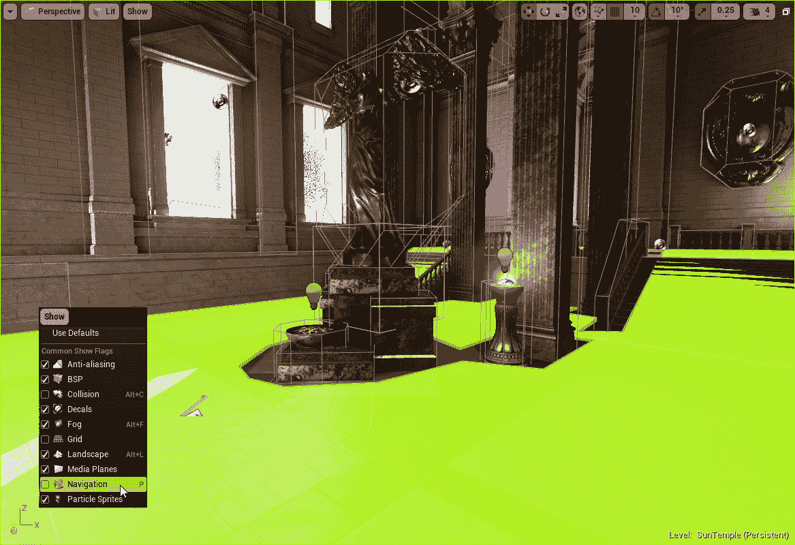

Use the P key or Show | Navigation to display the generated navmesh in the environment. If you don't see any navigable space after you've placed a NavMesh Bounds volume, make sure it's intersecting a walkable floor. The volume sets the boundaries for the navmesh generation, so if it's above the floor, it won't generate anything.

当然，我们刚刚放置的 NavMesh 边界体积太小了。 让我们将其扩展到我们想要移动的空间。 我们将通过缩放音量来实现这一点。

2.  按*R*键切换到缩放模式，或者只需轻触*空格键*，直到显示缩放 Gizmo。

我们可以从透视视图缩放体积，但对于这种操作，转到正交视图通常是一个好主意，这样我们就可以真正看到我们在做什么。

3.  按*Alt*+*J*或使用视口的视图选择器切换到俯视图：

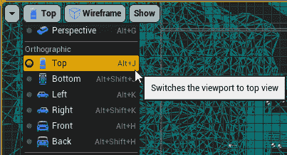

Switch to an orthographic top view using the menu or its associated shortcut key.

4.  缩放导航网格以包围建筑物的可步行区域。

在导航可见的情况下，您可以看到它正在生成导航网格曲面的位置，以及它是否做得很好：

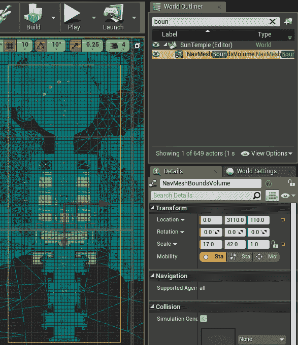

A top view of our level showing the extents of the NavMesh bounds volume

在我们的例子中，我们预计可以步行的建筑部分还没有覆盖。 这是因为我们还没有对边界体积的高度做任何处理，而这些区域太高或太低，无法放入其中。 让我们跳到侧面来解决这个问题。

5.  按*Alt*+*K*跳转到左侧视图，或从视口视图选择中选择左侧。
6.  将边界体积缩放到合理覆盖地板的比例：

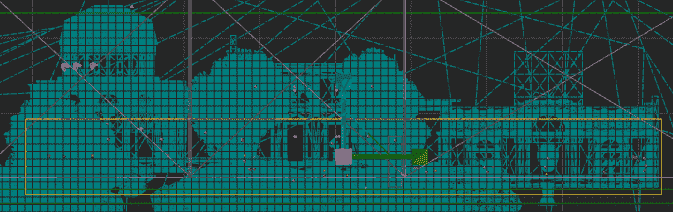

Side view of the level. You can see here that we're scaling the navmesh bounds volume to encompass the floor

7.  点击*Alt*+*G*跳回透视图，看看我们做得怎么样。 或者，也可以从视图选择器中选择透视。

It's worth memorizing these keystrokes for changing views. You'll use them all of the time, and it's handy to be able to switch quickly. *Alt* + *J*, *K*, and *H* switch view angles. *Alt* + *2* switches to a wireframe view, and *Alt* + *4* switches back to a shaded view. There are plenty of other hotkeys, but you'll use these the most.

如果我们飞到寺庙的后面，我们可以看到我们在这里有一个问题。 我们的导航网格在后走廊没有像预期的那样生成。 我们来搞清楚这是怎么回事：

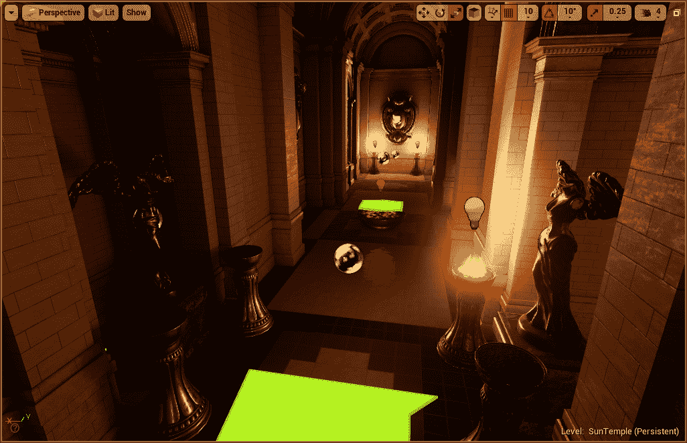

Here we can see that part of our level hasn't been properly covered by the navmesh.

# 修复碰撞问题

导航网没有在您期望的位置生成几乎总是有两个原因。 您的体积不在试图生成网格的区域周围，或者该区域中的碰撞有问题。 我们来看一下：

1.  按*Alt*+*C*在后厅查看碰撞，或按 Show|Collision。

看起来大厅里没有任何杂乱的碰撞，所以很可能是地板上的一次丢失的碰撞。

2.  选择坏区中的楼板。
3.  在其详细信息中，找到其静态网格并双击将其打开：

Use the Details panel to find the static mesh for the bad floor region.

4.  在静态网格编辑器中，选择碰撞工具栏项目，并确保选中了简单碰撞：

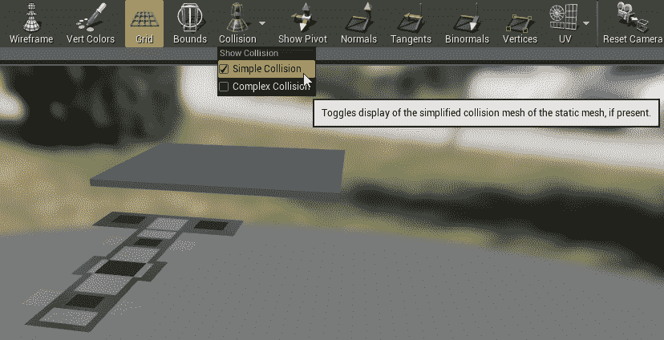

View simple collision for the static mesh

果然，我们的简单碰撞不见了。 我们来解决这个问题吧。

5.  选择碰撞|添加长方体简化碰撞，将简单碰撞平面添加到我们的地板上。

那好多了。 我们现在应该看到，我们期望的导航网格已经在我们的主要级别中生成：

Simplified collision created for our floor mesh

在我们继续之前，让我们花一点时间来谈谈这里发生了什么。 在实时软件中，我们需要做的一件非常常见的事情就是找出一个对象何时撞到了另一个对象。 不真实使用*碰撞网格*来执行此操作。 碰撞网格是简化的几何体，用于检查与世界上其他碰撞网格的交点。

演员有两个这样的角色：

*   **复杂碰撞**网格。 这只是模型的可见网格。
*   网格之间的**简单碰撞**。 这是一个围绕对象的不太详细的凸面网格。 它们通常在导入对象时生成，或者可以在创建模型的 DCC 中显式创建。 如果它丢失了，您可以在编辑器中创建一个简单的碰撞，就像我们在这里所做的那样。 最后，可以将 Details|Collision|Collision Complex 设置为使用复杂碰撞作为简单方法，以便将对象的可见网格用于所有碰撞计算。 不过，不要对包含大量多边形的网格执行此操作。 很贵的。

碰撞检测和处理本身就是一个相当深入的话题，超出了本书的范围，但为了我们在 VR 开发中的目的，我们将非常关心我们对象的简单碰撞网格，因为我们将使用这些简单的碰撞网格作为可行走的表面来检测其他对象何时撞到它们，检测我们是否可以抓住它们，以及用于许多其他目的。

# 从导航网格中排除区域

环顾我们的地图，我们还有几个问题需要解决。 我们的导航网格边界卷在一些我们不想让玩家传送的区域生成一个导航网格。 让我们也来解决这个问题：

1.  按*Alt*+*2*切换到线框视图，或使用视口的视图模式选择器切换到线框。

我们可能有一些问题可以通过调整 NavMesh 边界体积的比例来修复。 如果我们在屋顶或窗台上生成导航网格，让我们尽可能减少边界体积的垂直比例以排除这些区域。 在这个区域，按*Alt*+*K*跳到侧视图会有所帮助。

如果 NavMesh 边界体积扩展到建筑外部的距离比需要的更远，我们可以使用*Alt*+*J*跳到俯视图，然后调整它以使其更适合。

我们仍然会有一些想要排除的剩余杂散区域，这不是简单地通过缩放音量就能解决的。 对于这些，我们将使用导航修改器体积。 请参阅以下步骤：

1.  从模式调色板中抓取导航修改器体积，并将其拖动到场景中。
2.  移动并缩放它，直到它围绕生成不需要的导航网格的区域。

当导航修改器体积包围导航网格时，您将看到该区域中的导航网格消失。 查看详细信息面板中的导航修改器体积属性。 您是否看到 Default|Area Class 设置为 NavArea_Null？ 这会告知导航网格生成器忽略在该区域中生成导航网格。 你可以从下拉菜单中看到，它也可以用来标记障碍物和爬行空间，但对于我们在这里做的事情，我们并不关心这些。 我们只想用它来清除不需要的导航。

3.  根据需要将任意数量的这些对象拖动到场景中，以清理杂乱的部分。 可以在拖动修改器体积的同时按住*Alt*键进行复制，或按*Ctrl*+*W*进行复制：

A perspective wireframe view can be useful for finding problems with your navigation coverage. You'll find it helpful to memorize the transform hotkeys as you're moving objects around. *W* activates the Translate tool, which allows you to slide an object around. *E* activates the Rotate tool, and *R* activates the Scale tool. Tapping the *spacebar* also cycles through these tools. *Ctrl* + *W* duplicates an object, and holding *Alt* while dragging an object also copies it.

当你完成的时候，你应该有一个导航调整音量集合来阻挡你不想让你的玩家站立的区域。

飞过你的关卡，确保你不会在你不想要的地方有任何奇怪的水网。 在发现问题的地方，可以通过缩放导航网格边界体积或添加导航修改器体积来修复这些问题。

# 修改您的 navesh 属性

在我们继续之前，还有一件事您应该知道，那就是调整刚刚生成的导航网格的属性的位置。

如果需要更改其行为的任何内容，请选择将在您的级别中创建的`RecastNavMesh`对象。 在其详细信息面板中，您可以看到控制其生成、查询和运行时行为的属性。

我们不会在这里讨论这些问题，只想提醒大家注意其中一个属性：如果您想调整玩家可以容纳的区域的大小，您可以调整 Agent Radius 来实现此目的。 把它变小可以让你的玩家适应更紧的地方。 同样，您可以调整 Agent Height(座席高度)和 Max Height(最大高度)以确定应在其下生成导航的可接受的上限高度。 通常，在疯狂微调导航修改器体积之前，您需要对这些值进行更改，因为此处的更改会更改生成导航网格的位置。 出于我们的目的，我们将不考虑这些值。

# 设置典当蓝图

现在我们已经在场景中构建并调整了导航，我们可以通过点击*P*来关闭导航可视化，并开始处理我们的移动行为。

要实施远程传送移动方案，我们需要做三项工作：

*   找出玩家想要移动的位置
*   计算出玩家实际被允许移动的位置
*   将播放器移动到新位置

让我们开始工作吧。

# 迭代开发

我们将以迭代的方式开发此方法，就像从头开始开发它一样。 大多数教程只是引导您完成构建已完成方法的步骤，但这种方法的问题是它不会教您*为什么*要做您正在做的事情。 一旦你想做一些相似但不完全相同的事情，你就得从头开始。

取而代之的是，我们将分阶段工作。

肯特·贝克(Kent Beck)是一位开拓性的软件开发人员，他给开发人员提供了这样的建议：[0]让它工作，让它正确，让它变得更快。

这里重要的是你做事的顺序。 乍一看，这似乎很明显，但很少有开发人员在刚开始时就能做到这一点。 如果你按这个顺序工作，你会省去很多心痛的。

# 让它发挥作用

把你想要做的事情粗略地组装起来。 尽早并经常测试它。 将其构建为易于测试和易于更改。 改变周围的事情，直到你满意它在做正确的工作。

# 让它变得正确

既然您知道了代码需要做什么，那么就确定应该如何真正地组织它。 有没有更好或更干净的方法来做你想做的事？ 有没有可以重复使用的部件？ 这段代码需要在其他地方使用吗？ 如果有必要，你能调试一下吗？ 使用您在*使它工作*阶段所做的工作作为起点，但是现在您了解了您真正需要做什么，请正确地写下它。 在第一个阶段弄得一团糟是可以的(事实上，如果你没有弄得一团糟，你可能做错了)，但是在这个阶段把它清理干净。

# 快点，快点

一旦您有了做正确工作的相当干净的代码，就可以寻找让它运行得更快的方法。 是否有多次生成的结果可以缓存到变量中并重复使用？ 你是否在反复检查条件，即使你知道它们只有在某些事情发生时才会改变？ 您是否正在复制只能从原始位置读取的数据？ 找出你可以做的更有效率的事情，并在你能做的地方加快速度。 不过，这里要小心。 有些优化非常小，可能不会对正在运行的应用产生明显的影响。 找出最大的问题，并使用分析工具来了解你真正的问题所在。 你要确保你正在优化那些真正会有所不同的东西。 此外，在优化代码时，请注意不要使代码更难阅读或调试。 更改会使您的帧时间减少很少，但会使类很难或不可能更新或维护，这可能是不值得的。 在优化时使用判断。

# 把事情做得井井有条

许多新开发人员把这个顺序搞乱了，在他们真正确定自己做的是正确的事情之前，就开始尝试优化他们的代码。 这只会浪费时间，因为其中一些代码很可能会被抛出。 其他开发人员跳过*Make It Right*阶段，认为他们的工作一开始就已经完成了。 这也是一个错误，因为一段代码 80%的生命周期都花在维护和调试上。 如果您的代码工作正常，但却是一团糟，那么您将在以后花费大量额外的时间来保持它的运行。

Problems that are created by rushed or sloppy work early in development are often referred to as *technical debt*. This is stuff you're going to have to fix later because, even though it runs, it may not be flexible or robust, or might just be an unreadable shambles. The time to clear your technical debt is right after you've finished your *make it work* phase, and before you've moved onto other things and started to build more code on top of something that needs to change.

按照这个顺序工作，并将它们视为独立的阶段，将使您成为更高效的开发人员。

# 从正确的运动控制器设置线轨迹

让我们从让我们的远程传送运行起来需要做的第一件事开始--找出玩家想要去的地方：

1.  打开 BP_VRPawn Blueprint，如果尚未打开，请打开 My Blueprint|Graphs|EventGraph。

在我们设置跟踪原点的 Event Graph 中，我们应该仍然可以看到`BeginPlay`事件。 现在，我们将向事件记号中添加一些代码。

The Tick event is called every time the engine updates the frame. Be careful about putting too much work into your Tick events, as they can eat performance.

2.  如果尚未在事件图中看到事件记号节点，请右键单击图中的任意位置，在搜索框中键入`tick`，然后选择添加事件|事件记号。 如果已经定义了 Tick 事件，这不会添加新的事件-它只会将您带到事件图中的那个节点。 如果不这样做，现在就会创建一个。
3.  在事件记号的右侧单击鼠标右键，然后按通道添加线迹。

当您执行线跟踪时，您需要提供一个*开始*点和一个*结束*点，并告诉它您正在寻找的*碰撞通道*。 如果碰撞设置为提供的碰撞通道的执行元与起始点和结束点之间的线相交，跟踪将返回`true`，并将返回有关其命中内容的信息。 我们将使用此行为来找到我们的远程传送目的地。

让我们从正确的运动控制器的位置开始跟踪：

1.  从组件列表中，抓取`MotionController_R`，并将其拖到事件图中。
2.  我们希望在运动控制器的位置开始跟踪，所以让我们从`MotionController_R`返回值拖出一个连接器并释放。

3.  在出现的对话框中，在搜索栏中键入`getworld`并选择 GetWorldLocation：

默认情况下，蓝图节点创建是上下文相关的。 这意味着，如果您从另一个对象拖动连接，则只会显示适合该对象的操作。

4.  将`GetWorldLocation`的结果拖到线迹节点的起始输入引脚中。

现在，让我们设置跟踪终点。 我们将在距离起始位置 10,000 个单位的点结束跟踪，指向控制器所面向的方向。 让我们做一些简单的数学运算来找出那个点在哪里。

5.  从`MotionController_R`输出创建一个`Get Forward Vector`节点。

这将返回一个长度为 1 的向量，该向量指向控制器面对的方向。 我们说我们希望终点从一开始就是 10,000 个单位，所以让我们将向前向量乘以这个值。

6.  将`Get Forward Vector`返回值拖出并在搜索栏中键入`*`。 选择向量*浮点。

现在，将连接符从浮点输入拖到乘法动作，然后选择 Promote to Variable：

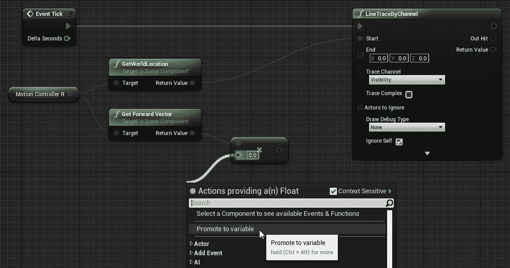

This is a fast way of creating variables in Blueprint. You can simply drag out from an input, select Promote to variable,
and a variable will be created with the correct type for the input

7.  将新变量命名为`TeleportTraceLength`，编译蓝图，并将变量的值设置为`10000`。

You could have simply typed `10000` directly into the multiplication action's float input, but it's bad practice to do so. If you start hiding values all over the place in your Blueprints, you'll have a hard time finding them later on when you need to change them. Also, a number typed into an input doesn't do anything to explain what it is. A variable, on the other hand, can be given a name that describes what's actually going to change if its value is changed. Numbers buried without explanation in your code are called *magic numbers* by developers, and they're an example of *technical debt*. They're just going to turn into a hassle for you later on when you need to maintain or debug your code. Unless the use of a value is absolutely obvious in its context, use a variable instead, and give it a meaningful name.

我们现在有一个 10,000 个单位长的矢量，指向控制器的前进方向，但现在它将从世界中心运行 10,000 个单位，而不是像我们预期的那样从控制器运行。 让我们将控制器的位置添加到此向量以修复此问题：

1.  从控制器的`GetWorldLocation`调用中拖动另一个连接器，然后在搜索栏中键入`+`。 选择向量+向量。
2.  将输出从正向向量乘法拖动到另一个输入。
3.  将此加法的输出连接到`LineTraceByChannel`的结束参数：

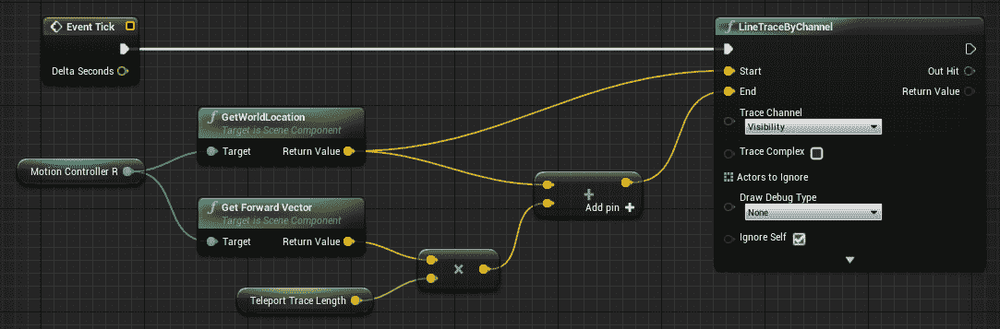

在我们继续之前，让我们先设置一些调试绘图，看看到目前为止一切是否如我们预期的那样运行。

4.  按住*B*键并单击`Line Trace`节点右侧的空白区域以创建`Branch`节点。 (您也可以像往常一样单击鼠标右键并创建分支节点，但这是一个有用的快捷方式。)
5.  将连接符从`Line Trace`节点的布尔返回值拖动到此分支的条件。

跟踪操作将在命中某物时返回`True`，如果未命中则返回`False`。我们只对命中某物时的调试绘制结果感兴趣，因此我们将使用分支的`True`输出。

如果我们真的撞到了什么，我们需要知道是在哪里发生的。

6.  从 OutHit 结构拖动连接符，然后选择 Break Hit Result 以查看 Hit 结果结构的成员。

A **struct** is a bundled collection of variables that can be given a name and passed around as a single unit. The `Hit Result` struct is a commonly used struct that describes the properties of a detected collision, telling you where it occurred, what actor was hit, and many other details. Calling **break** on a struct allows us to see its contents. 

现在，让我们画一条调试线来表示我们的跟踪：

1.  从`Branch`节点的`True`输出拖动一条执行线，并创建一个`Draw Debug Line`操作。
2.  将位置从`Hit Result`结构拖到`Debug Line`调用的 Line End 输入中。
3.  将命中结果的轨迹起点拖到线起点。
4.  将线条的粗细设置为`2`，并将其颜色设置为您喜欢的任何颜色。

现在，让我们在命中位置绘制一个调试球体：

1.  在\\t0 抯节点创建。
2.  将其执行输入连接到调试行的输出。
3.  将其中心设置为点击结果的位置：

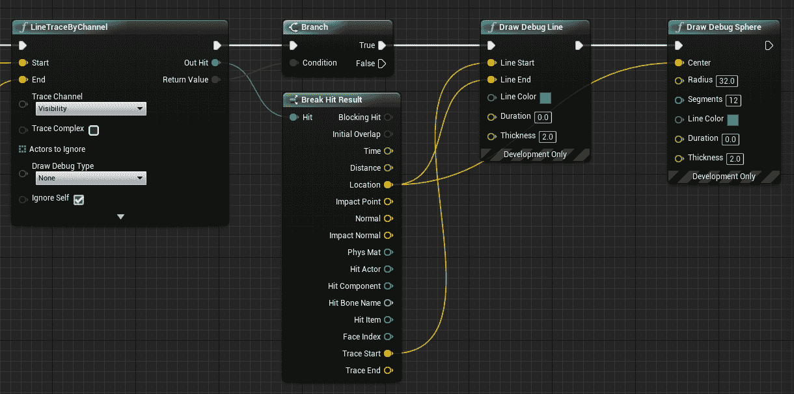

请注意，`Draw Debug`仅在开发版本中调用工作。 它们对于理解正在发生的事情很有用，但它们只是调试工具，需要替换为实际软件的真实可视化效果。 我们很快就会这么做的。

4.  我们来测试一下。 您的结果应该如下所示：

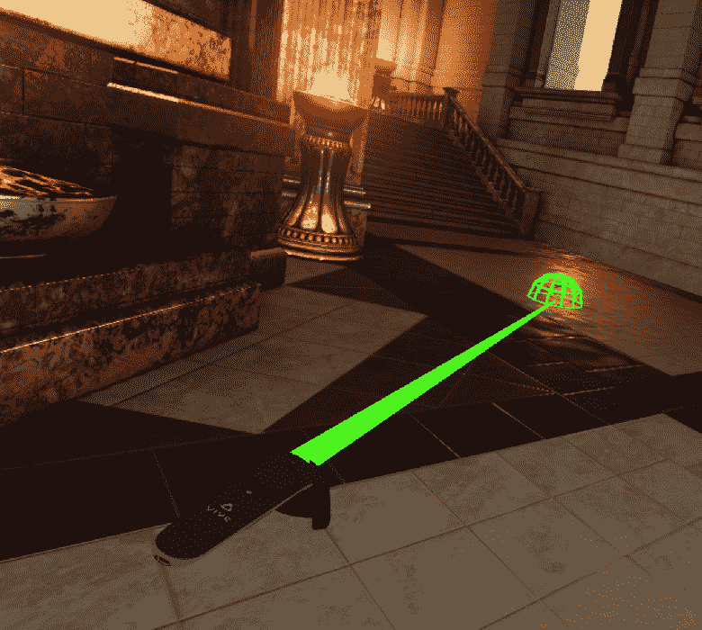

好的。 到目前为止，它正在做我们预期的事情-从控制器投射光线，并向我们显示它击中曲面的位置。 然而，问题是，撞墙和撞地板一样令人高兴。 我们需要把它限制在有效的传送目的地。 就这么办吧。

# 改进我们的跟踪命中结果

我们首先要做的是设置一个简单的测试，它只接受面向上的表面。 我们将通过使用称为*点积*的向量操作来比较曲面法线和世界上方向向量来完成此操作。 请按照以下步骤开始：

1.  右键单击 Hit Result Breakout 右侧的某个位置，然后创建一个 Dot Product 节点。
2.  将法线从命中结果拖动到第一个输入中，并将第二个输入的*Z*值设置为 1.0。

A *normal* is a vector that's perpendicular to the surface from which it extends. A *dot product* is a mathematical operator that returns the cosine of the angle between two vectors. If two vectors are exactly parallel, their dot product will be 1.0\. If they're facing exactly in opposite directions, their dot product will be -1.0\. If they're exactly perpendicular, the dot product is 0.

由于向量(0，0，1)是世界上的向上向量，通过测试曲面法线相对于该向量的点积，我们可以通过检查点积是否大于 0 来确定法线是否朝上。

3.  从点积的结果中拖出一个连接符，然后选择`>`操作符。
4.  使用此结果作为其条件创建另一个分支运算符。
5.  按*Alt*并单击绘制调试线节点的执行输入以将其断开。
6.  将新的执行行从返回值的分支拖到此新分支。
7.  将点积分支的 True 输出与我们的 Draw Debug Line 节点连接起来：

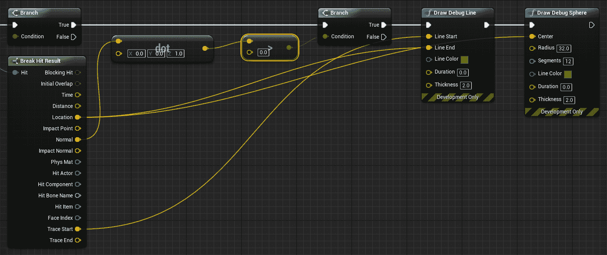

我们来测试一下。 我们将看到，现在可以看到光线撞击地板时绘制的调试球体，而不是光线撞击墙壁或天花板时绘制的调试球体。 正如我们刚才提到的，这是因为墙的法线对世界上方向矢量的点积是 0，而天花板对世界上方向矢量的点积是-1。

这样好多了，但是我们决定不让球员去的那些地方怎么办？ 我们花了所有的时间来设置我们的导航网格边界和导航网格修改器，但是我们还没有使用它们。 我们应该解决这个问题。

# 使用导航网格数据

现在，我们将进一步测试，并在导航网格上查找与指针指向的位置最近的点：

1.  在我们的图表中单击鼠标右键，然后创建一个项目点到导航节点
2.  将点击结果的位置输出连接到此新结点的点输入
3.  将节点的预计位置输出与调试行的 Line End 和 Debug Sphere 的 Center 连接，替换我们之前在那里使用的位置输入：

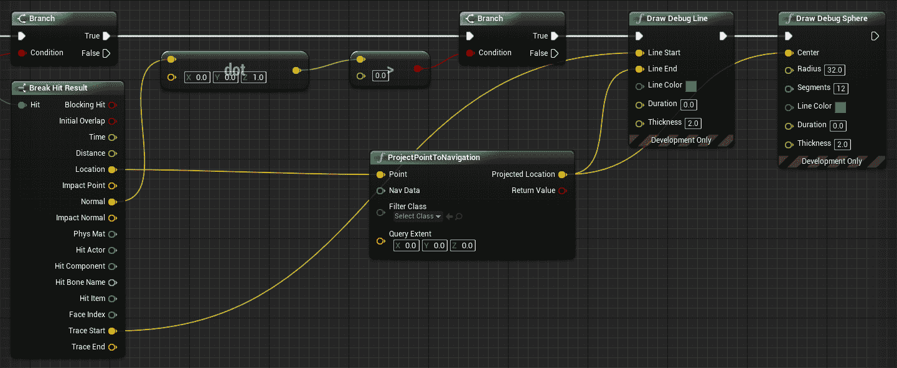

我们在这里所做的是查询我们创建的导航网格，以找到网格上离我们提供的位置最近的点。 这将防止选择我们已从网格中排除的位置。

然而，当我们环顾现场时，我们可以开始看到我们将遇到一个问题。 直接从控制器投射光线不会让我们传送到比我们现在所站的位置更高的位置，因为光线不能击中更高的楼层。 这是我们系统的一个缺陷，我们需要重新考虑这一点。

这就是为什么在我们投入大量的清理工作之前，坚持*让它工作*阶段是如此重要的原因。 经常发生的情况是，您的第一个运行原型会揭示您需要重新思考的东西，最好在您耗费大量精力之前尽早发现这些东西。

# 从线迹变为抛物线迹

仔细想一想，很明显，我们需要一条弯曲的路径才能到达比我们目前的视点更高的地方。 让我们修改我们的跟踪方法来实现这一点。 这是我们将得到的结果：

用来计算抛物线的数学实际上相当简单，但我们有一个更简单的选择。 `Predict Projectile Path By TraceChannel`这个方法已经为我们处理了数学问题，可以为我们节省一些时间。 现在让我们使用这个：

1.  断开我们的事件记号与旧的按通道跟踪的线条节点的连接。
2.  在我们的图表中单击鼠标右键并通过 TraceChannel 节点创建预测投射路径。
3.  把它和我们的记号联系起来。
4.  将其轨迹通道设置为可见性。

5.  接下来，将来自 MotionController_R 的 GetWorldLocation 的输出连接到 Start Pos 输入。

要获得启动速度，我们将获取 MotionController_R 的前向向量，并将其乘以任意值：

*   断开旧的`TeleportTraceLength`变量与乘法节点的连接。
*   从倍增节点的浮点输入拖出一个新连接器，并将其提升为变量。 让我们将其命名为`TeleportLaunchVelocity`。
*   编译我们的蓝图，并将其赋值为 900。
*   将结果连接到 Launch Velocity 输入：

现在，让我们绘制结果路径，这样我们就可以验证它是否正在执行我们预期的操作。

# 绘制曲线路径

`Predict Projectile Path By TraceChannel`方法将返回一个描述抛物线路径的点数组。 我们可以用这些点来画出我们的目标指示器。 让我们开始吧：

1.  就像我们之前所做的那样，将 Branch 连接到我们的返回值。 只有在得到好结果的情况下，我们才会对画任何东西感兴趣。

现在，要绘制曲线路径，我们实际上需要绘制一系列调试线，而不是只画一条调试线。

2.  让我们从外部路径位置拖动一个连接器，并创建一个 ForEachLoop 节点：

我们应该花点时间谈谈我们在这里所做的事情，因为这是一个您会经常使用的概念。

到目前为止，我们在棋子蓝图中处理的所有变量都包含单个值--一个数字、一个真或假的值以及一个向量。 然而，用于外部路径位置的连接器看起来不同。 它不是一个圆，而是一个 3x3 的网格。 此图标表示这是**数组**。 数组包含一系列值，而不是保存单个值。 在本例中，这些值是组成我们将要绘制的曲线路径的点的列表。

每个循环的*是称为**迭代器**的编程结构。 迭代器遍历值集合，并允许您对集合中的每个元素执行操作。*

让我们快速查看一下 ForEach 循环的输出：

*   循环体将为它在数组中找到的每个项执行一次。
*   Array 元素是它找到的项。
*   数组索引就是它找到它的地方。 数组始终从零开始编号，因此第一个项目的索引为 0，第二个项目的索引为 1，依此类推。
*   完成的执行管脚在到达列表末尾时将被调用。

我们将使用此循环来绘制曲线的线段，但每个线段需要两个点，这意味着在到达数组中的第二个点之前，我们无法绘制任何内容：

1.  从数组索引输出拖动连接器，并将其连接到 INTEGER|INTEGER 节点。 将第二个值保留为 0。
2.  将其输出连接到分支，并将循环主体连接到分支输入。 这将允许我们跳过数组中的第一个值。
3.  创建一个 Draw Debug Line 节点，并将 Array 元素连接到 Line End 输入。 因为我们从数组的第二个值开始，所以该位置处的点就是我们行的终点。 我们将通过在这条线之前得到点来开始这条线：

4.  要找到我们的线起点，请从数组索引中拖动另一个连接符，然后*从其中减去 1*。
5.  现在，从外路径位置拖动另一个连接器，并在搜索框中键入`Get`。 选择获取(副本)：

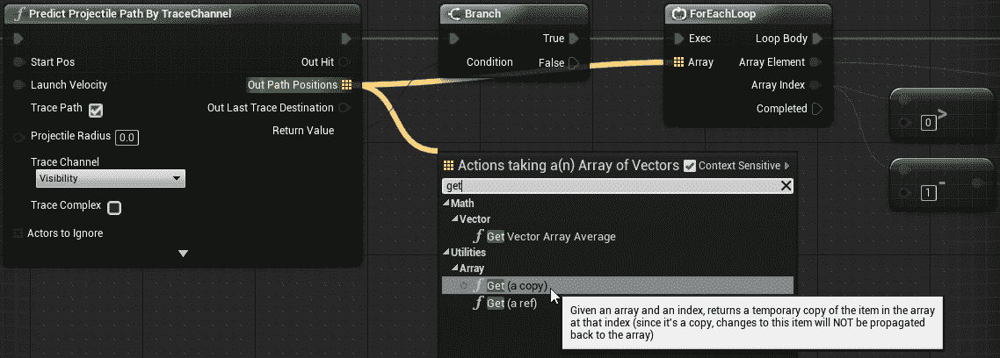

这将获得存储在数组中与我们给出的索引相对应的位置的元素。

6.  将 Array Index-1 减法的结果连接到 Get 节点的整数输入。 这将在我们当前迭代的值之前检索该值。
7.  将此 Get 节点的输出连接到 Draw Debug Line 的第一行开始行：

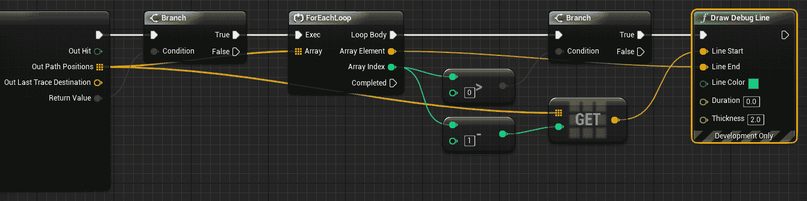

完成后，绘图例程应该类似于前面的屏幕截图所示。

我们刚才所做的是循环遍历出路径位置中的每个路径位置向量，并且对于第一个路径位置之后的每个路径位置向量，我们从它之前的位置到当前位置画了一条线，直到我们到达列表的末尾。

# 绘制完所有线段后绘制终点

最后，让我们在跟踪终结点绘制一个调试范围。 我们可以重复使用以前用于在直线轨迹末尾绘制球体的节点：

1.  就像我们之前所做的那样，**将****Hit Result**结构从 Out Hit 中断开。
2.  获取其位置并将其馈送到 ProjectPointToNaviation 节点。
3.  将 Branch 连接到其返回值，并将**True**分支的执行提供给 Draw Debug Sphere 节点。
4.  使用投影位置作为调试球体的中心。

但是，不要在 Draw Debug Line 节点之后立即调用它，而是从 ForEachLoop 的未完成输出调用它，因为我们只需要在绘制完所有线段之后绘制一次球体。

您的图表现在应该如下所示：

让我们测试一下，看看当我们运行它时会发生什么：

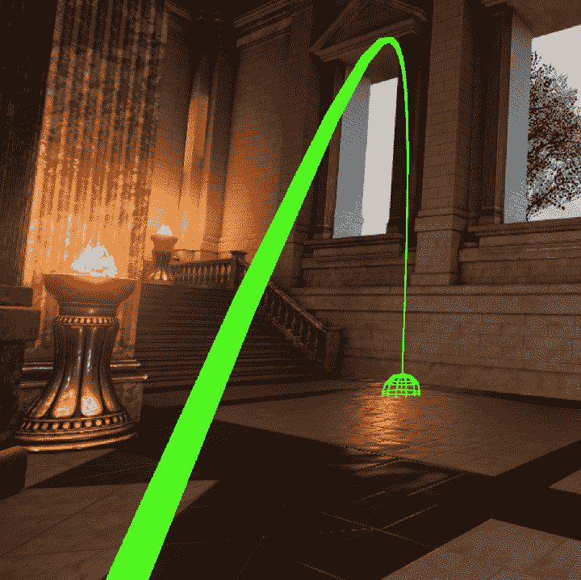

太棒了！ 我们现在正在投影一条弯曲的路径，这将使我们更容易地绕过地图，我们已经使用调试绘图来验证它是否给我们带来了良好的结果。

The Draw Debug methods we're using here will only work in debug and development builds. They aren't included in shipping builds. The correct way to draw this path would be to use the collection of points in Out Path Positions to change the shape of a spline mesh, but doing this is beyond the scope of this book. There's a good example, however, in the VR Template, and the work we've done here is a good starting point for understanding what they're doing in that project's Blueprints.

接下来，让我们来处理下一个任务，让我们的玩家传送到他们选择的目的地。

# 传送玩家

在这种情况下，我们需要做的第一件事是给玩家一种方法来告诉系统他们打算什么时候进行心灵传送。

# 创建输入映射

我们将使用引擎输入映射来设置一个新的命名输入。 让我们开始吧：

1.  打开您的项目设置并导航到引擎|输入。
2.  单击绑定|操作映射旁边的+号以创建新的操作映射：

3.  我们将它命名为`TeleportRight`。

这将创建一个具有此名称的输入事件，然后我们可以在事件图中对其进行响应。

You may have already discovered that you can set up events in your event graphs directly to listen to controller inputs and keystrokes. For most projects, though, it's a better idea to map your inputs here as it gives you a central location from which to manage them.

现在，让我们指出哪些输入应该触发此传送操作。 新操作映射下方会出现一个下拉菜单，并显示无指示符。 (如果下拉菜单不可见，请单击操作映射旁边的扩展器箭头。)。 让我们继续吧：

1.  在 TeleportRight 下，使用下拉菜单选择 MotionController(R)拇指杆。

这将处理我们的 Oculus Touch 控制器映射，但对不使用拇指杆的 HTC Vive 没有帮助。

2.  点击 TeleportRight 操作旁边的+号，将另一个映射添加到组中。
3.  为此选择 MotionController(R)FaceButton1：

您的绑定现在应该如前面的屏幕截图所示。

现在，我们已经告诉输入系统发送 TeleportRight 输入事件，无论玩家使用的是带拇指杆的运动控制器还是带面部按钮的运动控制器。

These bindings are stored in `DefaultInput.ini` and can be edited there, but it's generally more convenient to set them up here in the Project Settings UI. If you need to copy a bunch of input bindings from one project to another, however, it can be convenient to copy the contents of `DefaultInput.ini` from one project to another. Not every project will have `DefaultInput.ini`. If yours doesn't, you can simply add it and the engine will use it.

让我们关闭项目设置并返回到 VRPawn 的事件图表。 您会发现现在可以在这里创建 TeleportRight 事件，因为我们在输入设置中定义了它。 让我们这样做，如下所示：

# 缓存我们的远程端口目的地

现在，在对此事件执行任何操作之前，我们需要存储之前在跟踪方法中找到的位置，以便玩家尝试传送时可以在此处使用它：

1.  在 My Blueprint|Variables(我的蓝图|变量)下，按+号创建一个新变量。
2.  将其类型设置为 Boolean，并将其命名为`bHasValidTeleportDest`。

Variable names are important. They tell the reader (who might be another developer maintaining your code or might be yourself in the future) what a variable represents. Your variable names should accurately reflect what they contain. In the case of True/False Boolean variables, make sure your name describes what question it's actually answering. So, for instance, in this case, *Teleport* would be a poor choice for a name, as it doesn't indicate whether the variable's value means that the player can teleport, is teleporting, has recently teleported, or just enjoys daydreaming about teleporting. Be clear about these things. `bHasValidTeleportDest` clearly indicates what it means.

Prefixing Boolean variable names with *b* is a practice mandated by Epic's coding style guide for C++, but it's a good idea to follow it in Blueprint development as well. (If you plan on developing in C++, you should know and follow the Unreal style guide, which can be found at [https://docs.unrealengine.com/en-us/Programming/Development/CodingStandard](https://docs.unrealengine.com/en-us/Programming/Development/CodingStandard).)

3.  创建另一个变量并将其命名为`TeleportDest`。
4.  将其类型设置为向量。

让我们填充这些变量。 我们关心的位置是我们在命中位置调用的 Project Point to Guide 方法找到的预计位置。 让我们存储一下是否找到了有效的位置。 您可能希望将 Draw Debug Sphere 节点向右拖动一点，以便给自己留出一些空间，因为我们将在调用它之前添加几个节点：

1.  将`bHasValidTeleportDest`变量拖到事件图上，并在询问时选择 Set。

您看到 ForEach 循环的完整输出在哪里运行到我们的 Project Point to Navigation 方法的 Branch 语句中了吗？

2.  按*Ctrl*并将执行输入拖动到该分支节点，将其移动到`CanTeleport`设置器上。 (请注意，在图形中使用布尔变量时，会自动隐藏该变量上的*b*前缀。)
3.  将项目点到导航方法的返回值馈送到此变量。 您也可以按*Ctrl*+拖动来移动它。
4.  将一条执行行从 set bHasValidTeleportDest 拖到 Branch 输入，并使用 setter 的输出来驱动分支。

让我们将 TeleportDest 设置为 Project Point to Guide 方法的预计位置(如果返回 true)：

1.  将我们的`TeleportDest`变量拖到事件图上并选择设置它。
2.  将从 Branch 节点运行的执行行放入 Draw Debug Sphere 节点，然后按*Ctrl*并拖动它以将其移动到 Set Teleport Dest 输入中。
3.  将投影位置输出送入`TeleportDest`变量。
4.  现在，仅仅因为它更干净，让我们将来自`TeleportDest`setter 的输出提供给 DrawDebugSphere 节点上的 Center Input。

It's worth learning about Blueprint shortcuts. Pressing *Alt* + clicking on a connection disconnects it. Pressing *Ctrl* + dragging a connection allows you to move it somewhere else.

5.  从 Branch 的错误执行管脚开始，让我们将 TeleportDest 设置为(`0.0, 0.0, 0.0`)。

您的图表现在应该如下所示：

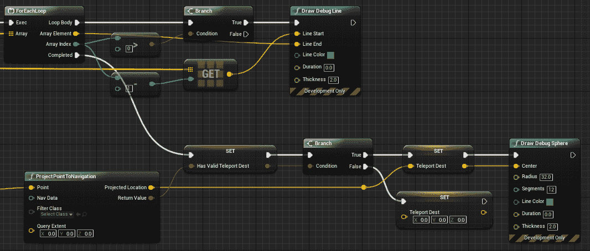

Can you see the extra pin on the connection between Projected Location and Set Teleport Dest? That's a **Reroute Node**. You can create one by dragging a connection out and selecting Add Reroute Node from the creation dialog, or by *double-clicking* on an existing connector. These are useful for organizing your connections so that you can easily see what's going on in your graphs. In general, try to avoid allowing connectors to cross underneath nodes they're not connected to, as this can mislead someone reading your Blueprint. You can also feed multiple inputs into a reroute node or branch multiple outputs from it.

现在，在每个刻度上，我们在`bHasValidTeleportDest`中都有一个真或假的值，如果它是真的，我们就有了可以传送到的位置。

# 执行心灵传送

让我们使用刚刚存储在`bHasValidTeleportDest`标志中的值来查看我们是否有一个有效的目的地，如果有，则将玩家棋子传送到`TeleportDest`：

1.  从我们刚才创建的`TeleportRight`个输入操作，我们将把一个执行行从它按下的输出连接到一个 Branch 节点。

Remember that you can hold down *B* and click to create a Branch node. Take a look at the other shortcuts found on Epic's Blueprint Editor Cheat Sheet here: [https://docs.unrealengine.com/en-us/Engine/Blueprints/UserGuide/CheatSheet](https://docs.unrealengine.com/en-us/Engine/Blueprints/UserGuide/CheatSheet). They'll save you a lot of time.

2.  抓取`bHasValidTeleportDest`变量并将其拖到 Branch 节点的条件输入上。
3.  从 True Execution 输出中，创建一个 SetActorLocation 操作，并将`TeleportDest`变量拖到其 New Location 输入上：

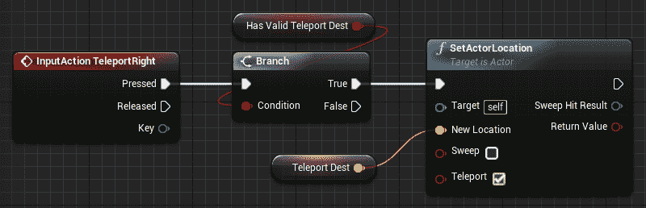

将其启动到 VR 预览中，并尝试一下。 你现在应该可以传送地图了。 能够探索是件好事，不是吗？

现在一切都正常了，让我们做些工作来改进吧。

当我们开始在地图上跳来跳去时，我们会注意到的第一件事是，我们没有任何方法来改变玩家在他们着陆位置的方向。 我们绝对可以改进这一点。

# 允许玩家选择他们的着陆方向

如果我们想让我们的玩家在落地时能够指定他们面对的方向，我们首先要做的是给他们一种方法来告诉系统他们想看哪里。

# 映射轴输入

让我们添加一个输入，为我们的玩家提供一种实现此目的的方法：

1.  打开项目设置|引擎|输入。

您看到绑定|操作映射中设置 TeleportRight 输入的部分了吗？ 其正下方是**轴映射**的列表。

2.  单击轴贴图旁边的+按钮以添加新贴图。
3.  使用展开箭头将其打开，并将其命名为`MotionControllerThumbRight_Y`。
4.  将其映射到 MotionController(R)拇指杆 Y。
5.  将其比例设置为-1.0。
6.  创建名为`MotionControllerThumbRight_X`的第二个映射。
7.  将其映射到`MotionController (R) Thumbstick X`，并将其比例保留为 1.0。

Unreal's input system handles two kinds of mappings: **Action Mappings** and **Axis Mappings**. Action mappings are discrete events, such as button or key presses and releases. Axis mappings give you continuous information about an analog input, such as a joystick or a trackpad.

您可能已经注意到，我们将运动控制器拇指杆的 Y 输入缩放了-1.0。 这是因为来自该设备的 Y 输入是反转的，所以我们需要反转它。 将其乘以-1 可以简单地反转输入：

您的输入映射现在应该如前面的屏幕截图所示。

现在我们已经添加了新的输入映射，可以关闭项目设置了。

# 清理我们的滴答活动

让我们回到棋子的事件图上。

因为我们想要在设置心灵传送时不断检查玩家的拇指杆位置，所以我们需要将此标记在事件记号上。 不过，我们的滴答活动变得有点拥挤了。 在开始添加更多内容之前，让我们先清理一下：

1.  在 Tick 事件的当前内容上拖动选框：

Select all the nodes connected to your Event Tick.

2.  右键单击选定节点上的任意位置，然后从上下文菜单中选择折叠以起作用：

Right-click any of the selected nodes and select Collapse to Function.

3.  将新函数命名为`SetTeleportDestination`。

那干净多了，不是吗？ 请看下面的屏幕截图：

通常，使用函数作为组织和重用代码的一种方式是一个好主意，而不是让所有东西散落在事件图上。 请记住，任何一段代码的 80%的生命周期都将花费在调试和维护上，因此及早组织代码可以节省您以后的大量工作。

The names you give your functions should be descriptive and they should be accurate. Think of them as a promise to the reader that the contents of the function really do whatever the name suggests they do. That reader might be you in the future, debugging or updating your code, or it might be another developer altogether. If you've named your functions clearly, everyone's going to have a much easier time understanding what your code is doing. If you modify a function in a way that changes what it does, change its name too. Don't let a legacy name mislead your reader.

# 使用拇指棒输入来调整玩家的方向

让我们创建一个新函数来处理我们的传送定位：

1.  点击 My Blueprint|Functions(我的蓝图|函数)中的+按钮创建新函数。
2.  将其命名为`SetTeleportOrientation`。

将自动打开一个新选项卡，向您显示函数的内容。 现在，它只包含一个带有执行别针的入口点。

3.  右键单击函数图形中的任意位置，然后在上下文菜单的搜索框中键入`thumbright`。 您将看到您在输入设置中创建的两个轴映射现在在此处显示为函数。
4.  在此处添加“Get MotionControllerThumbRight_Y”和“Get MotionControllerthhumbRight_X”节点：

5.  创建一个 Make Vector 节点。
6.  将来自 get MotionControllerThumbRight_Y 的返回值提供给 Make Vector 节点的 X 输入。 (这看起来可能是落后的，但它是正确的-我们需要转换此输入以使用它来驱动我们的旋转。)
7.  将 Get MotionControllerThumbRight_X 馈送到新向量的 Y 输入。
8.  通过将规格化节点添加到 Make Vector 的返回值来规格化新向量：

**Normalizing** a vector scales it to a length of 1\. A vector whose length is 1 is called a **unit vector**. Many mathematical operations on vectors will return incorrect results if they're called on vectors with arbitrary lengths. A general rule of thumb is that, if you're doing vector operations to figure out rotations or angles, make sure you're using unit vectors.

现在我们已经标准化了我们的输入向量，我们需要旋转它，使它瞄准玩家想要的方向。

关于为 VR 设计运动系统的问题是这样的：当你让玩家轮换时，你必须决定它的基础是什么。 当玩家在触控板上向前推操纵杆或向前触摸时，我们如何将其转化为真实世界的旋转？ 如果你已经操作过遥控汽车或者玩过足够长时间的游戏，还记得*Resident Evil*和*Fear Effect*中旧的*坦克风格的*控制，那么你对我们在这里描述的东西有一定的了解。 *在这些系统中，前进*意味着汽车或角色面对的方向，如果角色此时正对着摄像机，这些控制将会感觉后退。

在过去 20 年的传统第一人称设计中，这不是我们必须解决的问题。 角色面对的方向和玩家看的方向没有区别，所以使用相机的注视方向作为向前的方向是一个显而易见的选择。

另一方面，在虚拟现实中，我们有几个选择：

*   我们可以根据*棋子的旋转*来旋转，但在房间大小的 VR 中这不是一个好主意，因为玩家可以在跟踪体积中转身，而不必旋转他们的棋子。 您不希望基于玩家可能看不到的东西来调整控件的方向。
*   我们可以基于玩家的*注视方向*，这是一个更好的选择，因为它从玩家的角度来看是一致的，但在玩家环顾四周时会产生时髦的行为：

A character in VR can have several transforms at the same time - head, body, and hands.

在 VR 中，玩家的头、手和身体可以相互独立地旋转，因此不再明显地看到*FORWARD*在哪里。

不过，最好的选择(稍后我们将在处理无缝移动时会发现)是基于*运动控制器的方向*，因为玩家已经在使用它来提供输入，知道它的方向，并且可以很容易地改变它的方向。

让我们这样设置我们的系统：

1.  将 RotateVector 节点添加到 Normize 节点的返回值中。
2.  将对 MotionController_R 的引用拖到图表上。
3.  从 MotionController_R 拖动 GetWorldRotation 节点：

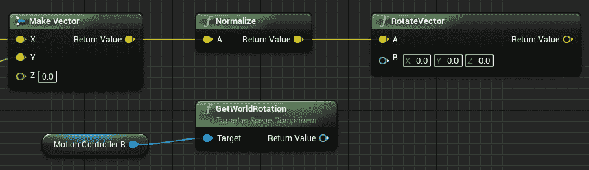

这将使我们在世界上找到正确的控制器方向，但我们只对侧向旋转(Yaw)感兴趣。 我们不想要任何俯仰或滚动信息。

4.  在 GetWorldRotation 中的返回值上单击鼠标右键，然后选择“拆分结构销”(Split Struct Pin)：

5.  对 RotateVector 节点的 B 输入执行相同的操作。
6.  将 GetWorldRotation 的偏航输出连接到 RotateVector 的偏航输入。 保持侧滚和俯仰不连接：

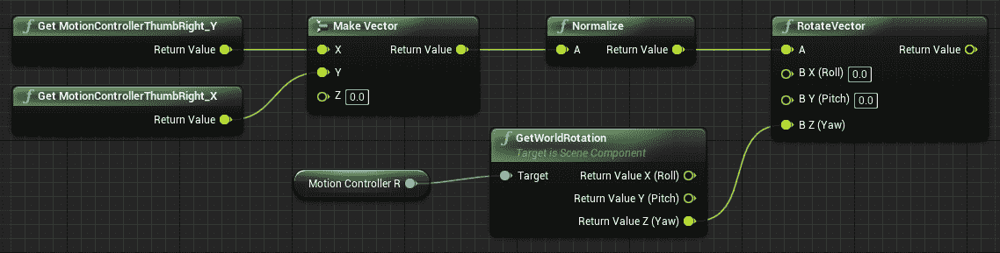

**Splitting** struct pins in Blueprints is often cleaner than using **Break** and **Make** nodes to split them and reconstruct them. They do the same thing. It's purely a question of what makes your Blueprint more readable.

现在，我们需要将旋转后的向量转化为可以使用的旋转体。

7.  将 RotationFromXVector 节点添加到 RotateVector 的返回值。

最后，我们需要存储该向量，以便稍后使用。

8.  将 RotationFromXVector 节点的返回值拖出并选择 Promote to Variable。
9.  将新变量命名为`TeleportOrientation`。
10.  这将自动为新变量创建一个集合节点。 将一条执行线从函数的入口点拖到此 setter。

11.  从设置器拖出一条执行线，然后选择 Add Return Node(添加返回节点)，为您的函数添加一个出口点。

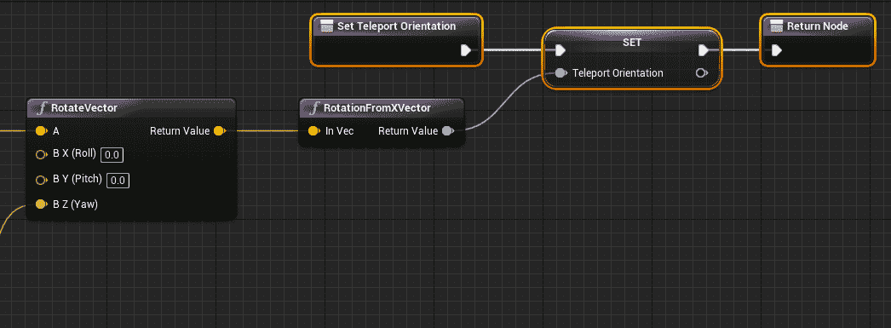

We're now converting the return value from our RotateVector node to a rotator and using it to populate Teleport Orientation. Adding return nodes to functions that don't return values isn't required, but it's good practice to do it because it makes it clear to someone maintaining or debugging the code where the exit points are. Nothing will break if you don't do this, but your code will be easier to read if you do. We're not going to do this with every method in this book, just to avoid adding extra steps, but it's a good idea to make this a habit.

12.  返回到事件图的事件标记，并将 SetTeleportOrientation 函数从 SetTeleportDestination 拖到传出执行管脚上：

现在，在设置远程端口目的地完成后，将在每一帧上调用设置远程端口方向。

让我们使用以下新信息：

1.  在事件图中，找到 InputAction TeleportRight 事件，我们在该事件中设置参与者位置。
2.  首先，让我们也将其压缩为一个函数。 将其排除在事件图中是草率的。 选择输入操作右侧的节点，右键单击，然后*将它们折叠*为一个新函数。
3.  将新函数命名为`ExecuteTeleport`：

因为我们现在有一个需要适应的远程端口方向值，所以 SetActorLocation 对我们来说已经不够了，因为它只设置位置而不设置旋转。 我们可以使用存储在 TeleportOrientation 变量中的值，在它之后立即调用`Set Actor Rotation`方法，但是有一个更干净的方法可供我们使用。

4.  在此处选择 Set Actor Location 节点，然后**删除**它。
5.  在图表中单击鼠标右键并创建一个 Teleport 节点。
6.  将分支语句中的 True 分支连接到其执行输入。
7.  将 TeleportDest 变量连接到其 Dest Location 输入。

8.  从我们的变量列表中抓取 TeleportOrientation 变量，并将其拖到 Dest 旋转输入引脚上：

让我们试试看吧。 好多了。 现在，拇指在触控板上的位置或拇指杆的方向会影响我们的心灵传送方向。 我们可以更容易地四处看看。

不过，还有一件事我们需要解决。 如果玩家仍然看着与棋子旋转相同的方向，我们的传送方向会工作得很好，但如果不是这样，我们的传送方向就会变得令人困惑地不准确。让我们来适应这一点。

我们要做的是找出玩家相对于棋子的方向看在哪里，然后将旋转的差异与我们选择的心灵传送方向结合起来，这样当玩家降落在那里时，他们就会朝他们选择的方向看。

1.  单击鼠标右键并创建 GetActorRotation 节点。
2.  我们只需要这个旋转的偏移值，所以右键单击节点的返回值并选择 Split Struct Pin 来分解旋转器的组件。
3.  从组件列表中，将对相机组件的引用拖到图表上。
4.  拖动其输出并对其调用 GetWorldRotation。
5.  在其返回值上单击鼠标右键，然后选择“拆分结构销”。

6.  在图形中单击鼠标右键并创建增量(旋转体)节点。 拆分其 A 和 B 输入结构引脚。
7.  将 GetActorRotation 节点的返回值 Z(Yaw)输出连接到增量(旋转器)节点的 A Z(Yaw)输入。
8.  将摄影机的 GetWorldRotation 节点的返回值 Z(偏航)输出连接到增量(旋转器)节点的 B Z(偏航)输入。
9.  在图形中单击鼠标右键并创建一个 CombineRotators 节点。
10.  将 Teleport 方向变量的值提供给 CombineRotators 节点的 A 输入。
11.  将 Delta(旋转器)节点的返回值输入到 CombineRotator 节点的 B 输入。
12.  将返回值从 CombineRotators 节点馈送到 Teleport 节点的 Dest 旋转输入。

现在，当玩家降落在选定的心灵传送点时，他们会朝他们期望的方向看。 如果你来自传统的平板游戏开发，作为一名 VR 开发者，这是你必须适应的一件事：棋子的旋转并不等同于看的方向。 VR 中的玩家可以在不影响棋子方向的情况下环顾四周，所以当你在 VR 中处理旋转时，你总是需要记住这两个方向。

现在的问题是，当我们着陆时，我们看不到它会把我们对准哪里。 让我们改进我们的目标指示。

# 创建传送目的地指示器

我们将创建一个简单的 Blueprint 执行元来充当我们的传送目的地指示器：

1.  在项目的 BluePrints 目录中，右键单击并创建一个新的 BluePrint 类，将`Actor`作为其父类。
2.  将其命名为`BP_TeleportDestIndicator`。
3.  把它打开。
4.  在其 Components 选项卡中，单击 Add Component，然后添加一个圆柱体组件。
5.  将圆柱体的最大比例设置为(`0.9, 0.9, 0.1`)。 (请记住解锁缩放输入右侧的统一缩放锁定。)
6.  在圆柱体的碰撞特性下，将 Can Character Step On On 设置为 No，并将其碰撞预设设置为 NoCollision。 (这一点很重要-如果棋子发生碰撞，此指示器将干扰棋子。)
7.  添加多维数据集组件。
8.  将其位置设置为(`60.0, 0.0, 0.0`)。
9.  将其比例设置为(0.3，0.1，0.1)：

我们的指示器应该看起来像这样。

10.  编译、保存并关闭它。

# 给它一种材料

如果空白的白色材料不适合你，我们可以做一些更好的东西。 我们不会在这一点上疯狂，但我们可以通过一些快速的工作来改善它的外观：

1.  从内容浏览器的项目目录中，创建名为`MaterialLibrary`的新目录。

2.  在其内部单击鼠标右键(Right)，然后选择“创建基本资源|材质”。
3.  将新材质命名为**M_TeleportIndicator**。
4.  把它打开。
5.  在详细信息|材质部分中，将其混合模式设置为相加。
6.  将其着色模型设置为未照明。
7.  按住*3*键并单击图形中的任意位置以创建恒定的 3 向量节点。 这就是颜色在材质中的表示方式。
8.  双击该节点并选择主绿色：R=0.0、G=1.0、B=0.0。
9.  将颜色节点的输出拖动到发射颜色输入中。
10.  在图表中的任意位置单击鼠标右键(Right)，然后创建一个线性渐变节点。
11.  将 VGradient 输出拖动到材质的不透明度输入中：

12.  保存并关闭材质。
13.  打开 BP_TeleportDestIndicator Blueprint 并选择 Cylider 组件。 在其详细信息|材质下，将其元素 0 材质设置为刚创建的材质。
14.  对多维数据集组件执行相同的操作：

好的!。 这是一种非常简单的材料，如果我们真的想要，我们可以花很多时间设计一些奇妙的东西，但对于我们现在正在做的事情来说，这是完全可以的。

# 将心灵传送指示器添加到棋子上

现在，让我们将这个新指标添加到我们的棋子中：

1.  在我们的 VRPawn 的 Components 选项卡中，添加子执行元组件。
2.  在其 Details|Child Actor Component|Child Actor Class 中，选择我们刚刚创建的新 BP_TeleportDestIndicator 执行元。
3.  将 ChildActor 重命名为`TeleportDestIndicator`。 (可以使用*F2*键重命名对象。)

让我们创建一个新函数来设置其位置和方向：

1.  在兵的 Functions 集合中创建一个新函数，并将其命名为`UpdateTeleportIndicator`。
2.  将 TeleportDestIndicator 拖到函数的图形中。

3.  拖动 TeleportDestIndicator 的输出并创建一个 SetWorldLocationAndRotation 节点，将其用作其 Target。
4.  将 TeleportDest 变量拖到 New Location 输入上。
5.  将 TeleportOrientation 变量拖到 New Rotation 输入上。
6.  给它一个返回节点：

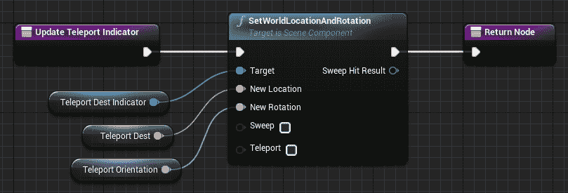

7.  返回您的事件图，在设置远程传送方向后，将`UpdateTeleportIndicator`函数的一个实例拖到您的事件标记上：

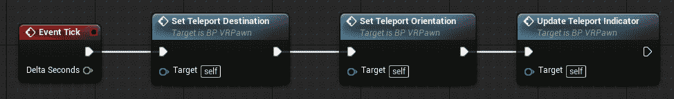

让我们试试看吧。 那好多了!。 现在，我们可以看到我们着陆时面对的方向。 说到这里，让我们去掉之前用作临时解决方案的 Debug Sphere。

8.  在 Set Teleport Destination 函数中，找到 Draw Debug Sphere 调用并**删除**。

# 优化和完善我们的远程传输

让我们把事情做得更精致一些，我们仍然可以看到一些粗糙的边缘。

# 仅在按下远程传送输入时显示 UI

首先，我们一直在运行远程传输指示器，而不管用户是否真的在尝试远程传输。 让我们仅在用户按下远程端口输入时激活这些界面：

1.  向我们的玩家棋子添加一个新变量。 将其类型设置为 Boolean，并将其命名为`bTeleportPressed`。
2.  按住*Alt*并单击从 InputAction TeleportRight 到`ExecuteTeleport`函数调用的执行行，将其断开。
3.  将`bTeleportPressed`变量从 InputAction TeleportRight 拖到按下的执行管脚上以创建设置器。 在此处将其设置为 True。
4.  将`bTeleportPressed`的另一个实例拖到释放的执行销上。 将其设置为 False。
5.  将 ExecuteTeleport 连接到清除 TeleportPressed 的设置器，以便在用户释放输入时进行远程传送：

现在我们有了一个变量，该变量在保持远程端口输入时为真，否则为假，我们可以使用它来管理在 Tick 事件上发生的事情。

6.  断开事件记号与 SetTeleportDestination 的连接。

7.  在这里添加一个分支节点，并使用`bTeleportPressed`作为其条件。
8.  将执行行从 Event Tick 馈送到分支输入，并将其 True 分支馈送到`SetTeleportDestination.`。这样，仅当用户按下远程端口输入时，远程端口 UI 才会更新或显示：

让我们试试看吧。 这样更好，但是我们的目的地指示器在未按下输入时仍然可见，并且没有更新。 我们需要在不用的时候把它藏起来：

1.  从棋子的 Components 选项卡中选择 TeleportDestIndicator 组件。
2.  在其详细信息中，将 Render|Hidden in Game 设置为 True。
3.  将 TeleportDestIndicator 组件拖到图表上。
4.  从其中拖动一个连接器，并在其上调用 Set Hidden in Game。
5.  将**bTeleportPressed**的一个实例拖到您的图表上，**获取**它的值。
6.  从其中拖出一个连接器，并在搜索栏中键入`not`。 选择 Not Boolean(非布尔值)。
7.  将此值插入到 Set Hidden in Game 动作中的 New Hidden 输入中。

这将使指示灯在未按下 Teleport 时隐藏，在按下时不隐藏：

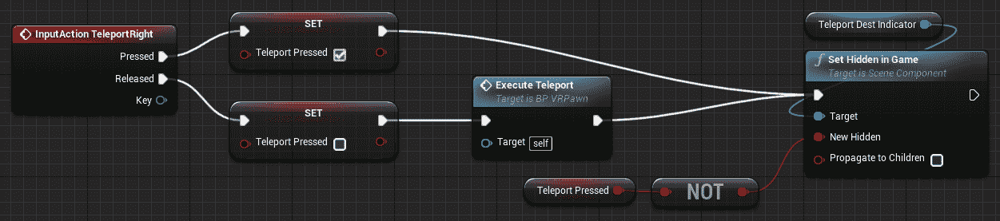

让我们再试一次。 好多了。 仅当我们需要时才会显示 UI。

We would still need to replace the teleport arc we're currently drawing with debug methods before we could ship. We're not going to run through that process here, though, because it's a bit too involved for the scope of this chapter. Basically, what you would do here is create a spline component on the pawn and attach a mesh to it. Instead of using a ForEach loop in `SetTeleportDestination` to draw a series of debug lines, we would save the path positions to a variable. In `UpdateTeleportIndicator`, we would then use these positions to set the points on the spline. If you'd like to give this a shot, there's a good example in the VR Template.

# 为我们的输入创建死区

当我们在地图上跳来跳去的时候，也变得很明显，我们没有给玩家一种简单的方法来传送而不改变方向。 当他们想四处看看时，我们的系统运行得很好，但没有给他们一种选择退出的方式。

让我们打开`SetTeleportOrientation`并解决这个问题：

1.  在 BP_VRPawn 中创建一个新变量。 将其类型设置为 Float，并将其命名为`TeleportDeadzone`。
2.  编译蓝图并将其值设置为 0.7。 这将接受触控板或拇指杆半径的 70%的输入。
3.  从组合了两个 Get MotionControllerThumbRight 输入值的 Make Vector 节点拖动第二个输出，并从中创建一个 VectorLengthSquared 节点。
4.  将`TeleportDeadzone`变量拖到图形上并获取其值。
5.  平方 Teleport Deadzone 的值。
6.  拖动 VectorLengthSquared 的输出并创建>=1 节点。
7.  将平方的 Teleport Deadzone 值拖入其另一个输入：

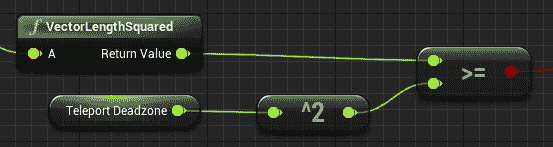

这里发生了什么事？ 我们感兴趣的是，用户的输入是否超过了其范围边缘的 70%。 我们可以通过获取矢量长度并将其与 Teleport Deadzone 进行比较来找到这一点，这将给我们一个正确的答案，但是找到矢量的实际长度需要一个平方根，这是非常昂贵的。 另一方面，求一个值的平方只需要将它本身乘以，这是很便宜的。 在我们的例子中，因为我们并不关心实际的矢量长度是多少--只关心它与死区的比较。 我们可以跳过向量长度的平方根，只需将其与目标长度的平方进行比较。 这是优化矢量长度比较的常用方法。 你会经常看到的。

Using squared vector lengths to test input deadzones will give you a properly round test region, so you'll get consistent results at any input angle.

现在，让我们使用此比较结果来选择要使用的旋转值：

1.  在图形中放置一个 Select 节点，并将>=测试的输出连接到其 Index 输入。
2.  断开 RotationFromXVector 节点的输出与设置远程端口方向节点的连接。
3.  将 RotationFromXVector 节点的输出连接到 Select 节点的 True 输入。
4.  创建一个 GetActorRotation 节点，并将其输出连接到 Select 节点的 False 输入。
5.  将 Select 节点的返回值连接到 Set Teleport Orientation 节点的输入：

我们在这里做的是使用死区检查的结果来决定我们是应该使用拇指杆输入的旋转值，还是只使用棋子现有的旋转值。 如果输入在范围的 70%或更大，我们将使用输入。 如果没有，我们就使用棋子的旋转。

让我们来运行它。 现在，如果你点击触控板的边缘或按下拇指杆相当远的距离，你会改变方向，但如果它们离中心更近，当你传送时，你只会保持当前的方向不变。

# 在远程传输上淡出和淡入

我们的系统开始工作得很好，但我们的传送可能会感觉有点不和谐。 让我们淡入淡出，来一个更愉快的过渡：

1.  打开我们棋子的事件图。
2.  在我们的 InputAction Teleport Right 事件附近，创建一个`Get Player Camera Manager`节点。
3.  根据该节点的返回值，创建一个`Start Camera Fade`操作。
4.  将其设置为 Alpha，将其值设置为 1.0。
5.  拖出其持续时间输入并将其提升为变量。 编译并将其值设置为**0.1**。

这将在十分之一秒的持续时间内将场景摄影机褪色为黑色。

6.  断开`Execute Teleport`函数调用的输入。
7.  将 Teleport Press=False 节点的执行输出连接到新的启动相机淡入动作。
8.  您可能需要向右拖动几个节点才能腾出一些空间。

现在，我们将在用户释放远程端口输入后调用 Start Camera Fade，因为我们已经清除了`bTeleportPressed`标志：

1.  从开始摄影机淡入淡出节点的执行输出拖动一条执行线，并将其延迟。
2.  将延迟持续时间设置为淡入淡出持续时间变量。
3.  将延迟的**已完成**输出拖到`Execute Teleport`函数调用中，以便在淡入淡出和延迟发生后调用该函数。

当用户释放远程传送输入时，我们将在十分之一秒内淡出，等待另外十分之一秒，然后执行远程传送。 现在，一旦传送完成，我们需要淡入。

4.  创建另一个开始摄影机淡入淡出节点，并将 Execute Teleport 输出连接到其执行输入。
5.  将 Get Player Camera Manager 的输出连接到该节点的 Target 输入。
6.  将其持续时间设置为您的`Fade Duration`变量。
7.  将其“从 Alpha”值设置为 1.0，并将其“到 Alpha”值设置为 0.0。
8.  将此节点的输出连接到 Teleport Dest 指示器的 Set Hidden in Game 节点的输入：

您的图表现在应该如下所示。

让我们在游戏中测试一下吧。 这样好多了。 当传送动作发生时，我们现在有一个快速淡出和淡入。 这是微妙的，但为应用增加了一些润色，并使传送不那么刺耳。

由于此操作需要时间，无论时间多么短暂，我们应该确保玩家不能在第二次远程传送正在进行时触发第二次远程传送：

1.  创建一个新的布尔变量并将其命名为`bIsTeleporting`。
2.  将它的一个实例拖到您的图表上并获取其值。
3.  在 InputAction TeleportRight 之间插入一个新的分支节点，并将按下的 Teleport 设置为 True。
4.  使用`bIsTeleporting`作为分支节点的条件。
5.  将其 False 输出连接到 Set Teleport 按下至 True 节点，并保持其 True 输出未连接。
6.  对输入操作的已释放执行执行相同的操作：

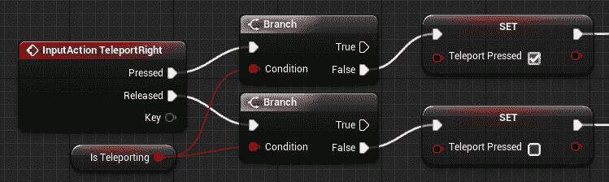

这样，仅当`bIsTeleporting`为 FALSE 时才会处理远程端口按下或释放事件。

现在，我们需要在开始传送操作时将`bIsTeleporting`设置为 True，然后在操作结束时再次将其设置为 False：

1.  在来自输入操作的已释放输出的 set Teleport Press=false 节点之后，插入一个 setter 以将`bIsTeleporting`设置为 True。
2.  将其输出连接到开始摄影机淡入淡出节点。

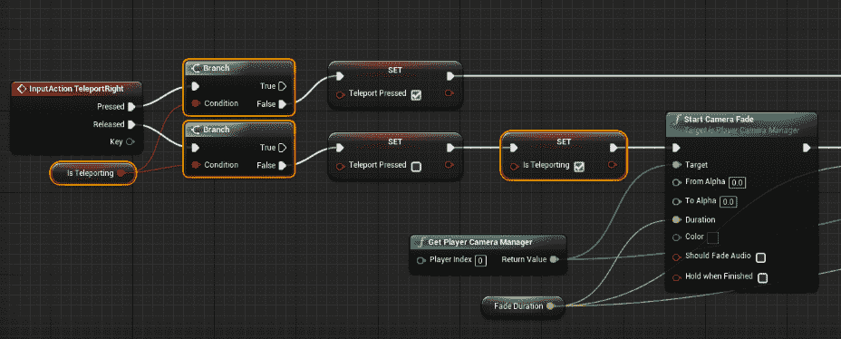

3.  在第二个开始摄影机淡入淡出节点之后，添加另一个设置器以将`bIsTeleporting`设置为 False。
4.  将该节点的输出连接到远程端口目的地指示器的设置游戏中隐藏输入：

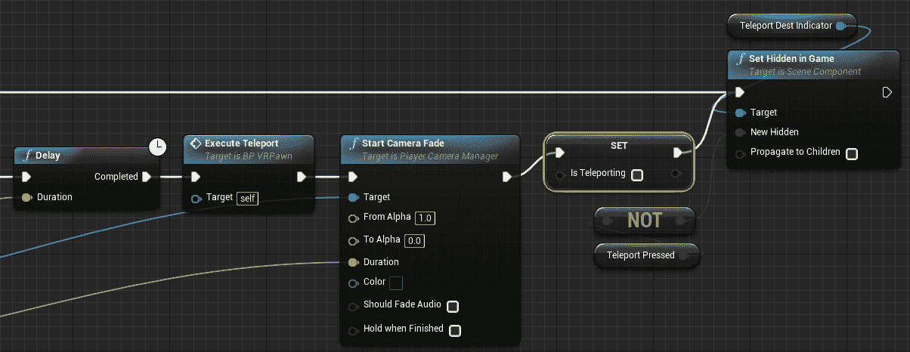

现在，当我们通过释放输入来执行远程传输时，`bIsTeleporting`将被设置为 TRUE，直到远程传输操作完成，并且不会接受新的远程传输操作。

# 传送移动摘要

我们已经在这里覆盖了很多地方，并创建了一个相当全面的远程传送移动方案。 让我们来回顾一下这个计划：

*   它被绑定到导航网状网上，所以它不允许玩家传送到非法地点
*   它使用抛物线轨迹，这样玩家就可以传送到比他们当前位置更高的目的地
*   它允许玩家在传送时选择目标方向
*   它很好地显示了玩家要去的地方和他们将要面对的地方
*   它包括一些改进，如输入死区和相机淡入淡出

我们还可以做更多的事情，但这是一个相当完整的解决方案。 如果我们要进一步改进它，我们很可能希望允许它与任何一只手一起工作，并且我们肯定需要用能够在发货版本中工作的东西来替换我们的调试绘制的远程传送路径。 如果你选择从这里进一步探索，引擎附带的 VR 模板是很好的下一步。 我们刚刚在这里编写的许多方法与该模板中使用的方法类似，因此您应该会发现，当您开始挖掘这些方法时，您会发现自己站在了很好的位置上来理解您所看到的内容。

隐形传送是在 VR 中行走的一个有效解决方案，因为正如我们前面提到的，它不会试图表示运动，所以它通常不会引发用户晕车。 对于不需要高度沉浸在玩家在世界上移动的方式的应用来说，它工作得相当好。

对于想要保持更高沉浸感的游戏和应用来说，隐形传送可能不是你想要的，因为它的表现与现实世界中的运动不同：它创造了一种不连续的空间感，并引入了显然不存在于世界上的界面元素。 这是一个无法回避的现实，因为它是一种沉浸式的破解方式。

接下来，我们来看看一种身临其境的移动方案，它可以让玩家在世界上平稳地移动。 非常敏感的玩家或刚接触 VR 的人可能会觉得身临其境的移动不舒服，因此在某些情况下，在也提供无缝移动的应用上提供心灵传送移动作为选项可能是合适的。

让我们来看看它是如何工作的。

# 无缝移动

如果你正在制作一款身临其境的游戏或体验，如果玩家对周围空间的感觉不会经常被心灵传送行为打破，那么这种体验对玩家来说会更有说服力。 让我们来看看如何处理太空中的无缝移动。

# 设置无缝移动的输入

通常，我们可能会允许用户在选项菜单中选择他们喜欢的运动方案，但是由于我们当前的角色除了四处移动之外什么都不做，而且我们还没有使用左边的控制器做任何事情，所以我们可以用它来驱动我们的无缝运动方案。

让我们为左侧控制器的拇指杆添加一对输入轴映射：

1.  打开项目设置|引擎|输入。
2.  单击绑定|轴映射旁边的+按钮两次，以添加两个新的轴映射。
3.  将它们命名为`MoveForward`和`MoveRight`。
4.  将 MoveForward 绑定到 MotionController(L)拇指杆 Y。
5.  将其比例设置为-1.0。

6.  将 Moveright 绑定到运动控制器(L)拇指杆 X，并将其比例保留为 1.0：

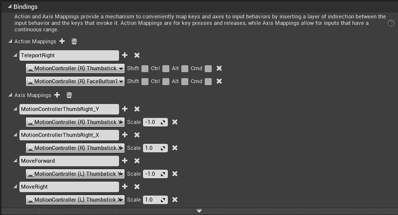

现在我们已经完成了输入绑定，因此可以关闭我们的项目设置。

# 更改兵的父类

为了让我们的棋子顺利移动，我们需要给它一种方法来处理它的移动输入。 我们有两种方法可以做到这一点。 我们可以在 tick 事件上编写自己的输入处理程序，但这是一个相当复杂的过程，如果我们对实现简单的移动方案感兴趣，就不需要这样做。

一个更简单的方法是给我们的棋子添加一个移动组件。 然而，在 Blueprint 中，无法添加移动组件(在 C++ 中有)，因此，我们将不得不将棋子的父类更改为包含我们需要的组件以及其他几个我们也需要的组件的类。 让我们开始吧：

1.  打开 BP_VRPawn 的蓝图，点击工具栏上的类设置：

We mentioned earlier that Unreal Engine is an **object oriented** system. An **object** is an instance of a **class**, and classes **inherit** from other classes, taking on their abilities and characteristics as they do. This is where that becomes important. We're going to change the capabilities of our BP_VRPawn by changing its parent class to a child of the Pawn class that contains the component we need.

2.  在详细信息|类选项下，将父类从典当更改为字符：

如果您查看 Components 选项卡，您将看到出现了一些新组件：

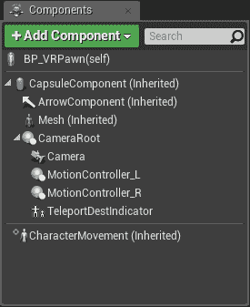

除了我们之前创建的组件之外，我们现在还拥有以下组件：

*   一种胶囊组件
*   箭头组件
*   网格组件
*   角色移动组件

这些都是从`Character`类继承的。

这很有用。 我们需要移动组件来允许我们四处走动，我们需要胶囊组件来防止我们穿墙而行。 我们并不真的需要网格组件，因为我们不会渲染玩家棋子的身体，但是在这种情况下，将它放在这里并暂时将其骨架网格属性保留为空并不会对我们造成伤害。

Be careful when changing an object's parent class. If the class you're changing to is a child of the previous parent class, that's generally going to be a safe change, because it will add new elements, but the parent's properties and functions will still be there. Going from a child class to a parent class can be riskier, since you may be relying on properties or functions that exist on the child, but don't exist on the parent. Changing to a class that's very different from your current class will probably create problems. It's fine if you know what you're doing, and the engine won't stop you, but you'll probably wind up cleaning up a lot of invalidated function calls or variable references.

# 修复碰撞组件

如果你现在运行游戏，你会发现我们比以前稍微高了一点。 这是因为我们的太空舱组件与地面相撞，并将我们向上推。 要解决此问题，请打开棋子的视口选项卡。 (如果已将其关闭，则可以通过双击组件选项卡上的 BP_VRPawn(Self)条目将其重新打开。)。 让我们开始吧：

*   按*Alt*+*K*将视口切换到侧视图。

*   抓住 Camera Root 并将其向下拖动，直到它位于胶囊组件的底部。 其位置现在应为(0.0，0.0，-90.0)：

如果你再次玩这个游戏，你会发现你已经正确地躺在地板上了。

# 处理移动输入

现在我们已经为我们的棋子提供了一个移动组件，让我们使用刚才映射的输入绑定来允许我们四处移动：

1.  在棋子的事件图中单击鼠标右键并创建一个 Input|Axis Events|MoveForward 事件：

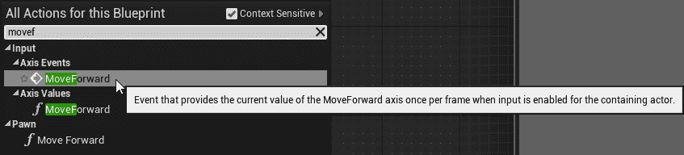

2.  对我们在轴绑定中创建的 Moveright 事件执行相同的操作。

我们现在有两个事件，它们将运行每一帧，并允许我们将移动输入提供给移动组件。

3.  创建一个 Add Motion Input 节点，并将其执行输入连接到 InputAxis MoveForward 的输出。
4.  将 MoveForward 的移动轴值输入到移动输入的比例值中。

5.  对 InputAxis Moveright 重复此操作：

现在，我们需要告诉它我们想要前进的方向：

1.  从组件列表中抓取摄影机组件，并将其拖到事件图上。
2.  根据其输出创建一个 GetWorldRotation 节点。
3.  右键单击 GetWorldRotation 输出并拆分结构管脚。
4.  在图形中单击鼠标右键(Right)，然后创建一个 Get Forward Vector 节点。
5.  拆分其输入引脚。
6.  将 GetWorldRotation 的偏航输出连接到 Get Forward Vector 中的 In Root Z(偏航)输入。
7.  单击鼠标右键(Right)以创建一个 Get Right Vector 节点。
8.  拆分其输入，并将 GetWorldRotation 的偏航输出连接到其 In Rot Z(偏航)输入。

9.  将 Get Forward 向量的输出连接到 World Direction 输入，以添加 InputAxis MoveForward 节点的移动输入。
10.  将 Get Right Vector 的输出连接到 Moveright 添加移动输入：

让我们在游戏中试一试吧。

我们仍然可以使用右侧的触控板或拇指杆进行心灵传送，但如果我们使用左侧的输入，它会以相机的视线方向作为前进方向，让我们顺利地在世界中穿行。

Gamers that are used to first-person shooters are used to thinking of their camera direction as their forward direction. In VR, this doesn't have to be the case—it's perfectly reasonable for a character to be looking to the right while moving to the left. Our pawn has a concept of *Control Rotation*, which is its actual orientation in space, and is distinct from the direction the camera is facing. In practice, if you're going to drive movement from a pawn's control rotation rather than camera rotation, you need to provide visual cues to make it clear to the player exactly what their forward orientation is, or your movement scheme will just confuse them. To keep things clear in this instance, we've made our movement relative to the look direction.

这工作得很好，但也有一些问题。

# 固定移动速度

首先，我们进展得太快了。 让我们解决这个问题：

1.  选择棋子的角色移动组件，并在详细信息|角色移动：行走中，将其最大行走速度设置为 240.0

对于环游世界来说，这是一个更合理的速度。

# 让玩家环顾四周，而不需要不断地转向

让我们面对现实。 使用相机向前向量作为我们转向的基础感觉有点颠簸。 每次你转过头去看什么东西的时候，你都必须调整方向来纠正自己。 世界不是这样运转的。 让我们改用左控制器的方向作为移动的基础：

1.  抓住`MotionController_L`组件并将其拖动到事件图中，靠近我们当前获取摄影机世界旋转的位置。
2.  将 MotionController_L 组件的输出馈送到 GetWorldRotation 节点，替换摄影机的连接：

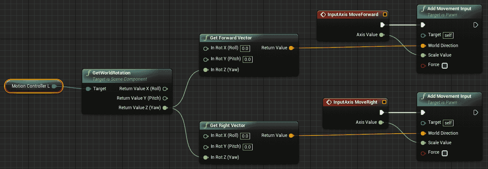

现在，我们没有使用相机的偏航作为我们前进和正确世界方向的基础，而是使用了控制器，这是很直观的。 前进是你指向控制器的任何地方，同时，玩家可以使用触控板或操纵杆执行精细的动作。 他们可以通过指向他们想去的方向来驾驶，并且可以环顾四周而不影响他们的运动。

# 实施咬合车削

我们需要给玩家的最后一件事是一种改变他们方向的方法，而不需要在现实世界中旋转他们的椅子。

虽然它可以让你的球员像我们一样在世界上平稳地移动，但我们不希望他们平稳地转向。 我们在[章](01.html)，*中讨论了在 VR*中思考的原因，但在这里回顾一下，当玩家看到他们感觉不到的运动时，视觉诱导的晕动病就会发生。 我们尤其习惯于看起来在旋转的动作。 这可能是由以下几个原因造成的：

*   旋转的感觉是中毒破坏前庭系统的自然结果。 你有没有在外面度过一个艰难的夜晚后打过滚床单？ 接下来发生了什么？ 正确的。 不要那样对待你的球员。
*   当图像中有大量光流时，前庭分离最为强烈。 当运动员旋转时，画面中几乎所有的东西都会移到一边。 那可是个很大的动作啊。
*   在现实世界中，当我们旋转头部时，我们自然会眨眼，或者我们的眼睛首先对准我们想看的东西(这种动作被称为**扫视**)，然后转过头来跟随。 在现实世界中，当我们转过身来时，我们的眼睛不会一直盯着。

通过转弯而不是让玩家平稳转弯，不仅可以避免产生可能会让用户生病的巨大光流，而且它实际上比平滑转弯更好地复制了我们在现实世界中感知转弯的方式。

我们来做个急转弯。

# 设置咬合车削的输入

让我们添加一对动作绑定以向右和向左捕捉：

1.  打开您的项目设置|引擎|输入。
2.  在 Engine|Input|Bindings 中添加两个新的 Action Mappings，并将其命名为`SnapTurnRight`和`SnapTurnLeft`。
3.  将 SnapTurnRight 绑定到运动控制器(L)FaceButton2。
4.  将 SnapTurnLeft 绑定到 MotionController(L)FaceButton4 和 MotionController(L)FaceButton1。

我们将两个输入绑定到 SnapTurnLeft，以同时支持 Oculus 和 Vive 输入。 在 Oculus Touch 控制器上，左侧控制器上的 FaceButton1 是 X 按钮，而 FaceButton2 是 Y 按钮。 在 HTC Vive 上，FaceButton2 是触控板的左侧，FaceButton4 是触控板的右侧：

您的输入绑定现在应该如下所示。

我们现在可以关闭项目设置。

# 执行咬合转弯

现在，让我们在按下这些按钮时执行快速旋转：

1.  在棋子的事件图中，为 SnapTurnLeft 和 SnapTurnRight 动作添加输入事件：

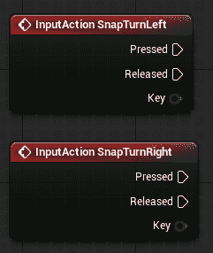

2.  创建一个 GetActorRotation 节点并拆分其输出。
3.  从返回值 Z(Yaw)输出中拖动并创建浮点-浮点节点。
4.  从减法节点的第二个输入拖出，**将其提升**为变量。 将变量命名为`SnapTurnIncrement`。
5.  编译蓝图并将 SnapTurnIncrement 值设置为 30.0。
6.  创建一个 SetActorRotation 节点，并将**GetActorRotation**节点的侧滚和俯仰输出直接连接到其相应的输入。
7.  将减法结果连接到偏航输入。
8.  将 InputAction SnapTurnLeft 中按下的执行输出连接到 SetActorRotation 节点的输入。
9.  选择这些节点，然后按*Ctrl*+*W*复制它们。
10.  用加法替换重复集中的减法。

11.  将复制的节点连接到执行 InputAction SnapTurnRight 输出：

在游戏中试一试吧。 还不错。 我们可以肯定地进一步改进它--现在，快速转弯也会触发移动，但这是一个非常有用的解决方案。 如果这对我们的游戏有意义，我们可以潜在地将按下 Vive 触控板上的按键或按下左侧 Oculus Touch 上的操纵杆来 180°转弯。

# 走得更远

有几种方法可以改进我们在这里所做的工作，但是完全实现它们将超出本章的范围。 让我们花一点时间来讨论一下在进一步学习的过程中可以改进这门课程的方法。

# 使用模拟输入的咬合旋转

我们目前的 Snap Turn 实现在 Vive Wand 上运行得相当好，但在 Oculus Touch 控件上感觉不是很好。 对于我们的玩家来说，听其中一个拇指杆上的模拟输入，如果它超过了某个阈值，就会触发一个快速转弯，这可能会让玩家感觉更好。 这样，玩家就可以将拇指杆翻到一边来执行抓拍，或者只需触摸 Vive 触控板的边缘，而不必按下它。

您可以通过在运动控制器拇指杆上设置输入轴绑定来执行此操作，并测试以查看输入是大于阈值(对于此测试，我们使用 0.8)(对于右转)还是小于负阈值(对于左转)。

您需要记住在快照上设置冷却时间，这样它就不会在一次按下时重复触发。 在我们的例子中，我们使用的冷却时间为 0.2。

如果你想把这个放进你的棋子里，下面是步骤：

1.  为 MotionControllerThumbRight_X 输入轴创建一个输入事件处理程序。
2.  创建分支，仅当`bTeleportPressed`为 FALSE 时才继续。 我们不想在传送时处理急转弯。
3.  创建一个名为`bSnapTurnCooldownActive`的新布尔变量。
4.  创建分支，仅当`bSnapTurnCooldownActive`为 FALSE 时才继续。
5.  创建一个名为`SnapTurnAnalogDeadzone`的新浮点变量，编译，并将其值设置为 0.8。
6.  添加>=test 以查看来自拇指杆输入的传入轴值是否大于或等于`SnapTurnAnalogDeadzone`。
7.  由此创建一个分支，并在其错误输出上创建另一个分支。

8.  对于第二个分支，测试以查看传入的轴值是否小于或等于负的 SnapTurnAnalogDeadzone 值(乘以-1.0)。

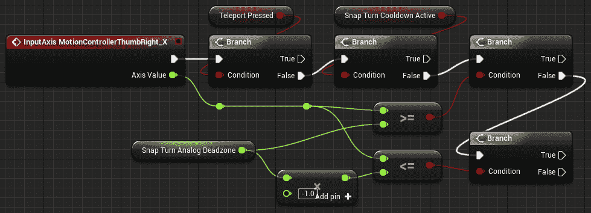

9.  创建一个名为 ExecuteSnapTurnLeft 的新自定义事件，并将其提供给从 InputAction SnapTurnLeft 进行的 SetActorRotation 调用。
10.  创建另一个名为 ExecuteSnapTurnRight 的文件，并将其输入处理 InputAction SnapTurnRight 的位置：

11.  现在，回到 ThumbtickRight 处理程序上，如果 Input Axis>=1SnapTurnAnalogDeadzone，则调用 ExecuteSnapTurnRight。
12.  如果 Input Axis 为<=-SnapTurnAnalogDeadzone，则调用 ExecuteSnapTurnLeft。

现在，我们需要设置一个冷却时间，这样当用户移动操纵杆时，就不会出现一系列快速旋转：

1.  添加一个 setter 以将 bSnapTurnCooldownActive 设置为 true，并在 ExecuteSnapTurnRight 和 ExecuteSnapTurnLeft 之后调用它。
2.  添加延迟。 默认值 0.2 在这里是合适的，但如果您想要调整冷却时间，请将此值提升为一个变量。
3.  延迟后，再次将 bSnapTurnCooldownActive 设置为 False。

有了这个布尔标志和延迟，我们只需设置一个门，在上次处理后 0.2 秒内将忽略捕捉转弯输入，这样用户就有时间释放操纵杆，一旦他们被定位到他们想要的位置。

这个实现给你的玩家一个很自然的感觉，在右手杆上快速转动，同时让左手杆模拟无缝移动。

# 简略的 / 概括的 / 简易判罪的 / 简易的

我们在这一章做了相当多的工作。

我们学习了如何在场景中设置和优化导航网格，以及如何查找和修复场景中对象的碰撞问题。 我们学习了如何设置输入动作并使用它们来移动我们的玩家角色，也许最重要的是，我们学会了 Kent Beck 软件开发的口头禅：*让它工作，让它正确，使它快*，并学会在我们追求迭代开发时遵循它意味着什么。 我们会经常重温这一点。 这是有效软件开发的秘诀。

那是很大的工作量。 本章中的练习涵盖了很多方面，但在设置玩家棋子和移动系统时，应该会让您对各个部分是如何组合在一起有一个不错的认识。

现在我们已经给了我们的棋子脚，在下一章，我们将给它举手。 我们将学习如何使用运动控制器来指向、抓取和与世界上的对象交互。 我们还将以我们所学到的设置导航网格的知识为基础，并将一些人工智能投入到世界中来使用它们。 现在我们可以环游世界了，我们要开始让它活起来。