# 与虚拟世界互动--第二部分

在最后一章中，我们设置了我们的手，并学习了如何设置它们的动画。 正如我们当时提到的，仅此一项就代表了在我们的应用程序中建立存在状态的一大步。现在，让我们进入下一步并开始使用它们。

在本章中，我们将了解以下主题：

*   如何使用 Blueprint 接口为各种蓝图添加功能
*   如何使用附件来拾取和丢弃物理演员
*   如何向玩家指示他们何时可以与对象交互
*   如何创建触觉反馈效果以向用户提供更多触觉反馈

# 创建一个我们可以拿起的物体

我们将从制作一些我们可以拿起的物品开始。 让我们从一个简单的立方体开始：

1.  在内容浏览器中的项目`Blueprints`目录中单击鼠标右键，然后选择创建基本资源|创建蓝图类。
2.  这一次，不是选择其中一个公共类作为其父类，而是展开位于拾取父类对话框底部的所有类条目。

3.  选择静态网格执行元：

4.  将其命名为`BP_PickupCube`。
5.  打开`BP_PickupCube`。

您可以看到它继承了一个`Static Mesh Component`。

We could just as easily have created an `Actor` Blueprint and added a `Static Mesh` component, but it's a good idea to get in the habit of choosing your parent classes appropriately when you're building a new asset. Don't reinvent things if you don't have to.

6.  将`Static Mesh Component`命令的静态网格属性设置为`Engine Content/Basic Shapes/Cube1`。
7.  将其比例设置为`0.2, 0.2, 0.2`。
8.  将其材质|元素 0 设置为`Content/SoulCity/Environment/Materials/Props/MI_Glow`。 (或者任何你喜欢的东西，但是这个在地图上很容易看到。)

现在，我们希望我们的立方体模拟物理，所以让我们设置几个值来实现这一点：

1.  将其物理|模拟物理标志设置为`True`。
2.  将其冲突|模拟生成命中事件设置为`True`。
3.  将其冲突|生成重叠事件设置为`True`。
4.  确保其碰撞|碰撞预设设置为`PhysicsActor`。 (当您将模拟物理设置为 true 时，应已自动设置此选项。)
5.  将其冲突|可能会影响导航设置为`False`。 (这将隐藏在碰撞部分的高级属性中。)

我们现在已经创造了一个发光的小立方体，它将自然地对物理做出反应，但不会阻碍我们的导航网络在世界各地移动。

现在，我们需要赋予它被接收的能力。 我们有几种方法可以做到这一点。 我们可以简单地将`Pickup`和`Drop`方法直接写入`BP_PickupCube`的蓝图中，但我们需要能够从外部调用这些函数。

正如我们在前面看到的，如果您想从其蓝图之外调用一个函数，您必须确保您正在与包含该函数的类对话，这是通过将引用强制转换到该类来实现的。 如果我们只期望捡起立方体，这是很好的，但是如果我们想让其他物体更容易捡起来呢？ 我们不想在每次添加一个可以拾取的新类型的对象时都重写我们的`BP_VRHand`蓝图，所以这在这里不是一个很好的解决方案。

我们可以从实现`Pickup`和`Drop`方法的公共父级派生`BP_PickupCube`，然后将引用强制转换到该父级。 这好多了，但还不够完美。 `BP_PickupCube`继承自`StaticMeshActor`，但是如果我们想要使继承自`SkeletalMeshActor`的东西能够被拾取，该怎么办呢？ 我们没有一种简单的方法来在该实例中创建公共父类。

这个难题的答案是*蓝图接口*。 接口是一个 Blueprint 对象，它允许我们定义可以在实现该接口的任何对象上调用的函数，而不管该对象从哪个类派生。 它是一个可以附加到任何对象的类，它作为一个承诺，它附加到的对象将实现接口中包含的每个函数。 例如，如果我创建了一个声明`Pickup`和`Drop`函数的接口，并将该接口应用到我的`BP_PickupCube`，我就可以调用`Pickup`和`Drop`方法，而不必首先强制转换对象。 这是一个强大的模式。 通过巧妙地使用接口，您可以使您的代码非常灵活且易于扩展。

如果这一点还不完全清楚，请不要担心。 一旦我们建造了它，它就会变得更有意义。

# 创建拾取对象的蓝图界面

要创建蓝图界面，请按照给定的步骤操作：

1.  在项目的`Blueprints`目录中单击鼠标右键，然后选择创建高级资产|蓝图|蓝图界面：

2.  将其命名为`BPI_PickupActor`。

当您打开它时，您会看到它包含一个函数列表，除此之外什么也没有。 您会注意到该图表不能编辑。 这是因为接口只是附加对象必须实现的函数的列表，但这些函数不会写入接口中。

3.  默认情况下，它会为您创建一个新的函数声明。 将其命名为`Pickup`。
4.  在函数的详细信息|输入下，添加新输入。 将其类型设置为 Scene Component|Object Reference，并将其命名为`AttachTo`：

5.  添加另一个函数，并将其命名为`Drop`。 这个不需要任何输入。
6.  编译、保存、关闭界面。

现在，让我们将这个新接口应用于`BP_PickupCube`：

1.  打开`BP_PickupCube`，点击工具栏上的班级设置选项。
2.  在详细信息|接口下，单击实现的接口下的添加按钮。
3.  选择`BPI_PickupActor`。

# 实现取放功能

现在我们已经将此接口添加到`BP_PickupCube`类中，我们可以在事件图中实现在该接口中声明的函数。 让我们开始吧：

1.  在事件图中，右键单击并选择`Event Pickup`以创建拾取事件。 这个事件现在存在于这个 Blueprint 类中，因为我们已经附加了一个声明它的接口。 您将看到该事件指示它是来自`BPI_PickupActor`的接口事件。
2.  以同样的方式创建`Drop`事件。

现在我们已经为来自接口的两个事件创建了处理程序，让我们让它们工作起来。

当这个物体被拿起时，我们想要关闭它的物理模拟，这样它就不会从我们的手中掉下来，我们想把它附加到拿起它的手上的一个场景组件上。

3.  将对`Static Mesh Component`的引用拖到事件图上。
4.  对其调用`Set Simulate Physics`，将模拟设置为`False`。
5.  在图形中单击鼠标右键并选择`Get Root Component`。
6.  从根零部件参照中拖曳一个连接件，然后选择`Attach to Component`。 您将看到有两个选项可供选择。 将鼠标悬停在它们上并选择其工具提示显示为 Target is Scene Component 的组件，因为我们将附加到场景组件：

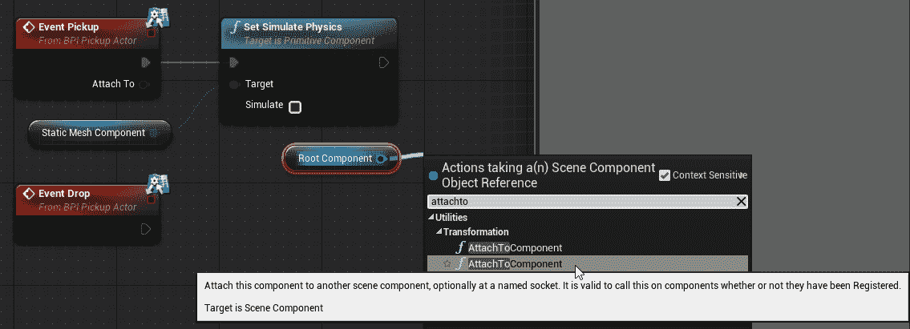

7.  将附加到输出从`Event Pickup`拖动到`Attach To Component`节点上的父输入。
8.  在`Attach To Component`节点上，将位置、旋转和缩放规则设置为`Keep World`，并将焊接模拟实体设置为`False`。

您完成的收件实施应如下所示：

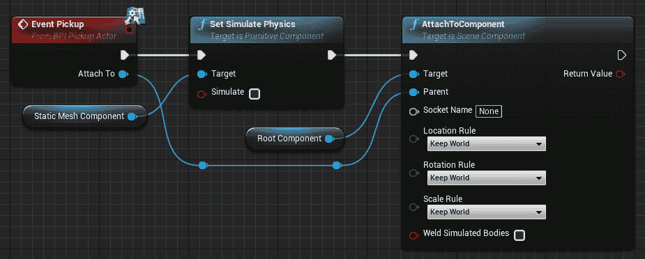

当我们放下该对象时，我们希望重新启用其物理功能，并将其从拾取时附加的场景组件中分离出来。

9.  选择您的`Static Mesh Component`引用和`Set Simulate Physics`调用，然后点击*Ctrl*+*W*复制它们。
10.  将 Event Drop Pin 的执行连接到复制的`Set Simulate Physics`调用。
11.  将模拟设置为 True，以便我们重新打开物理。
12.  右键单击并创建`Detach From Actor`节点。
13.  将位置、旋转和缩放规则设置为`Keep World`，就像我们在附加节点上所做的那样。

完成的 Drop 实现应该如下所示：

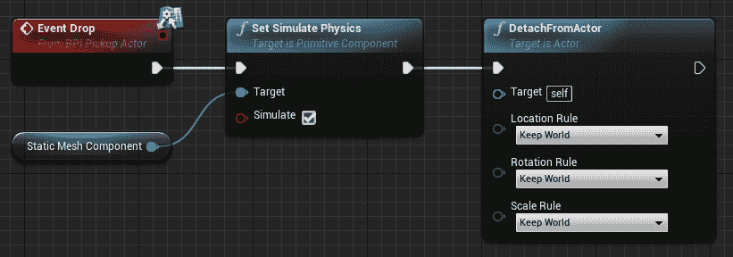

我们的`Pickup Cube`演员到此为止。 我们可以关闭蓝图。

# 设置 VRHand 以拾取对象

现在，我们准备好抓起这些物体了。

# 创建函数以查找最近的拾取对象

我们需要做的下一件事是找出哪些物体离我们的手足够近，可以拿起。 让我们创建一个函数来完成此操作：

1.  在`BP_VRHand`中，创建一个名为`FindNearestPickupObject`的新函数。
2.  将其类别设置为`Grabbing`，并将其访问说明符设置为`Private`。
3.  在其实现图中，右击创建一个`Get All Actors with Interface`节点，并将其 Interface 值设置为`BPI_PickupActor`。

这将为我们提供场景中实现`BPI_PickupActor`接口的每个参与者的数组。

4.  从 Out Actors 输出拖动连接器并创建`For Each Loop`节点：

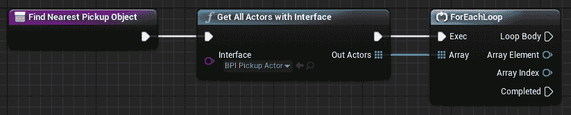

我们将遍历可能被挑选的演员，忽略任何太远而无法考虑的演员，然后返回最接近的剩余合格演员。

5.  从`For Each Loop`数据数组元素输出中，拖出一个连接器并在其上调用`Get Actor Location`数据。
6.  将对`Hand Mesh`的引用拖到您的图形上，并对其调用`Get World Location`。
7.  从数组元素的作用器位置减去手部网格的世界位置：

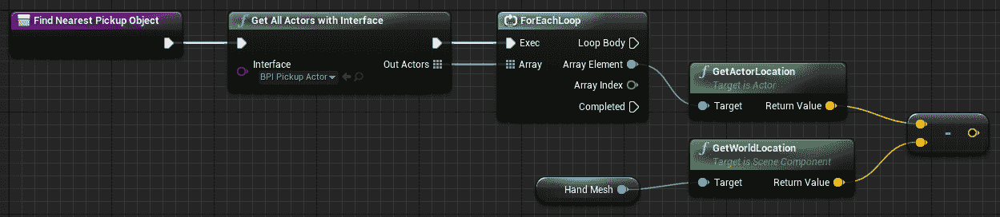

8.  获取结果向量的值`Vector Length Squared`。
9.  拖出其结果并选择 Promote to Local Variable。 将新变量命名为`LocalCurrentActorDistSquared`：

10.  将循环体执行行连接到局部变量的 setter。
11.  拖动本地变量 setter 的输出并创建一个`<=`测试，以查看它是否等于或小于我们要给它的值。

The reason why we're creating a local variable here is that we're going to need to use this value again if there's more than one grabbable actor in our test radius, and we don't want to waste time recalculating the distance, so we're stashing it here so that we can use it later if we need it.

12.  创建一个浮点变量并将其命名为`GrabRadius`。 编译蓝图并将其值设置为 32.0。 (稍后，您可以将此值调整为您认为合适的任何值。)
13.  按*Ctrl*并将`GrabRadius`拖动到图形上。
14.  将连接器从其输出拖动到`Square`。
15.  将正方形的结果连接到`<=`测试的第二个输入：

Remember when we mentioned that real distance checks are expensive? This is a place where it matters because we're going to call this function on the `Tick` event. Since we just want to see whether the actor is within the supplied radius, but we don't care how far away it really is, it's cheaper to do this test on the squared values.

16.  从我们的`<=`测试输出创建一个`Branch`节点。

如果我们的演员通过了`<=`测试，我们就知道它在抓取范围内。 现在，我们需要看看它是否是该范围内最近的物体。

17.  在局部变量列表中，创建一个名为`ClosestRange`的新局部变量，并将其变量类型设置为`Float`。 将其默认值设置为`10000.0`。

Local variables are variables that only exist within the function in which they're declared. They can't be read from outside the function. It's a good idea to use local variables within functions for values that are only used by that function so that they don't clutter the surrounding object. Local variables are also reset to their default values each time the function is run, so you don't have to worry about strange values hanging around from previous function calls.

18.  按*Ctrl*+将`LocalCurrentActorDistSquared`拖动到图形上以获取其值。
19.  从其输出拖动一个连接器，并从它创建一个`<`测试。
20.  将`Closest Range`局部变量拖到测试的第二个输入中。
21.  使用`<`测试结果作为其条件创建`Branch`：

如果测试结果是真的，我们找到了一个最接近的演员。 我们希望保存对它的引用，并将其距离记录为新的最近范围。

22.  按*Alt*+将`Closest Range`拖到图形上，然后将`LocalCurrentActorDistSquared`拖到其输入上。
23.  从分支的 True 输出设置此值。
24.  创建一个名为`NearestPickupActor`的新局部变量，并将其类型设置为 Actor|Object Reference。
25.  按*Alt*并将其拖动到图形上以设置其值。
26.  将其值设置为`For Each Loop`数组元素。 (这将是一段很长的联系。 考虑创建一些重新路由节点，以使其更具可读性。)

27.  将其连接到`Set Closest Range`节点的输出：

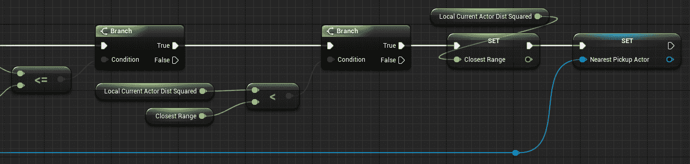

最后，一旦我们遍历了所有可能的对象并找到了最佳的拾取候选对象(如果存在)，我们希望保存该值，以便我们的拾取方法可以使用它。

28.  创建一个新变量(这次不是局部变量-我们希望从外部读取此值)，将其命名为`AvailablePickupActor`，并将其类型设置为`Actor > Object Reference`。
29.  按下*Alt*并将其拖到事件图上，靠近已完成的输出`For Each Loop`。
30.  将设备`For Each Loop`的完整输出连接到设备`Available Pickup Actor`的设置输入。
31.  将`Nearest Pickup Actor`局部变量拖到设置器的输入上：

这将做的是将一个外部可读的`Available Pickup Actor`变量设置为我们在迭代可能参与者列表时找到的参与者(如果我们找到了任何参与者)。 如果我们没有找到，`Nearest Pickup Actor`将是`Null`。

# 调用以在 Tick 事件上查找最近的拾取对象

现在，是时候调用我们的新函数了，这样我们就知道什么时候可以拿起一个对象了。 然而，如果我们已经持有一个对象，那么我们不想这样做，所以我们应该存储对我们已经持有的任何对象的引用。 让我们开始吧：

1.  返回到`BP_VRHand`的事件图并找到`Event Tick`。
2.  在`Event Tick`附近创建`Sequence`节点。
3.  我们只想在找到可以抓取的对象之后更新我们的手部动画，所以按*Ctrl*+将事件 Tick 的执行针的输出拖到`Sequence`节点的然后 1 的输出上。
4.  将事件计时的执行引脚连接到序列节点的输入。
5.  选框选择连接到该序列的节点的节点网络，然后向下拖动它们，以便给自己留出一些工作空间：

6.  创建一个新变量，将其命名为`HeldActor`，并将其变量类型设置为`Actor > Object Reference`。
7.  按*Ctrl*+将`HeldActor`拖到事件图上以获取其值。
8.  在其上单击鼠标右键并选择`Convert to Validated Get`。
9.  将对`Find Nearest Pickup Object`的调用拖到图表上，并从`Held Actor`getter‘s is Not Valid 输出中调用它：

这样一来，如果我们还没有搭讪演员的话，我们只会费心去找一个搭讪的演员。

# 找个男演员

现在我们正在寻找我们可以挑选的演员，让我们在试图抓住他们的时候实现这一点。 让我们开始吧：

1.  在`BP_VRHand`中打开您的`Grab Actor`函数。
2.  这里不再需要`Print String`节点，因此可以将其删除。
3.  按*Ctrl*并将`HeldActor`的 getter 拖到图形上，右键单击它，然后将其转换为经过验证的 GET。
4.  将`bWantsToGrip`setter 的执行输出连接到`HeldActor`getter 的输入。

5.  按*Ctrl*+将`AvailablePickupActor`的 getter 拖到图形上，并使其也成为经过验证的 get。
6.  将从`Held Actor`get 的输出连接到此 getter 的输入是无效的，因为我们只对拾取尚未持有的对象感兴趣。
7.  从`Available Pickup Actor`拖出一个连接器，并在其上调用`Pickup (Message)`：

这就是 Blueprint Interfaces 如此有用的原因。 我们不需要将拾取参与者强制转换为任何特定的类来调用其上的接口方法。 我们可以简单地进行调用，如果对象实现了接口并知道如何处理它，那么调用就会起作用。 如果对象没有实现接口，它就什么也不做。

If you need to find out whether a given actor implements an interface, call `Does Implement Interface` on it. This will return true if the interface is found on the object. In this particular case, making this call would be redundant since we know that `Available Pickup Actor` will always implement the BPI_PickupActor interface. We used that interface as a filter when we were looking for objects in the `Find Nearest Pickup Object` function.

8.  将运动控制器组件拖动到`Pickup`节点的附加到输入上。
9.  将`Held Actor`变量拖到`Available Pickup Actor`命令的输出上，将其设置为该值。
10.  将`Return Nodes`添加到您的出口点。 (您不必这样做，但从长远来看，如果您养成这样的习惯，代码的可读性会好得多。)

完成的`Grab Actor`图表应该如下所示：

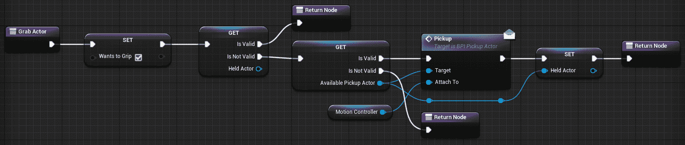

总结一下这里发生的事情，当调用`Grab Actor`时，`bWantsToGrip`被设置为 true，然后我们检查我们是否已经持有一个对象。 如果是的话，我们什么也做不了。 如果没有，我们会检查是否在`Event Tick`上找到了可以拾取的对象。 如果我们没有，那就没什么可做的了。 如果我们这样做了，我们通过它的接口向它发送一条`Pickup`消息，引用我们的`Motion Controller`组件作为它应该附加到的对象，并将其存储为我们的`Held Actor`。

# 释放一名演员

既然我们现在可以挑选一名演员，我们也希望能够再次放弃它。 我们现在就开始吧：

1.  打开`Release Actor`功能。
2.  删除其中的`Print String`节点-我们已完成该操作。
3.  按*Ctrl*+将`Held Actor`拖到图形上，右键单击它，然后将其转换为经过验证的 GET。
4.  在我们设置`bWantsToGrip`之后，调用经过验证的 GET。
5.  将返回节点连接到其无效输出：

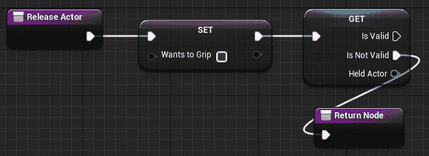

如果我们什么都没拿到，我们就什么都不需要做了。 如果是，我们应该确保演员仍然认为我们是拿着它的那个人(因为我们可以用另一只手抓住它)，如果它仍然是我们的对象，就把它扔掉。

6.  从`Held Actor`拖动一个连接器并获取其`Root Component`。
7.  在根组件上调用`Get Attach Parent`。
8.  从返回值为`Get Attach Parent`的位置拖动一个连接器，并创建一个`==`测试。
9.  将`Motion Controller`组件拖到测试的其他输入上。
10.  使用此测试的结果作为其条件创建`Branch`：

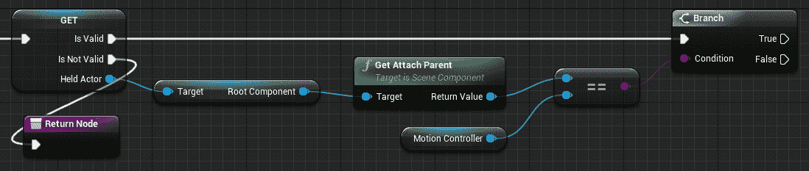

11.  从分支的 True 输出中，在`Held Actor`上调用`Drop`。
12.  按*Alt*+将`Held Actor`拖动到图形上以创建设置器。
13.  将其连接到`Drop`调用的执行输出，并连接到`Branch`节点的 FALSE 输出，以便在任何一种情况下清除该值：

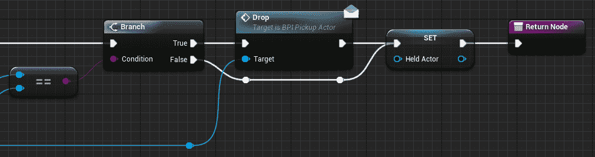

完成的图表应该如下所示：

回顾一下这里发生的事情，当调用`Release Actor`时，我们首先将`bWantsToGrip`设置为 FALSE。 然后我们检查我们目前是否持有任何东西。 如果我们不是，那就没什么可做的了。 如果我们认为我们拿的是什么东西，我们会检查以确保我们认为拿着的物体仍然将我们的运动控制器视为其父对象，因为我们可以用另一只手抓住它。 如果我们真的持有该对象，则将其删除并清除`Held Actor`变量。 如果最终证明我们不再持有该对象，我们将清除`Held Actor`变量，这样我们就不再认为我们持有该对象。

# 测试抓取和释放

让我们在我们的地图上测试一下这一点：

1.  从编辑器的模式面板中，选择 Place|Basic|Cube，然后将其拖动到场景中。 将其位置设置为 X=-2580，Y=310，Z=40，这样它就位于玩家起跑点附近。
2.  从内容浏览器中抓取`BP_PickupCube`，并将其放在刚刚放置的立方体上。 您可以使用*End*键将其放到其下方的曲面上。 (`X=-2600, Y=340, Z=100`可能是一个不错的地点。)
3.  按住*Alt*并拖动多个`BP_PickupCubes`，然后将它们堆叠到立方体上：

启动 VR 预览。 走到或传送到立方体上的物体，并使用触发器来捡起它们，扔下它们，扔它们，然后用手把它们从手中移走。

还不错，但有几件事我们需要解决。

# 修复立方体冲突

首先，也是最重要的是，它们可能会与 VRPawn 的碰撞太空舱相撞，并将我们抛来抛去。 我们最好把它修好：

1.  打开`BP_PickupCube`蓝图并选择其`Static Mesh Component`。
2.  在其详细信息|冲突下，将其碰撞预设从`PhysicsActor`更改为`Custom`。

3.  现在可以编辑该对象的各个碰撞响应通道。 将棋子碰撞响应设置为`Overlap`，而不是`Block`：

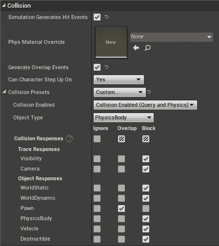

这样，如果我们对棋子感兴趣，我们仍然可以检测到与棋子的碰撞，但它们不会阻止玩家四处走动。

# 让玩家知道他们什么时候能拿到东西

其次，我们不会给玩家任何视觉上的暗示，表明他们可以捡到东西。 让我们改进一下这个。

首先，让我们向`EGripState`枚举器添加另一个状态：

1.  从项目的`Blueprints`目录中打开`EGripState`。
2.  在其枚举器列表下，单击 New 以添加另一个条目。 将其命名为`CanGrab`。
3.  关闭并保存它。

现在，我们需要告诉我们的动画蓝图该怎么做。

4.  打开`ABP_MannequinHand_Right`动画蓝图并打开其`Event Graph`。
5.  在`Event Blueprint Update Animation`下，您将看到`Grip State``Select`节点已自动更新，以反映我们添加的新`Can Grab`枚举器。 将其值设置为`0.5`：

通过在动画预览编辑器中编译然后更改夹点状态来尝试。 当夹点状态设置为`Can Grab`时，手应变为半张开状态。

6.  保存并关闭动画蓝图。

接下来，我们需要获取`BP_VRHand`蓝图，当它检测到玩家可以抓取东西时，将`Grip State`设置为`Can Grab`。 让我们创建一个纯函数来确定我们的`Grip State`应该是什么。

7.  打开`BP_VRHand`的事件图，找到`Event Tick`。
8.  选择`bWantsToGrip`引用和连接到它的`Select`节点，并将它们折叠成一个函数。

9.  将函数命名为`DetermineGripState`，将其 Category 设置为 Grabb，将其 Access Specifier 设置为 Private，并将 Pure 设置为 True：

10.  打开`DetermineGripState`。
11.  按*Ctrl*+将`Held Actor`拖到图形上，并将其转换为经过验证的 GET。
12.  将其连接到函数输入，并从其有效输出添加新的`Return Node`。
13.  将此节点的返回值设置为`Gripping`：

如果我们拿着一个物体，我们并不关心其他任何事情--我们只需要将动画设置到扣人心弦的状态即可。

14.  将`Branch`节点添加到图形中。
15.  将`bWantsToGrip`值拖入其条件。

16.  将其 True 分支连接到我们刚刚创建的`Gripping``Return Node`。
17.  按*Ctrl*+将`AvailablePickupActor`拖到图形上，并将其转换为经过验证的 GET。
18.  添加连接到其 IS 有效输出的另一个`Return Node`，并将其返回值设置为`Can Grab`。
19.  将另一个`Return Node`添加到其 IS Not Valid 输出，其值为 Open：

我们来试试看吧。 现在，当检测到可以抓取的对象时，您应该会看到手改变了姿势。

# 添加触觉反馈

还有一件事我们应该做，那就是当玩家与物体接触时，在手中添加一定程度的反馈。 这看起来可能是一件小事，但它实际上对唤起存在的过程很重要。 目前我们没有很多方法来模拟物理感觉，但任何与事件或动作相匹配的感觉都可以让虚拟世界感觉到不那么“空灵”，而更具物理意义。

让我们学习如何给我们的控制器添加一点隆隆声。

# 创建触觉反馈效果曲线

首先，我们需要创建我们想要玩的触觉效果：

1.  在项目的`Blueprints`目录中单击鼠标右键，然后选择创建高级资产|其他|触觉反馈效果曲线：

2.  将其命名为`FX_ControllerRumble`。
3.  打开我们刚刚创建的触觉反馈效果曲线。

你会看到在触觉反馈效应|触觉细节下有两条曲线：频率和振幅。 我们将在这里创建一个非常简单的效果，但它确实值得用这些曲线进行实验，并弄清楚如何创建令人信服的反馈效果。

4.  在 0.0 时间附近的频率曲线时间线上单击鼠标右键并选择`Add key to None`。
5.  固定其时间和值设置，以读取每个值的`0.0`：

6.  再次在时间线上单击鼠标右键，然后添加另一个关键点。 将此时间设置为`0.5`，并将其值设置为`1.0`。
7.  在曲线上创建第三个关键点，将时间设置为`1.0`，将值设置为设置为`0.0`。

8.  为振幅曲线创建相同的三个关键点：

您完成的曲线应该与前面屏幕截图中显示的一样。

9.  保存并关闭新的触觉效果曲线。

# 按指令发挥触觉效果

现在我们已经创建了触觉反馈效果曲线，让我们设置一种播放它的方法：

1.  打开`BP_VRHand`的事件图，然后单击鼠标右键。 选择添加事件|添加自定义事件。 将新事件命名为`RumbleController`。
2.  创建此事件的输入。 将其命名为`Intensity`，并将其类型设置为`Float`。
3.  单击鼠标右键并创建`Get Player Controller`节点。
4.  将连接器从`GetPlayerController`拖出并创建`Play Haptic Effect`节点。

5.  选择我们刚刚创建的触觉效果。
6.  将`Hand`变量拖到手写输入中。
7.  将事件的强度输出拖动到比例输入中：

现在，当我们接触到一个我们可以捡到的新物体的时候，让我们把这种盖普特效称为盖普提效应(Gaptic Effect)。

8.  打开你的`BP_VRHand`的`Find Nearest Pickup Object`功能。

看到我们将`Available Pickup Actor`设置为在`Nearest Pickup Actor`中找到的值的位置了吗？ 让我们检测一下我们何时在其中放入一个新值，并在这种情况发生时触发效果。

9.  右键单击您的`Nearest Pickup Actor`getter，并将其转换为经过验证的 GET。
10.  按*Ctrl 或*并将执行输入拖入`Set Available Pickup Actor`到`Get Nearest Pickup Actor`getter 的执行输入上。
11.  从`Nearest Pickup Actor`getter 的值拖动一个连接符，并创建`!=`个(不等于)节点。
12.  将变量列表中对`Available Pickup Actor`的引用拖到`Not Equal`节点的其他输入中。
13.  从其输出创建一个`Branch`。
14.  将有效执行引脚从`Nearest Pickup Actor`拖至`Branch`输入。
15.  从其 True 输出调用`Rumble Controller`，并将其强度设置为`0.8`。
16.  将输出从`Rumble Controller`拖到`Available Pickup Actor`设置器的输入中。

17.  将无效输出从`Nearest Pickup Actor`拖到`Available Pickup Actor`的设置器中。
18.  在`Set Available Pickup Actor`之后和`Not Equal`测试的`False`分支中添加返回节点：

总结一下这里发生的事情，一旦我们完成了对可能拾取的对象的迭代，我们需要检查是否找到了一个对象。 如果没有，我们只需将`Available Pickup Actor`设置为空值，这样，如果它以前包含一个值，我们就会将其清除。 如果我们确实找到了可以拾取的对象，我们会检查它是否与当前的`Available Pickup Actor`不同。 如果是，我们在将`Available Pickup Actor`设置为新值之前对控制器发出隆隆声。

# 走得更远

有几种方法可以进一步改进我们在这里所做的工作：

*   首先，通过距离检测可抓取的物体会给出模糊的结果。 它不考虑对象的大小。 用一个球体来代表我们抓取的手，并在这个球体上测试重叠，会给我们更准确的结果。 如果您想重构此代码以使用该方法，VR 模板项目包含一个很好的示例。
*   其次，我们的触觉反馈效果感觉模糊不清。 它均匀地淡入和淡出，不会提供太多的身体感觉。 编辑这些曲线以提供更锋利的攻击可能会使效果更具说服力。

# 简略的 / 概括的 / 简易判罪的 / 简易的

这一章从上一章开始，给了我们一个开始拾取物体的机会。 我们了解了如何使用 Blueprint Interfaces 在各种对象上进行函数调用，以及如何检测参与者，我们可以选择并使用附件来选择和删除它们。 最后，我们还学习了如何创建触觉反馈效果，以便在玩家接触到他们可以捡到的物体时向他们发出提示。

正如我们在上一章开始时提到的，手感是推动 VR 整体临场感的重要因素。 在现实生活中，我们无时无刻不在意识到自己的手，把它们带入虚拟世界也会让我们感觉到身处其中。 此外，用手直接操纵物体的能力是我们可以在 VR 中做的关键事情之一，这是我们在任何其他媒体上都做不到的。 (要了解这项技术能做得有多好，请查看由**EntroPi Games**([https://vinyl-reality.com/](https://vinyl-reality.com/))编写的*Vinyl Reality*)，然后想象一下尝试用游戏板或键盘做同样的事情。)。 手对虚拟现实很重要，对虚拟现实来说也是独一无二的。 花点时间将它们正确地应用到您的应用程序中。

在下一章中，我们将学习如何在 VR 中创建用户界面来显示信息，并使用户能够在 3D 空间中进行交互。