# 十一、让虚拟现实更上一层楼——虚幻引擎的延伸

专业开发人员区别于新手的主要因素之一是他们如何利用现有的工具和库来加速工作。 通常，新开发人员试图自己做每件事，要么是因为他们不知道可以帮助他们的资源，要么是因为他们认为依赖现有的库在某种程度上是*欺骗*。 事实并非如此。如果你是一名摄影师，如果你没有在车库里建造自己的相机，你就不是作弊--你是在专注于你的艺术中真正对你有意义的那部分。 不要害怕使用可以加速开发的工具和库。

不过，问题在于：要有效地利用其他开发人员的工作，您需要努力了解他们在做什么。 不要在没有真正理解其工作原理的情况下简单地粘贴别人的代码-如果这样做，您只会要求很难找到错误。 做你的功课，找到你可以依赖的代码，但把它作为你的功课的一部分来理解它是如何构建的，这样你就可以对如何使用它做出深思熟虑的选择。

Sooner or later in your development career, you'll encounter the phrase *cargo cult programming*. This term, commonly attributed to the physicist Richard Feynman, refers to aboriginal religious practices observed in some islands of the South Pacific after World War II, whereby the natives built replica airfields in an attempt to lure back the god-like cargo planes that had supplied the islands during the war. In doing this, they were reproducing the forms, but they didn't understand how those forms worked and didn't understand why they weren't working now. Don't let this describe how you develop software. For anything you include in the project you're building, you should be able to give a clear answer when another engineer points to any part of it and asks, *What is this doing*? This won't be possible in all cases, of course, but in general, consider that your work isn't finished until you've spent the time to understand how the library or plugin is doing what it's doing.

在本章中，我们将主要关注 VR 开发者可用的最有用的插件之一：Joshua(MordenTral)Statzer 的**VRExpansion**插件。 它是按照麻省理工学院的许可使用的(我们很快就会讨论许可--它们很重要)，这意味着它可以在非商业软件和商业软件中自由使用。 它不花费任何费用，但它代表了绝对杰出的专业水准的工作，所以如果你使用它，请认真考虑支持他的 Patreon，让项目继续下去。

在本章中，我们将学习如何有效地利用高级插件，如 VR 扩展插件，并使用示例项目中的示例蓝图来了解如何使用它。 我们将学习探索和理解陌生代码的策略，以及使用调试工具向我们展示代码如何运行的方法。

具体地说，我们将学习执行以下操作：

*   安装和构建插件以扩展引擎的功能
*   使用文档和示例项目了解插件的功能和预期用途
*   利用插件提供的新本地类
*   使用策略阅读复杂的蓝图并理解其结构
*   使用调试工具帮助我们探索不熟悉的蓝图并了解其执行流程

与之前的章节相比，本章涉及的蓝图构建不会那么直接，这是经过深思熟虑的。 这里真正的重点是帮助您制定策略，了解不熟悉的代码是如何工作的，这样您就可以利用它进行自己的开发，并使用它来学习高级技术。 这是作为开发人员可以培养的最重要的技能之一。 找到基本主题的教程相当容易，但一旦您进入更高级的领域，您主要需要通过查看其他高级工作来学习。 这并不像乍看起来那么令人望而生畏。 我们将学习一些策略来有效地做到这一点。

有了这些，让我们添加到引擎中，学习如何让它做以前做不到的事情。

# 创建一个项目来存放我们的插件

让我们从创建一个新的空白项目开始：

1.  使用 Blank 模板创建一个新的 Blueprint 项目，并将其硬件目标设置为 Mobile/Tablet，将其图形目标设置为 Scalable 3D 或 2D，无起始内容。

# 安装 VRExpansion 插件

一旦我们创建了我们的项目，我们将向其中添加 VRExpansion 插件。

在我们可以将任何插件安装到我们的项目中之前，我们需要做的第一件事是创建一个放置它的位置。 插件必须位于项目目录中名为`Plugins`的目录或`Engine`目录中：

1.  打开包含新项目文件的目录。 您应该在这里看到您的`.uproject`文件，以及您的`Config`目录和`Content`目录。
2.  在此处创建名为`Plugins`的新目录：

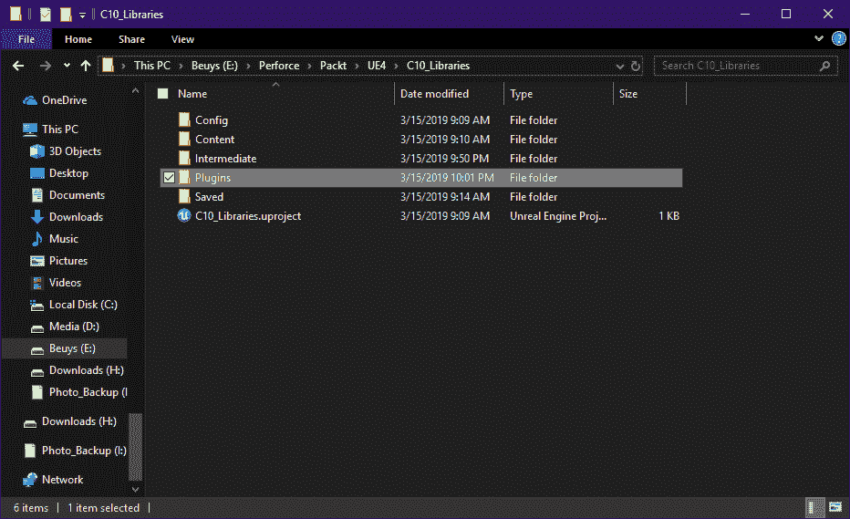

现在我们已经为我们的项目创建了一个`Plugins`目录，让我们将 VRExpansion 插件添加到其中。 我们有几种方法可以做到这一点。

# 使用预编译二进制文件安装

获取该插件的最简单方法是导航到其论坛讨论，网址为[https://forums.unrealengine.com/development-discussion/vr-ar-development/89050-vr-expansion-plugin](https://forums.unrealengine.com/development-discussion/vr-ar-development/89050-vr-expansion-plugin)，并使用适用于您的引擎版本的插件预置下载链接：

1.  点击引擎版本的完整二进制文件和源包链接并下载压缩插件
2.  下载完成后，打开`.zip`文件并将其中包含的`VRExpansionPlugin`目录拖到您的`Plugins`目录中

就这样。 只要您安装了为您的引擎版本构建的插件版本，您就可以开始工作了，可以打开您的项目了。

# 编译您自己的插件二进制文件

如果插件需要比预构建二进制文件中包含的代码更新的代码(如果您运行的是引擎的预览版，则需要更新代码)，那么您将需要自己构建插件二进制文件。 要做到这一点并不难：

1.  导航至 BitBucket 上的 VRExpansionPlugin 仓库：https://bitbucket.org/mordentral/vrexpansionplugin[VRExpansionPlugin](https://bitbucket.org/mordentral/vrexpansionplugin)
2.  单击下载链接，然后单击下载存储库链接，以下载仓库的压缩版本

It's also possible to clone the plugin's Git depot directly into your project's plugins directory, but unless you're working on the bleeding edge and need absolutely up-to-date code, you don't really need to do this. You will want to do this if you're planning to contribute your own changes to the plugin. For most users, though, it's easier to download the zipped repository.

3.  现在打开您刚刚下载的`.zip`文件。
4.  您将在其中看到一个名为`mordentral-vrexpansionplugin-9c1737a17bef`的文件夹(末尾的散列将有所不同)-将其拖到新的`Plugins`目录中。

5.  将刚解压缩的目录名称更改为`VRExpansionPlugin`：


现在启动您的项目，或者如果它已经打开，请将其关闭并重新打开。

现在应该会出现一个对话框，指示您需要构建插件二进制文件：

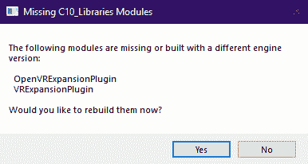

如果您按照[第 2 章](02.html)、*设置开发环境*中的说明设置 Visual Studio Community 2017，这不是问题。 (如果没有，请立即返回并按照说明进行设置。 在您的系统上设置一个可运行的编译器总是值得的，因为您有时会需要它。)。 回答“是”，让 Visual Studio 为您构建新的二进制文件。

Your plugin should build successfully, but if it doesn't, navigate to the plugin's home page at [https://bitbucket.org/mordentral/vrexpansionplugin](https://bitbucket.org/mordentral/vrexpansionplugin) and follow the instructions under *Basic Installation Step-By-Step*, which will take you through the manual build process. As mentioned earlier, you also have the option to download pre-built binaries from here: [https://forums.unrealengine.com/development-discussion/vr-ar-development/89050-vr-expansion-plugin](https://forums.unrealengine.com/development-discussion/vr-ar-development/89050-vr-expansion-plugin).

如果您点击 Build 对话框上的 Show Log，您应该能够看到您的构建进度。 预计需要几分钟时间：

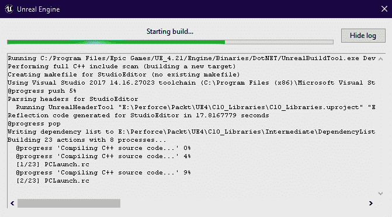

构建完成后，您的项目将打开。

# 验证项目中的插件

无论您是如何下载和安装该插件的，一旦您打开项目，现在就应该可以使用它了。

打开项目时，您应该会在右下角看到两个指示器，指示您有新的插件可用，并询问您是否要更新项目：

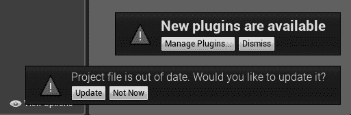

点击管理插件...。 打开插件列表。

您应该看到 VRExpansion 插件的两个条目，并且这两个条目都应该被启用：

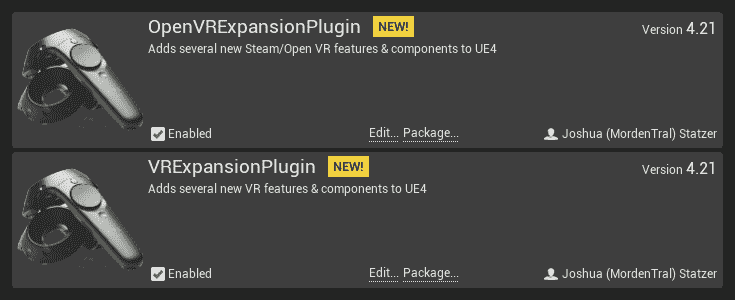

这是应该的，所以我们可以关闭此窗口。

现在，让我们通过点击 Update 按钮来更新我们的项目文件。

请记住，您的`.uproject`文件实际上只是一个文本文件，告诉您一些关于项目的基本信息。 如果在文本编辑器中打开它，您将看到添加了新条目，表明此项目现在依赖于 VRExpansion 插件及其配套的 OpenVRExpansion 插件：

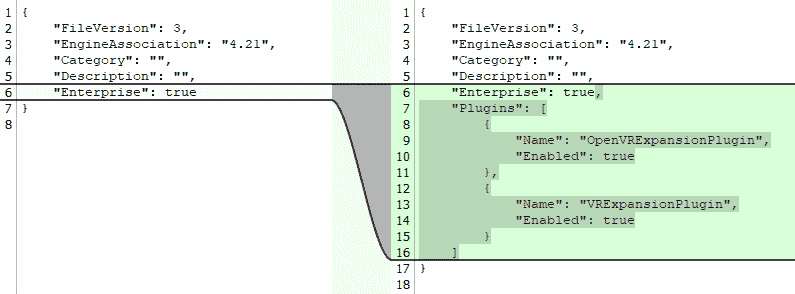

This is a text comparison of the .uproject file before and after we added the VRExpansion plugin

就这样。 我们已经准备好开始使用插件进行开发，但在此之前，让我们先简单介绍一下我们刚刚做了什么。

# 了解插件

插件是虚拟生态系统的重要组成部分。 它们可以包含内容、蓝图、本机代码以及任何其他影响虚幻引擎的功能和方式的内容。 它们可以为您节省大量时间，并几乎无限地扩展引擎的能力。

在很大程度上，你真的不需要太多地了解虚幻如何处理插件来使用它们-它们基本上就是工作的，但如果你想在出现问题时能够修复问题，或者如果你需要更新插件以适应新的引擎版本，稍微了解一下它们的居住地和它们是如何组装的是很有帮助的。 我们不会在这里深入讨论，但有几点要快速指出，它们将对您未来的发展有所帮助。 (如果您确实需要更深入地了解插件是如何开发的，请从此处的文档开始：[https://docs.unrealengine.com/en-us/Programming/Plugin](https://docs.unrealengine.com/en-us/Programming/Plugins))

# 插件所在的位置

首先，重要的是要知道将想要安装的新插件放到项目或引擎中的位置，也要知道从 Epic Games 启动器下载的插件将放在哪里。

您安装的任何插件将位于以下两个位置之一：对于仅安装到特定项目的插件，位于项目的`Plugins`目录中；对于安装到引擎并应用于所有项目的插件，位于`Engine\Plugins`目录中。

请花点时间查看您当前安装的引擎插件，如以下步骤所示：

1.  打开虚幻引擎的安装目录(默认在`C:\Program Files\Epic Games`下)，打开`Engine\Plugins`子目录：


这里你会注意到一些有趣的事情：引擎的许多特性，甚至那些我们认为是核心引擎功能的特性，比如效果编辑器，实际上都是生活在虚幻框架中的插件。 这是值得记住的。 插件在虚幻引擎中不是二等公民。 通过插件向引擎添加一些内容与直接将其写入引擎代码并没有多大意义上的不同，只是这样设置更容易替换，或者更容易打开或关闭。

通过 Epic Games 启动器下载的插件将出现在`Engine\Plugins`目录的 Marketplace 子目录中。 一般来说，当你从 Epic Games 启动器安装的插件有可用更新时，微博启动器会提醒你，你可以直接从启动器内进行更新。 您几乎不需要打开您的`Engine\Plugins`目录，但知道它就在那里是值得的。

# 从 Marketplace 安装插件

要使用 Epic Games 启动器安装插件，请从 Microsoft Marketplace 或您的库中选择所需的插件，然后单击 Install to Engine(安装到引擎)按钮，或者如果该插件已配置为资产包，请改为单击 Add to Project(添加到项目)按钮。 Install to Engine 会将插件放入 Engine Install 的`Engine\Plugins\Marketplace`目录中，而 Add to Project 会将其放入项目的`Plugins`目录中：

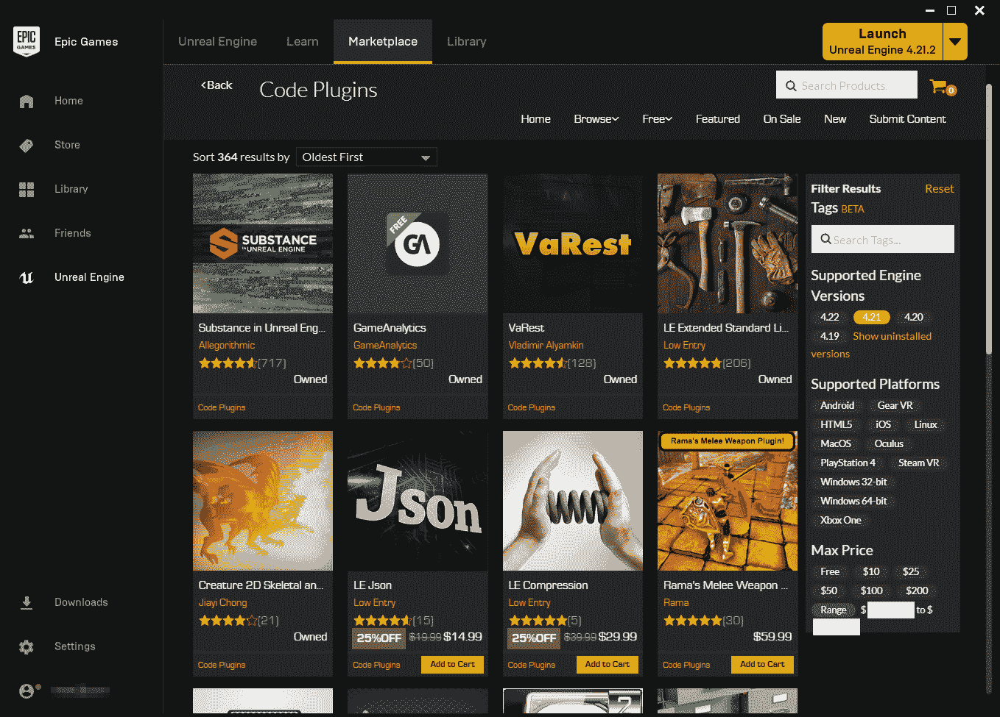

Epic Games 启动器会自动提醒你，如果你使用该工具安装的插件有可用的更新。

# 插件里有什么？

现在我们已经了解了插件在虚幻引擎中的位置，让我们来看看它们是由什么组成的。

为此，我们将快速浏览一下安装到项目`Plugins`目录中的 VRExpansion 插件：

1.  打开项目的`Plugins`目录，然后打开其中的`VRExpansionPlugin`目录

您将看到 VRExpansion 实际上由该目录中的两个独立插件组成：`VRExpansionPlugin`和`OpenVRExpansionPlugin`。 后者的存在是为了支持 Valve Software 的 OpenVR SDK。 就我们这里的目的而言，我们不会担心它，我们只关注 VRExpansion。

这里有两个文件，我们应该花点时间来提一下。

第一个是`README.md`文件。 花点时间把它打开。 这是一个标记文件，包含有关插件的一些基本信息。

If you have Visual Studio Code installed on your system, you can use VSCode to open markdown files. Once the file is open, you can right-click on its tab in the viewing area and select Open Preview, or just hit *Ctrl* + *Shift* + *V* to view the markdown with formatting.

您将看到这个`readme`文件基本上在这里的 BitBucket 主页面上重新创建了文本：[https://bitbucket.org/mordentral/vrexpansionplugin](https://bitbucket.org/mordentral/vrexpansionplugin)以及指向说明和信息页面的链接。 许多插件都会附带文档或`readme`文件，它们会告诉您在哪里可以找到文档。 值得一看。

# 关于许可证

我们应该在这里查看的另一个文件是`LICENSE.txt`文件。 如果你打算在你的项目中加入一个插件，重要的是要知道你是如何被允许使用它的。

如果你已经通过 Marketplace 下载了一个插件，你就不需要担心了。 所有通过 Etic‘s Marketplace 发布的插件都被授权用于非商业或商业用途，并且不会对它们的使用方式施加任何额外的限制。

If you need more information about licensing for plugins on the Marketplace, the details live here: [https://www.unrealengine.com/en-US/marketplace-distribution-agreement](https://www.unrealengine.com/en-US/marketplace-distribution-agreement).

如果你直接从网上下载插件，就像我们之前做的那样，你需要检查许可证，并确保作者允许你以你想要的方式使用插件。 大多数插件作者不会限制你使用软件的方式，但一定要阅读许可证并确保。 您不会想要构建一个以插件为基础的项目，结果却发现什么时候该销售实际上不允许您这样做的软件了。 请先阅读许可证。

Be especially careful of software licensed under the GNU **General Public License** (**GPL**)—this license places significant restrictions on the software in which it can be used and isn't compatible with Unreal Engine's licensing terms. The much more permissive **MIT** and **Apache** licenses, however, are fine, and you'll encounter many Unreal plugins that use them.

在我们的例子中，VRExpansion 插件的许可证允许您做几乎任何您想做的事情(除了删除许可证文件并试图假装作品是您自己的)，包括修改插件的代码。 它对您使用它的项目类型没有任何限制，无论是内容还是商业用途，还是非商业用途。 这是最理想的。 无论我们是将我们的项目作为商业游戏出售，还是将其用于现场表演，只是作为一种爱好来建造，还是其他什么，我们都很好。

# 插件目录内部

如果我们现在打开外部`VRExpansionPlugin`目录中的`VRExpansionPlugin`目录，我们将看到一个与虚幻项目的结构非常相似的目录结构。 这不是偶然的。 你几乎可以把插件想象成是被插入到你的项目中的迷你项目。 它们可以像项目一样包含代码、蓝图或资产和其他内容。

我们不会担心这个目录的内容，只需看一件事：

1.  在文本编辑器中打开`VRExpansionPlugin.uplugin`文件

您将看到这个文件，就像您的`.uproject`文件一样，只是一个包含插件信息的文本文件。 您很少需要打开此文件，但就像您的`.uproject`文件一样，如果您需要手动调试或更改某些内容，您应该知道它：

```cpp
{
    "FileVersion": 3,
    "Version": 4.21,
    "VersionName": "4.21",
    "FriendlyName": "VRExpansionPlugin",
    "Description": "Adds several new VR features & components to UE4",
    "Category": "VRExpansion",
    "CreatedBy": "Joshua (MordenTral) Statzer",
    "CreatedByURL": "",
    "DocsURL": "",
    "MarketplaceURL": "",
    "SupportURL": "",
    "EnabledByDefault": true,
    "CanContainContent": false,
    "IsBetaVersion": false,
    "Installed": true,
    "Modules": [
        {
            "Name": "VRExpansionPlugin",
            "Type": "RunTime",
            "LoadingPhase": "Default"
        }
    ],
    "Plugins": [
        {
            "Name": "PhysXVehicles",
            "Enabled": true
        }
    ]
}
```

这里的大部分信息只是描述性的，但有一个重要的细节：`Plugins`代码块用于指定插件和其他插件之间的依赖关系。 在本例中，我们可以看到`VRExpansion`插件需要启用`PhysXVehicles`插件。 这应该不是问题，因为它是默认开启的，但是如果你遇到一个插件无法工作的实例，看看它依赖于什么，并确保这些插件也存在。

你有时还会碰到另外一处房产。 某些插件使用如下所示的`EngineVersion`条目指定允许它们使用的引擎版本：

```cpp
"EngineVersion" : "4.21.0",
```

如果插件包含此条目，则虚幻将只允许其使用此处指定的引擎版本加载。 (*有时*可以通过在`.uplugin`文件中手动修改此值来绕过这个问题，但是插件是否能够编译和工作将完全取决于其中的内容以及您试图为其编译的引擎版本中的哪些更改。)

# 结束我们简短的游览

这是一个关于虚幻插件是如何安装的以及里面有什么的快速浏览。 正如我们前面提到的，在您的大部分开发过程中，您不需要打乱任何这些内容，但是当您确实需要弄清楚您的软件发生了什么情况时，知道从哪里开始查找可能是非常宝贵的。

有了这个，那么，让我们继续前进，开始在 VR 中工作。

# 探索 VRExpansion 示例项目

在我们返回到我们自己的项目之前，我们将再绕一圈，看看与 VRExpansion 插件一起维护的示例项目，这样我们就可以看到这个插件将允许我们做哪些事情。 我们还将通过使用本项目中的蓝图来加速本章中的一些开发，所以不要跳过这一步。

让我们从这里开始下载：[https://bitbucket.org/mordentral/vrexppluginexample/downloads/](https://bitbucket.org/mordentral/vrexppluginexample/downloads/)。 按照给定的步骤操作：

1.  单击下载存储库链接以下载项目的压缩版本
2.  将下载的项目解压缩到保存虚幻示例项目的位置
3.  打开项目目录，右键单击`VRExpPluginExample.uproject`，然后从上下文菜单中选择切换虚幻引擎版本...
4.  将其设置为您当前的虚拟引擎版本

由于此项目是作为 C++ 项目创建的，因此当您设置新的引擎版本关联时，也会为您创建 Visual Studio 解决方案文件。 你不需要在 C++ 中工作就可以使用这个插件。 项目本身的所有内容都是使用插件上的蓝图创建的，这也是我们构建项目的方式，但是如果您有兴趣更深入地研究 C++ 类并了解插件是如何构建的，那么这个解决方案文件提供了一个很好的方法来做到这一点。

试着启动这个项目。 它可能会要求您构建其包含的插件。 随它去吧。 (同样，请确保按照[第 2 章](02.html)、*设置开发环境*中的说明安装和设置 Visual Studio。)

一旦项目启动，让它编译着色器，然后稍微探索一下，看看它提供了什么。 VRExpansion 为 VR 开发者提供了巨大的助力，这一点应该很快就会变得明显起来。 这是一个专业编写的代码和蓝图示例的宝库，你可以在 VR 中做一些事情，许多专业制作和发布的游戏都在开发中使用了这个插件或其中的一部分：

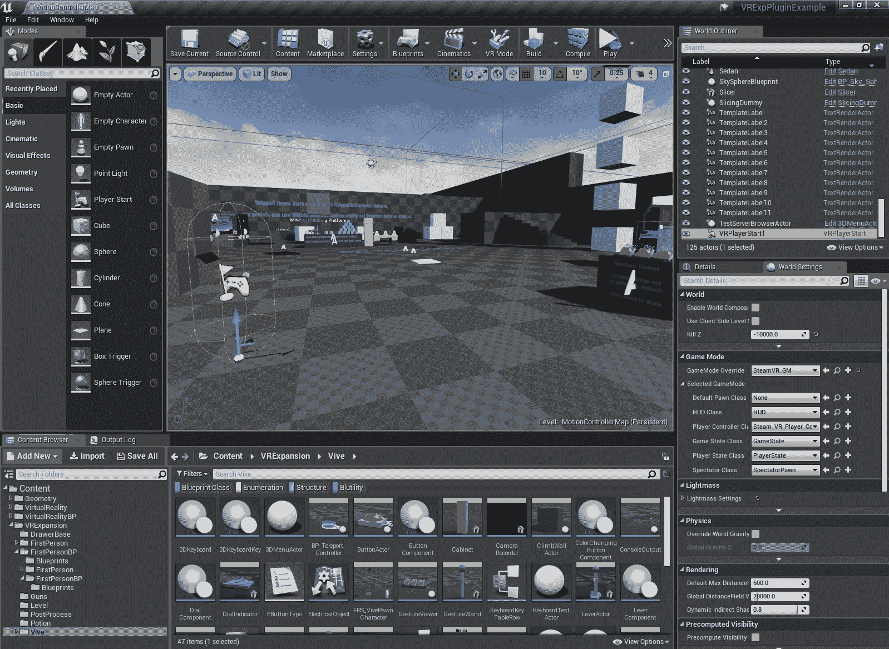

A view of the VR Expansion Plugin's test project. You'll find a wealth of useful VR development examples in here.

在这里玩吧。 我们不会涵盖这个示例项目中的所有内容，因为我们即将开始构建自己的项目，但是您不会浪费时间去探索足够多的内容，以便更好地了解其中包含的内容以及可以为您自己的应用重新分配用途的内容。

以下是一些帮助你入门的小贴士：

*   您的控制器的 D-Pad 或拇指杆会触发心灵传送移动，就像我们自己的示例中所做的那样
*   当你手中没有物体时，挤压控制器手柄会改变你的移动模式

我们强烈建议您现在花一些时间来尝试每种运动模式。 您将从我们之前构建的移动项目中熟悉远程传输和 DPadPress-ControllerOrient 模式。 其他人对你来说将是新的。 与他们一起玩耍，并获得想法：

*   许多物体都可以抓取和使用。 用扳机夹住。
*   白色物体可以抓取和攀爬。
*   玩家角色在处理玩家用头撞墙的案件时做得很好。 试试看。
*   Barf 平台名副其实。 (如果你回想一下我们在[第一章](01.html)，*Th**用 VR*打墨时的讨论，你就会明白原因了。)

当您了解此插件允许您做什么时，请将此示例项目视为一个主要资源。 由于您在本书中所做的工作，您应该做好准备，理解您在蓝图中看到的内容，并将其作为进一步开发的起点。

现在，让我们开始构建我们自己的项目，使用这个插件作为我们自己工作的基础。

# 完成我们的项目设置

现在我们已经建立了我们的项目，安装了 VRExpansion 插件，并且对插件是什么有了基本的了解，让我们回到构建内容。

当然，首先，我们需要为 VR 设置适当的项目设置：

*   项目|描述|设置|在 VR 中开始：0false
*   引擎|渲染🙂|◄正向渲染器🙂|◄正向着色：🙂TRUE
*   引擎|环境光渲染|默认设置|环境光遮挡静态分数：0.false
*   引擎|渲染模式|默认设置|模式抗锯齿方法：*MSAA
*   引擎|渲染|VR|实例化立体声：*True
*   引擎|渲染|VR|11-13 轮询遮挡查询：11-13 真

现在让我们给自己一个可以玩耍的环境：

1.  找到灵魂：洞穴环境在市场上打包，并将其添加到您的新项目中。 (可以在项目打开时执行此操作。)
2.  环境包下载完成后，如果您的项目尚未打开，请将其打开。
3.  在`Content/SoulCave/Maps`下，找到 LV_Soul_Cave_Mobile 级别并将其打开。 让您的着色器进行编译。

在此过程中，让我们将其设置为项目的默认级别：

1.  打开设置|项目设置|项目|地图和模式，将编辑器启动地图和游戏默认地图设置为 LV_Soul_Cave_Mobile

一旦您的着色器编译完毕，我们就可以开始工作了。

# 使用 VRExpansion 类

我们将使用这个项目来回顾我们在为 VR 设置场景时需要做的事情，以及作为 VRExpansion 类的介绍。

# 添加导航

当然，现在我们有了自己的环境，我们需要做的第一件事是设置一个导航网格，这样我们就可以选择使用心灵传送移动，这样 AI 角色就可以在其中导航。

首先检查您的碰撞环境：

1.  点击*Alt*+*C*(或从视口中的 Show|Collision)以可视化碰撞环境，并确保它看起来合理。

这里的碰撞看起来不错，所以让我们向场景中添加一个导航网格边界体积。

2.  将导航网格边界体积拖动到场景中，并对其进行缩放，以包含希望播放器能够导航的区域。
3.  以下值工作得相当好：位置参数(X=-11420.0，Y=-3790.0，Z=-490.0)和比例参数(X=100.0，Y=160.0，Z=20.0)。

请记住，通过使用视口的俯视图和侧视图来理解正在执行的操作，可以在设置体积时更轻松。

由此产生的导航网格将覆盖很多你不想让玩家导航的地方，所以记住使用导航调整音量来阻挡不想要的心灵传送目的地。

# 添加游戏模式

一如既往，我们需要为我们的项目设置一个游戏模式，以指定要加载哪些类，并处理我们想要应用于游戏的任何规则：

1.  在`Content`目录中为您的项目创建一个目录，然后在其中创建一个 BluePrints 目录。
2.  在此目录中创建一个新的 Blueprint 类，并使用游戏模式库作为其父类。 将其命名为`BP_VRExpansionGameMode`。
3.  打开设置|项目设置|项目|地图和模式，并将默认游戏模式设置为您刚刚创建的新游戏模式。
4.  打开地图的世界设置，重置游戏模式|游戏模式覆盖以清除它。

当我们基于 VRExpansion 类添加新类时，我们将多次重新访问我们的新游戏模式。

# 更新 PlayerStart 类

VRExpansion 插件提供了一个新的播放器开始类，它针对我们将要产生的`VRCharacter`进行了更精确的缩放，因此它更准确地表示了播放器可以容纳的位置。 我们将在这里使用它：

1.  将 VRPlayerStart 拖到现有`PlayerStart`执行元附近的场景中。
2.  从旧的`PlayerStart`详细信息中，右键单击其 Transform|Location，然后复制值。

3.  删除旧的`PlayerStart`。
4.  选择 VRPlayerStart，在其详细信息中，右键单击其 Transform|Location，然后粘贴从旧 VRPlayerStart 复制的值。
5.  把它往下移一点，把它放在地板上。 (X=-20220.0，Y=-13080.0，Z=-2118.0)效果很好。

# 添加 VR 角色

现在是时候在我们的项目中添加一个支持 VR 的角色了。 `VRExpansion`插件为我们提供了两个新类，我们可以从中派生出在 VR 中使用的角色：

*   `VRSimpleCharacter`是启用 VR 的角色的基类，它自动设置两个`GripControllers`(网络复制的 VR 摄像机)，并实现专门为在 VR 中使用而设计的移动组件。
*   `VRCharacter`包括在`VRSimpleCharacter`中找到的所有内容，但添加了一些附加方法以通过颈部位置来抵消碰撞，并支持对角色碰撞胶囊进行更重要的重新缩放。

通常，除非您确定需要使用颈部碰撞偏移或要从根本上更改碰撞胶囊大小，否则请使用`VRSimpleCharacter`。

我们现在就开始吧：

1.  在放置游戏模式的 BluePrints 目录中，右键单击以创建一个新的 Blueprint 类。
2.  展开“所有类”扩展器，并在“搜索”框中键入`vr char`。

3.  您将看到列出了`VRCharacter`和 VRSimpleCharacter 类。 选择 VRSimpleCharacter。 将新蓝图命名为`BP_VRCharacter`：

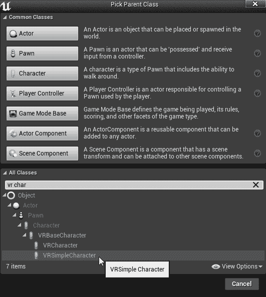

4.  现在，打开您的游戏模式，并设置`BP_VRCharacter`为其默认的典当职业。

查一下地图。 你现在还不能走动，但你应该在楼层登记。

# 设置输入

既然我们的角色已经就位，我们的游戏模式已经被告知要产生它，让我们让我们的玩家来控制它。

首先，我们需要映射一些输入。 如果我们想手动完成此操作，可以通过 Settings|Project Settings|Engine|Input 完成，但为了节省一点时间，让我们将`DefaultInput.ini`文件从 VRExpansion 示例项目复制到我们的项目中：

1.  打开解压 VRExpansion 示例项目的目录，并从其`Config`目录复制`DefaultInput.ini`文件
2.  打开当前项目目录并将`DefaultInput.ini`粘贴到其中

重新打开您的工作项目。 当然，如果我们正在构建我们自己的游戏，我们会为它设计我们自己的输入方案，但是这给我们提供了一种快速的方式来映射一些输入并准备进行测试。

# 使用示例资源设置 VR 角色

现在，通常我们会从头开始演练构建这个角色的过程，但是我们有很多材料要完成，所以我们会把 VRExpansion 示例项目中的示例角色迁移到我们自己的项目中，这样可以节省一些时间，然后我们将深入研究它是如何工作的。

# 有效利用示范资产

这带来了一个关于使用插件、示例资产和代码的值得一提的观点。 通常，库和插件会附带已经设计好使用它们的示例资产。 熟悉这些代码总是一个好主意，因为它们向您展示了作者希望如何使用他们的代码的意图。 通常情况也是如此，这些资产开箱即用，非常接近你需要的样子，尽管它们很少完全符合你的需要。

在使用某人的示例资产或代码时，您可以采取两种方法--您可以批量合并示例，然后修改或删除任何与您希望它的工作方式不同的内容，或者您可以从头开始构建您自己的资产，使用该示例作为指导，以了解作者建议您如何使用他们的代码。 每种方法都有其优点和缺点。 第一种方法倾向于让你更早地工作，但你通常会得到很多你不需要的额外东西，然后需要清理掉。 (请记住，我们在这里不相信 Cargo-cult 编程-您不会简单地将这些代码转储到您的项目中，然后在不理解它的情况下离开。)。 第二种方法可能需要更多时间，但它给您提供了一个干净的类，它准确地执行您需要的并且只执行您需要的操作，并且您非常了解它，因为它是您编写的。

还有一条中间路，这是我们推荐的路。 还记得肯特·贝克(Kent Beck)的建议吗：[0]让它工作；让它正确；让它快？ 考虑使用现有的示例资产或类作为*Make it Work*阶段的一部分。 在此阶段，您将在作者编写类时对其进行实验，并了解它的工作原理和使用方法。 然后，一旦你对事情有了把握，就开始拿出你现在知道你不需要的东西，并改变那些需要以不同方式工作的东西，直到你有了一个能做你需要它做的事情的版本。 现在，进入你的*使它正确*阶段。 这样可以吗？ 维护起来容易吗？ 另一位工程师，或未来的你，一年后，能读懂这份蓝图，了解正在发生的事情吗？ 考虑到这些问题，现在您已经有了构建类的可行模板，您是否想要编写一个新的并行版本的类。

# 迁移示例棋子

根据这种方法，让我们将示例项目的 VR 角色蓝图迁移到我们的项目中，这样我们就可以开始进行实验，并了解它是如何构建的：

1.  从`VRExpPluginExample`项目中，找到`Content/VRExpansion/Vive`中的`Vive_PawnCharacter`蓝图，并将其迁移到新项目的`Content`文件夹中

Don't worry about the Vive-centric name. This character works fine with the Oculus Rift and Windows Mixed Reality headsets as well. When this plugin was first written, only the Vive supported room-scale VR. Once Oculus added this support, the plugin was updated to accommodate it, but the example names were never changed.

2.  返回到您的新项目，并将游戏模式的默认典当类切换为我们刚刚迁移到的`Vive_PawnCharacter`。

我们想创建另一个 VR 角色作为示例，以演示插件中引入的新类可以像任何其他引擎类一样使用，但对于我们在这里实际要做的工作，我们将使用迁移的角色。

试试看。 现在，您应该能够使用远程传送在环境中导航，并且应该能够使用夹点按钮更改移动模式：


稍微玩玩这个，然后我们来看看引擎盖下的情况。

# 理解复杂的蓝图

现在我们已经掌握了基本工作，让我们深入了解一下这个类是如何构建的。 在我们这样做的过程中，您应该会发现，由于您在本书中所做的工作，您将在本蓝图中看到的许多技术将变得更有意义。

我们在这里要探索的技术很有价值。 如果您从事专业的软件开发工作，或者即使您是业余爱好者，您迟早会遇到一段现有的代码，您需要弄清楚它是如何工作的。 我们将通过一些策略来指导您，使这项任务远不像乍看起来那么令人望而生畏。

让我们开始吧：

1.  打开`Content/VRExpansion/Vive`，找到`Vive_PawnCharacter`蓝图。 把它打开。
2.  打开其事件图。

呀！ 这里有很多东西。


The example project's Vive_PawnCharacter Blueprint contains a lot of Blueprint code. Digging through it isn't as daunting as it may seem at first.

不过，事情是这样的：虽然乍一看可能令人望而生畏，但你很快就会意识到这一点的。 这门课是开发虚拟现实角色的有用技术的难以置信的概要。 就其本身而言，这将是一件美好的事情，但更令人惊讶的是，这里编写的蓝图和底层 C++ 代码都是在考虑到网络复制的情况下编写的，所以如果您计划编写网络 VR 体验，这个课程将立即帮助您。

然而，要利用它，你需要知道从哪里开始。 让我们学习如何接近一个新的班级，并弄清楚它。

# 首先检查父类

在查看新蓝图时，您要做的第一件事就是检查界面的右上角，看看它的父类是什么。

在我们的例子中，我们可以看到这个蓝图派生自`VRCharacter`。 `VRCharacter`是用 C++ 编写的本机类。 如果您遵循父类指示器提供的链接，它将向此类打开 Visual Studio，您可以浏览其本机实现以了解有关它的更多信息。 为了我们在这里的目的，我们将停留在蓝图中，但值得知道的是，这是一件你可以做的事情。

(如果我们深入研究这个类的本机实现，我们会看到它派生自`VRBaseCharacter`类，而该类又派生自`Character`。 因此，这个类本质上是一个虚幻的角色，如下所述：[https://docs.unrealengine.com/en-US/Gameplay/Framework/Pawn/Character](https://docs.unrealengine.com/en-US/Gameplay/Framework/Pawn/Character)。 但它有额外的 VR 专用修改，可以复制相机和手控器的位置，并以对 VR 有意义的方式处理移动。)

# 查看组件以了解它们是由什么组成的

要查看您正在研究的任何新类的下一件事是它的组件列表：

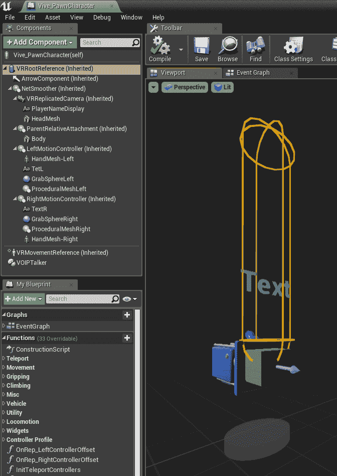

看看这个组件列表，我们就可以知道很多关于这个字符类以及它能做什么的信息。 在视口处于活动状态时执行此操作是值得的，这样您就可以看到哪些组件具有可见的表示。 将鼠标悬停在每个组件上，查看它是什么类型的组件，并让它在您的脑海中构建整个类的整体感觉。

我们可以看到，`VRCharacter`支持头部的静态网格、身体的静态网格以及附加了文本渲染器、抓取检测球体和骨骼网格的两个运动控制器。 (此运动控制器设置应该与我们在夹点交互上所做的工作有些相似。)。 我们还可以看到，它提供了一个角色移动组件和一些对 VOIP 通信的支持。

当你这样做的时候，你不需要为每一个细节而苦恼。 在这个过程的这个阶段，重点是建立一个整体的心理模型，了解课堂上的内容以及各个部分是如何结合在一起的。

# 查找已知事件，看看它们运行时会发生什么

要获得有关蓝图的信息，另一个有用的起点是从我们知道可能实现的事件开始，看看它们会做什么。

大多数类将在 Event BeginPlay 上执行某种设置工作，大多数类将在 Event Tick 上执行一些工作，因此这些通常是明智的起点：

1.  点击*Ctrl*+*F*激活查找结果面板，然后在搜索栏中键入`beginplay`。

2.  点击*进入*，因为我们只对这个蓝图中的内容感兴趣：

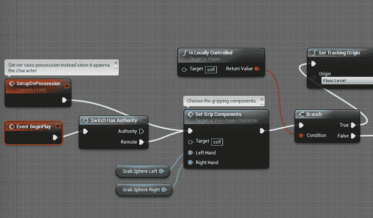

Event BeginPlay(事件开始播放)出现在 Find Results(查找结果)列表中。 我们可以双击它以跳转到蓝图中的该事件。

查看 BeginPlay，我们可以看到它只在服务器的客户机上处理此事件；它使用 SetupOnPosession 自定义事件。 我们可以看到，它正在为本地控制的玩家设置手柄组件；它正在调整跟踪原点和观众屏幕，然后它将为每个人生成并设置一对`BP_Teleport_Controller`角色，这些角色连接到运动控制器上。

我们可能还不知道这个棋子的一切，但仅仅从它的 BeginPlay 来看，我们已经学到了一些东西：

*   此棋子已设置为用于网络游戏-它根据其是否有权限执行不同的路径
*   棋子根据它是在本地运行还是由其他玩家控制，处理某些事情的方式会有所不同
*   传送处理由一个独立于棋子的类别管理。 我们会想看看这个

现在，让我们对 Event Tick 执行相同的操作：

*   搜索`Tick`，然后双击结果中出现的事件记号条目：

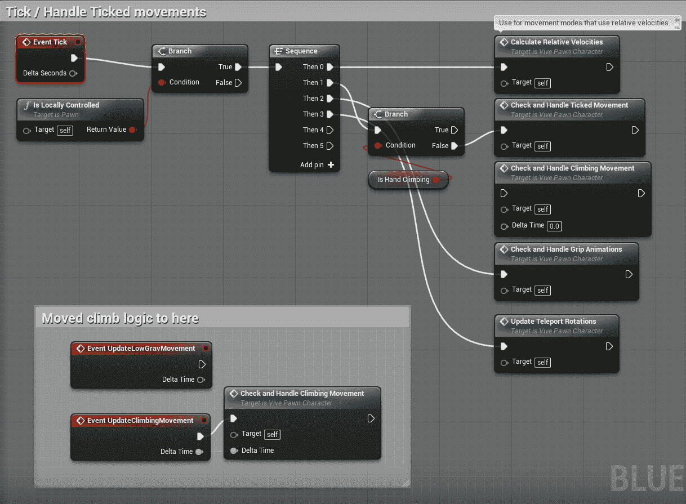

再说一遍，这马上告诉我们几件事：

*   远程棋子根本不会在滴答声中做任何事情。 这个不错。
*   扁虱在很大程度上是在处理运动，但攀登运动被移到了另一个单独的活动中。
*   手柄动画和心灵传送旋转也在 Tick 上处理。

在这个过程的这个阶段还没有必要做深入的挖掘。 您在这里的目的是让您自己对这个类包含哪些部分以及它们何时和如何完成工作有一个全面的了解。 这样，当您稍后查找详细信息时，您将很好地感觉到应该在哪里查找。

到目前为止，这个过程给了我们一些信息。 只需了解父类、它包含的组件以及它的两个已知事件，我们就可以直观地了解该类的功能。 现在是时候变得更具体了，并从一个简单的问题开始-当玩家试图心灵传送时会发生什么？

# 使用输入作为在蓝图中找到起点的方法

我们可以尝试通过查看这个巨大的事件图来回答这个问题，并试图找到我们正在寻找的东西(在这种情况下，这对我们来说是相当好的，因为这个图组织得很好，而且作者在记录它方面做得很好)，但是还有一种更简单的方法。

从一件你知道的事情开始，然后从那里开始执行，看看会发生什么。

在我们的例子中，我们知道玩家通过点击 Dpad 或拇指杆来执行传送，这取决于它们是在 Vive、Oculus 还是其他设备上。 这将被映射为输入。 让我们找到它：

1.  打开“设置”|“项目设置”|“引擎”|“输入”，然后展开“操作映射”扩展器。

这里有一个名为 TeleportRight 的输入，听起来很有希望。 如果我们展开它，我们可以看到它被映射到右侧的拇指杆或 FaceButton 1(在 Vive 上是 dpad 的顶部象限)。 就是这个：

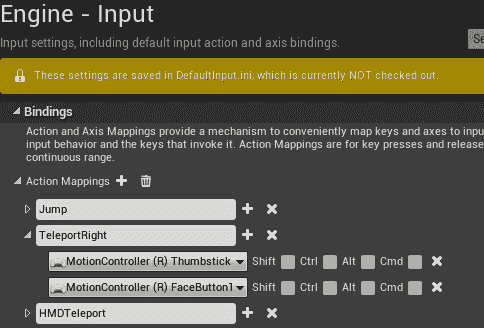

现在我们有了要查找的输入名称，我们将在蓝图中搜索 TeleportRight，我们可能会找到一些东西。 (有些项目在本地 C++ 环境中处理它们的输入，但更常见的是在蓝图中处理。

2.  跳回您的事件图并点击*Ctrl*+*F*以打开 Find Results 面板。
3.  在搜索框中键入`TeleportRight`，然后单击框右侧的望远镜符号以在所有蓝图中运行搜索：


这就是了。 我们的角色正在处理该输入：


在寻找输入时，另一个有用的策略是在搜索框中简单地键入 inputaction。 使用项目的输入设置(写入 DefaultInput.ini)映射的任何输入都将以此前缀开头。

4.  双击 InputAction TeleportRight 条目，您将转到事件图中的该事件处理程序：

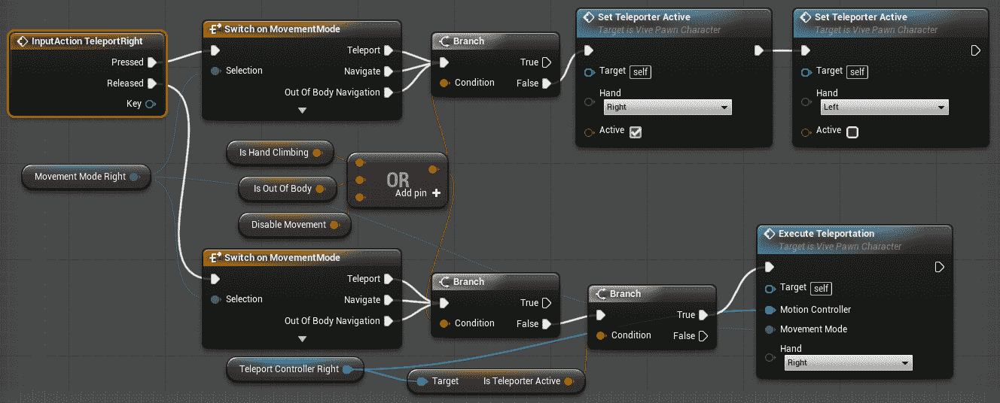

现在我们有东西可以看了。 我们可以使用断点来确认我们看到的是正确的东西。

# 设置断点和跟踪执行

我们将使用断点来验证我们认为在触发输入时将要执行的代码是否真的是要执行的代码。 这是理解他人代码的常用技术。 当您不确定它的执行路径时，将断点放在您预计会命中的位置，然后看看哪些断点真的会出错。 这将为您提供一个开始探索该软件的起点：

1.  选择 InputAction TeleportRight 节点，然后按*F9*在其上放置断点，或右键单击并从上下文菜单中选择切换断点：


当蓝图节点上的断点处于活动状态时，它会指示编辑器在到达包含该断点的节点时暂停蓝图的执行。 然后，您可以一次执行一个操作，并查看蓝图在做什么。 现在让我们来测试一下。

2.  在 InputAction TeleportRight 上仍设置断点的情况下，启动 VR 预览会话(您不必为此戴上耳机--我们马上就会退出)，并激活正确的远程端口输入。

游戏看起来会冻结在你身上，你的 VR 头戴式耳机将停止显示环境。

3.  现在来看 InputAction TeleportRight 节点。 您将看到一个红色箭头，表示蓝图模拟已在此节点处暂停：

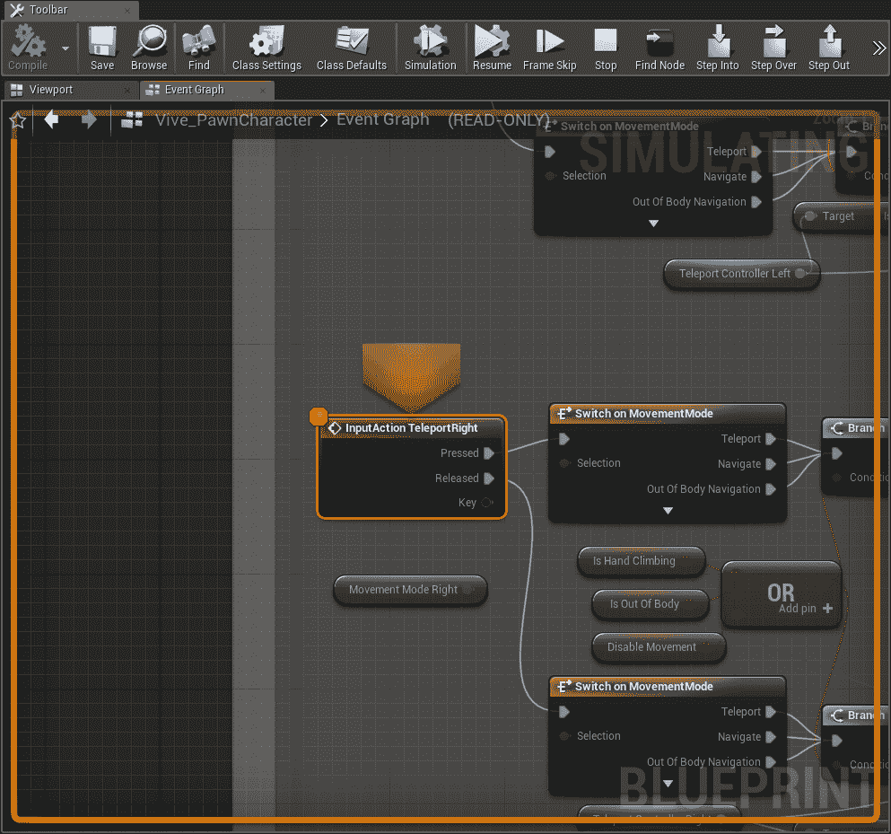

让我们在这里也注意一些其他的事情。 您可以看到蓝图显示用黄色指示器圈起来，表示它当前正在模拟，并且您可以从标题行看到图形当前处于只读状态。 在模拟蓝图时，不允许更改蓝图：


我们还来看看工具栏上显示的执行控件：

*   恢复按钮将恢复正常执行。 (在运行 VR 时这很危险-您的耳机可能无法正常从暂停状态唤醒。)
*   跳过帧按钮允许执行单个帧并返回到暂停状态。
*   停止按钮将关闭您的**Play-in-Editor**(**PIE**)会话并返回编辑器。
*   Find Node(查找节点)按钮会将您带回当前停止执行的节点。

接下来的三个节点是单步执行代码的重要节点，您应该记住它们的热键，因为您将一直使用它们：

*   单步执行(*F11*)步骤到下一个执行的节点，如果该节点表示蓝图函数调用或宏，则跳转到函数的实现。

在我们继续之前，让我们先来看看这一点的实际效果。

现在按*F11*。 请看我们现在如何跳到打开 MovementMode 节点：

1.  将鼠标悬停在 Switch on MovementMode 节点的选择输入上。 鼠标悬停工具提示指示输入的类型及其当前值：


我们可以看到，移动模式 Right 当前设置为 Teleport，因此将执行 Switch 语句的第一个分支。

2.  再次按*F11*，然后执行到`Branch`语句。

将鼠标悬停在它的输入值上，我们可以看到，因为我们没有手动攀爬、出体或处于禁用运动的状态，所以该值为 false，并且 false 分支将被执行。

3.  再次点击*F11*将我们带到预期的 SetTeleporterActive 节点。
4.  再次按*F11*，这一次发生了一些有趣的事情。 我们没有跳到事件图中的下一个节点，而是跳到了`Set Teleporter Active`函数内部。

这是步进(*F11*)和跳跃(*F10*)之间的区别。 *单步执行*将把您带到执行的任何地方，甚至进入函数调用或宏，而*F10*将单步执行函数调用，而不会进入函数调用内部。

5.  继续按*F11*，直到我们进入 is Valid 宏。

我们实际上对这个宏的内容不感兴趣，所以我们想退一步，这样我们就可以继续查看我们的`SetTeleporterActive`函数。

6.  点击*Alt*+*Shift*+*F11*或单步退出按钮返回到`SetTeleporterActive`图形。

现在，您已经看到了这三种导航操作中的每一种操作。 练习它们并习惯使用它们的热键。 像这样浏览蓝图是了解复杂蓝图如何运行的最快、最有效的方法之一。

请记住以下几点：

*   *F11*(单步执行)跳到下一个执行的节点，即使它在另一个函数或宏内。
*   *F10*(单步执行)跳转到当前上下文中的下一个执行节点，但不单步执行从该上下文调用的函数或宏。
*   *Alt*+*Shift*+*F11*(单步退出)从函数或宏退到调用它的上下文。

记住这些钥匙。 你会很高兴你这么做了。

These hotkeys—*F9* to toggle a breakpoint, *F10* to step over, and *F11* to step in, also work pretty much exactly the same way in Visual Studio when tracing through C++ code, and the same general techniques—find a known point in the code, set a breakpoint, and then step through to see how it works, and apply it there too. Use *Shift* + *F11* to step out of a method in Visual Studio.

7.  按*F11*，直到执行跳转到`Activate Teleporter`方法。

看一看你的标签栏，你会发现你现在已经完全跳进了一个不同的班级。 VRExpansion 插件的示例项目使用一个单独的名为`BP_TeleportController`的 Blueprint 参与者来处理远程传输光束和目标指示器的绘制。 这是有用的信息。

This is also a smart way to design this system. Keeping a system such as this bundled together into its own object makes it easier in the long run to swap things out, to add it to a new character class, or to find what you're looking for if you need to debug. What you're seeing here is a more advanced organizational principle, but it's worth learning to think in these terms.

# 查看执行跟踪

假设我们正在浏览一张蓝图，我们意识到需要后退几步，看看是什么值驱动了分支或交换机。 为此，我们可以利用 Debug 面板的执行跟踪：

1.  选择 Window|Debug(窗口|调试)以调出 Debug(调试)面板。
2.  展开面板的执行跟踪部分。
3.  继续浏览您的蓝图，看看这里会发生什么：


执行跟踪将构建一个面包屑列表，显示到目前为止我们在执行过程中所处的位置。 任何时候您需要重新访问前面的执行步骤时，都可以单击它，然后您将被带到图形的该部分，在那里您可以看到驱动它的是什么输入以及它产生了什么输出。

这是学习新蓝图的最有效方法之一：设置断点并查看它是如何运行的。 您将非常清楚地了解类是如何以这种方式构建的。

As you progress through your development career and get good at figuring out and leveraging existing code, you're probably going to be surprised by how many developers you encounter who hold themselves back by failing to learn to do this effectively and wind up doing things the hard way, if they get anything done at all. Some of this, you'll find, is what developers call the *not-invented-here* syndrome (generally a fear of doing the work masked as an ego), and some of it is simply lack of knowledge. The time you spend doing your research and learning what's already been figured out about the problem you're trying to solve is never wasted time.

# 使用调试窗口管理断点

稍后我们将进行另一次探索，但首先，我们将清除 Vive_PawnCharacter 蓝图中的断点：

1.  点击停止按钮结束模拟并返回到编辑器。
2.  按 Tab 键返回 Vive_PawnCharacter 蓝图，如果该蓝图尚未打开，请选择 Window|Debug。

这一次，我们感兴趣的是此面板上显示的断点列表：


在此屏幕截图中，我又添加了几个断点，以使示例更清晰。

您可以单击列表中的任何断点以跳转到其在蓝图中的位置，也可以右键单击以禁用或删除断点。

Disabling a breakpoint turns the breakpoint off without removing it. This is useful if you want to omit a breakpoint temporarily but still want to be able to re-enable it later for further debugging.

您还可以通过选择蓝图节点并按*F9*来打开或关闭任何断点。

让我们暂时把他们都赶出我们的班级：

*   点击调试|删除所有断点(或使用*Ctrl*+*Shift*+*F9*)。

这将删除我们先前在输入操作上设置的断点，以及我们可能在此蓝图中设置的任何其他断点。 此菜单还提供禁用和启用类中所有断点的选项。

# 使用调用堆栈

现在让我们再做一个实验。 我们已经了解了如何开始逐步执行输入事件，以查看事件被调用时会发生什么情况，但是如果我们对某个特定函数感兴趣，并且想知道它何时被调用以及谁调用了它，该怎么办？ 在这里，我们也有一些强大的工具来帮助我们。

比方说，我们在游戏中看到一个摄像头褪色，我们想找出是谁在指挥它。 也许我们甚至不确定呼叫的名称是什么，但我们猜测它的名称中可能有单词*Fade*：

1.  点击*Ctrl*+*F*激活查找结果窗口，然后在搜索栏中键入`fade`。

2.  使用双筒望远镜在所有蓝图中查找：

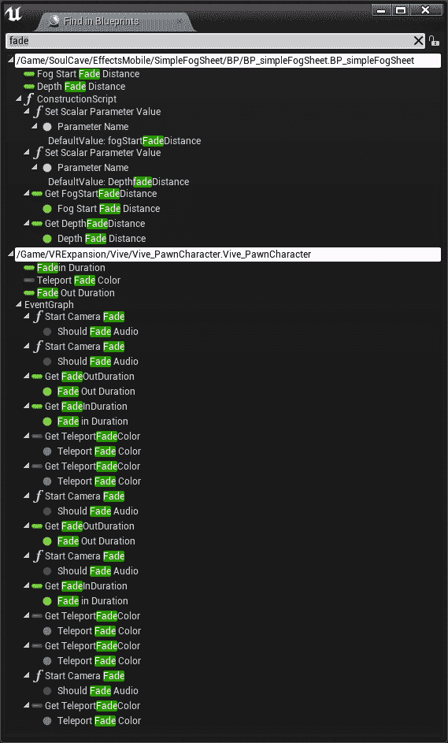

我们可以在这里看到一些条目，但它们中的大多数都是变量。 显然，雾表中的东西不是我们要找的，但 Vive_PawnCharacter 中的开始相机淡出呼叫看起来很有希望。

3.  双击第一个开始摄影机淡入淡出条目以跳转到其在图形中的位置，然后按*F9*在其上设置断点。
4.  对其他三个重复此操作。
5.  启动 VR 预览会话并激活远程传送。

执行将在一个开始摄影机淡入淡出节点处停止。 不过，这一次，我们不是遍历代码来查看接下来会发生什么，而是想看看我们是如何做到这一点的。

6.  点击 Window|Developer Tools|Blueprint Debugger 打开 Blueprint Debugger。

您将看到显示的三个选项卡中的第一个标签为 Call Stack：


调用堆栈是导致当前暂停执行的所有事件和函数的列表。 这给了你大量的信息。 调用堆栈的顶部表示当前暂停执行的位置，其正下方的条目是调用它的函数或事件。 该条目下面的条目是调用该函数的任何条目，依此类推。

查看这个堆栈，我们可以看到一个 C++ 例程检测到按钮按下并触发了 InputAction TeleportRight。 然后，从事件图进行调用。 让我们双击调用堆栈中的以下条目以查看它：


它是由输入操作的 Release 事件触发的执行隐形传送调用。

我们可以双击下一个调用-`ExecuteTeleportation`事件，并看到导致我们正在寻找的相机淡入淡出的图形。

这是一种强大的技巧，你应该养成使用它的习惯。

For more information on using Unreal's blueprint debugging tools, look here: [https://docs.unrealengine.com/en-us/Engine/Blueprints/UserGuide/Debugging](https://docs.unrealengine.com/en-us/Engine/Blueprints/UserGuide/Debugging).

使用这个工具浏览一下蓝图，然后点击 Stop 返回到编辑器。

# 查找变量引用

回到我们的远程传输示例，如果我们想知道驱动 InputAction TeleportRight 中的`switch`语句的`Movement Mode`变量发生了什么变化，该怎么办？

这很容易做到：

1.  选择移动模式右侧变量。
2.  在其上单击鼠标右键，然后选择“查找参照”，或按*Alt*+*Shift*+*F*：

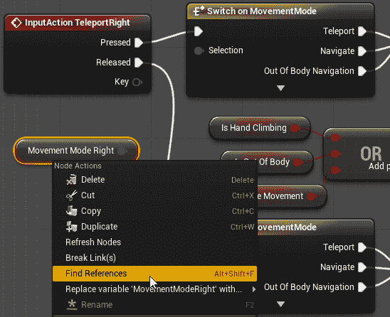

我们可以看到，这个变量在很多地方使用，但它只在两个地方设置。 这就是我们感兴趣的：


3.  双击查找结果中的 Set MovementModeRight 项目。

这将把我们带到设置该变量的位置，我们可以看到这发生在一个名为`Cycle Movement Modes`的函数中。 然后，我们可以使用我们学到的策略来查看何时以及如何调用该函数，以及随之而来的其他情况。

可以对函数和变量使用*Alt*+Shift+*F*。 练习这样做。

理解别人的代码就像解开一个复杂的结。 如果你试图一下子弄明白这一切，你会气馁的。 取而代之的是，你找到一条单链，开始跟随它并将其拉开，它的结构在你走的过程中变得清晰起来。 这些工具可以帮助您做到这一点。

# 使用更多 VRExpansion 插件

**VRExpansion**是一个大型插件，它为 VR 开发人员提供了大量功能。 现在你已经有了一些探索它的策略，并弄清楚了它是如何工作的，你可以如何使用它，你将能够释放出巨大的潜力。

除了我们刚刚探索的角色之外，这个插件还提供了一个支持 VR 的播放器控制器、一个 AI 控制器、立体声控件、按钮、操纵杆等等。

如果您想更好地了解此插件包含的内容(本章包含的内容太多)，请单击内容浏览器中的查看选项弹出窗口，打开显示插件内容，并确保显示 C++ 类可见：

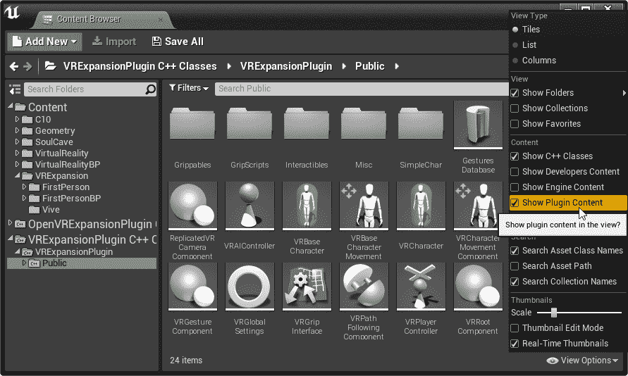

浏览一下类目录，看看里面有什么。 如果双击这些类中的任何一个，其本机源代码将在 Visual Studio 中打开。

不过，你最好的资源之一是 UnrealEngine.com 上的 VR 扩展插件论坛，可以在这里找到：[https://forums.unrealengine.com/development-discussion/vr-ar-development/89050-vr-expansion-plugin](https://forums.unrealengine.com/development-discussion/vr-ar-development/89050-vr-expansion-plugin)。

该插件的作者约书亚·斯塔泽(Joshua Statzer，mordentral)在论坛上非常活跃，周围都是乐于助人的开发者社区，他们非常愿意帮助新的开发者站稳脚跟。

# 简略的 / 概括的 / 简易判罪的 / 简易的

这一章与我们之前所做的教程略有不同，因为它的目的是帮助你探索在虚幻生态系统中找到的众多插件、模板、示例和其他项目，并学习如何使用它们来加速工作和学习新技术。 作为一名开发人员，这是您可以自学的最有价值的技能之一。 如果您习惯于探索在野外找到的代码，您将在更短的时间内开发更强大的软件，并通过查看经验丰富的开发人员是如何处理您正在尝试解决的问题来学习更先进的技术。 这将使您更快地成为更好的开发人员。